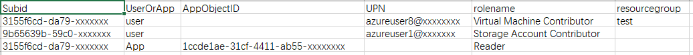
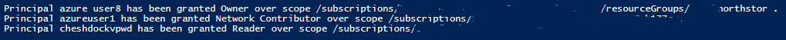

# 使用 PowerShell 为批量用户跨订阅赋予 RBAC 权限

Azure 管理员通常要为用户分配各类资源的访问权限。如果有需求为用户批量分配大量订阅和 Azure 资源的管理权限，通过 Azure 管理门户依次去设置明显不是一个好方法。

本脚本根据用户列表文件中提供的信息，实现了为批量用户或应用分配资源组或订阅管理权限。

管理员需要将用户列表 csv 文件放到当前系统用户的 Downloads 文件夹下，在文件中提供 Azure 用户或应用的信息，在 UserOrApp 字段中填入 **User** 或 **App**，并在 AppObjectID 或 UPN 字段中按实际情况填入应用的**对象 ID** 或**用户名全称**。

如果在列表中不提供资源组，那么角色会赋予到整个的订阅层面；如果提供资源组，则只会赋予到固定资源组。如果需要为同一个用户或应用赋予权限到订阅中的多个资源组，只需要在文件中分成多行，指定每个资源组即可。

脚本会根据管理员提供的信息，将对应的角色分配给列表中用户或应用，分配的 Scope 根据 **Subid** 和 **resourcegroup** 的值来决定。

## 脚本及用户列表示例下载

[Set-AzureRolesAcrossSubscription.ps1](https://github.com/wacn/AOG-CodeSample/tree/master/ActiveDirectory/PowerShell/aog-active-directory-grant-batch-users-rbac-permission-via-powershell/Set-AzureRolesAcrossSubscription.ps1)

[userlist.csv](https://github.com/wacn/AOG-CodeSample/tree/master/ActiveDirectory/PowerShell/aog-active-directory-grant-batch-users-rbac-permission-via-powershell/userlist.csv)

## 用户列表示例

## 脚本输出示例

