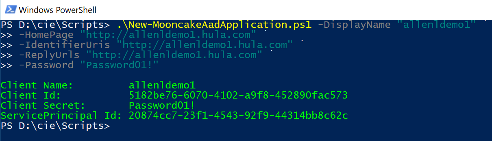
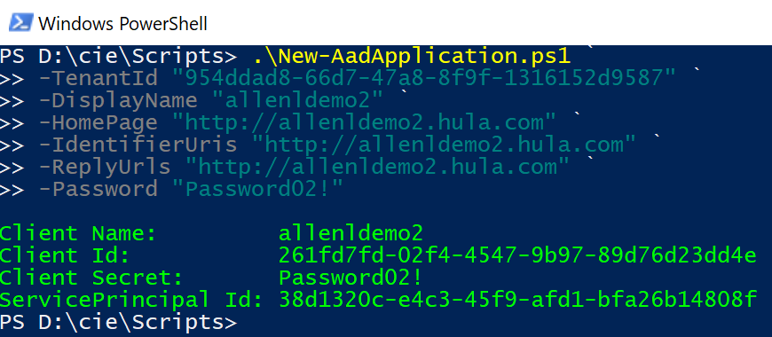

# 如何自动化添加默认用户代理权限

在认证链的场景中，最简单的一种是用户登录 Web Client，而 Web Client 代表用户去访问 Web API，然后返回结果显示。如果使用 AAD 来实现，我们得这么做：

1. 将 Web Client 和 Web API 都注册在同一个租户里面。
2. 配置 Web API 公开最基本的用户代理权限（user_impersonation）。
3. 赋予 Web Client 访问 Web API 的用户代理权限。

其中让用户感觉比较痛苦的是第二步，因为其他两步可以通过 UI 界面操作或者简单 PowerShell 命令就可以完成，但第二步需要去下载 Manifest，然后添加 oauth2Permissions 这个元素，再上传。所以我们首先需要了解什么是 [oauth2Permissions](https://msdn.microsoft.com/Library/Azure/Ad/Graph/api/entity-and-complex-type-reference#oauth2permission-type)？ 还得担心有没有写错，毕竟手写 Json 文件是很容易出错的。当然，考虑到 user_impersonation 是个最普遍常用的权限，最好是服务端能默认自动创建。好消息是微软已经这么做了，但坏消息是中国区暂时还没有部署到，那么在这之前，我们有什么好的办法来自动添加这个默认的用户代理权限呢？

是的，我们可以用 PowerShell 来自动化这个过程。

此处提供两种方案，一种是使用 [Azure AD PowerShell 模块](https://docs.microsoft.com/en-us/powershell/module/azuread/?view=azureadps-2.0)，但需要额外下载，因为它是独立的，没有内置在 Azure PowerShell 里面；另一种是用 PowerShell 来调用 [AAD Graph API](https://docs.azure.cn/zh-cn/active-directory/develop/active-directory-graph-api)。请参考以下脚本：

## 方法一：使用 Azure AD PowerShell 模块

```PowerShell
param (
    [Parameter(Mandatory=$true)]
    [string]$DisplayName,
    [Parameter(Mandatory=$true)]
    [string]$HomePage,
    [Parameter(Mandatory=$true)]
    [string[]]$IdentifierUris,
    [Parameter(Mandatory=$true)]
    [string[]]$ReplyUrls,
    [Parameter(Mandatory=$true)]
    [string]$Password
)

# use below command to install AzureAD module if needed
#Install-Module AzureAD

Connect-AzureAD -AzureEnvironmentName AzureChinaCloud | Out-Null

$defaultOAuth2Permission = [Microsoft.Open.AzureAD.Model.OAuth2Permission]::new()
$defaultOAuth2Permission.AdminConsentDescription = "Allow the application to access $DisplayName on behalf of the signed-in user."
$defaultOAuth2Permission.AdminConsentDisplayName = "Access $DisplayName"
$defaultOAuth2Permission.Id = New-Guid
$defaultOAuth2Permission.IsEnabled = $true
$defaultOAuth2Permission.Type = "User"
$defaultOAuth2Permission.UserConsentDescription = "Allow the application to access $DisplayName on your behalf."
$defaultOAuth2Permission.UserConsentDisplayName = "Access $DisplayName"
$defaultOAuth2Permission.Value = "user_impersonation"

$newAadApp = New-AzureADApplication -DisplayName $DisplayName -Homepage $HomePage -IdentifierUris $IdentifierUris -ReplyUrls $ReplyUrls -Oauth2Permissions @($defaultOAuth2Permission)
$appId = $newAadApp.AppId

# create client secret with provided password
New-AzureADApplicationPasswordCredential -ObjectId ($newAadApp.ObjectId) -Value $Password | Out-Null

$newSp = New-AzureADServicePrincipal -AppId $appId -Tags @("WindowsAzureActiveDirectoryIntegratedApp") -AccountEnabled $true
$spId = $newSp.ObjectId

# output
Write-Host ""
Write-Host "Client Name:         $DisplayName" -ForegroundColor Green
Write-Host "Client Id:           $appId" -ForegroundColor Green
Write-Host "Client Secret:       $Password" -ForegroundColor Green
Write-Host "ServicePrincipal Id: $spId" -ForegroundColor Green 
```

脚本中最关键的地方就是创建了 `user_impersonation` 这个 oauth2Permission 对象，并添加在应用程序对象里面。另外需要注意的是，除了创建应用程序对象之外，脚本中还一起创建了对应的服务主体对象，关于两者之间的关系，请查看[Azure Active Directory (Azure AD) 中的应用程序对象和服务主体对象](https://docs.azure.cn/zh-cn/active-directory/develop/active-directory-application-objects?toc=%2factive-directory%2fdevelop%2ftoc.json)。而且我们还给服务主体对象加了标签 “WindowsAzureActiveDirectoryIntegratedApp”，这是必须的，否则无法作为资源被其他应用访问。

运行示例如下，验证结果可以通过门户网站上去下载 manifest 查看 oauth2Permission 的配置。



## 方法二：用 PowerShell 来调用 AAD Graph API

```PowerShell
param (
    [Parameter(Mandatory=$true)]
    [string]$TenantId,
    [Parameter(Mandatory=$true)]
    [string]$DisplayName,
    [Parameter(Mandatory=$true)]
    [string]$HomePage,
    [Parameter(Mandatory=$true)]
    [string[]]$IdentifierUris,
    [Parameter(Mandatory=$true)]
    [string[]]$ReplyUrls,
    [Parameter(Mandatory=$true)]
    [string]$Password,
    [bool]$IsMooncake = $true
)

function Get-AuthToken
{
       param
       (
              [Parameter(Mandatory=$true)]
              [string]$TenantId,
              [bool]$IsMooncake
       )

       $adal = "${env:ProgramFiles(x86)}\Microsoft SDKs\Azure\PowerShell\ServiceManagement\Azure\Services\Microsoft.IdentityModel.Clients.ActiveDirectory.dll"
       $adalforms = "${env:ProgramFiles(x86)}\Microsoft SDKs\Azure\PowerShell\ServiceManagement\Azure\Services\Microsoft.IdentityModel.Clients.ActiveDirectory.WindowsForms.dll"
       [System.Reflection.Assembly]::LoadFrom($adal) | Out-Null
       [System.Reflection.Assembly]::LoadFrom($adalforms) | Out-Null

       $clientId = "1950a258-227b-4e31-a9cf-717495945fc2" 
       $redirectUri = [System.Uri]::new("urn:ietf:wg:oauth:2.0:oob")
       $resourceUri = "https://graph.windows.net/"
       $aadInstance = "https://login.windows.net"

       if($IsMooncake) {
            $resourceUri = "https://graph.chinacloudapi.cn/"
            $aadInstance = "https://login.chinacloudapi.cn"
       }

       $authority = "$aadInstance/$TenantId"
       $authContext = New-Object "Microsoft.IdentityModel.Clients.ActiveDirectory.AuthenticationContext" -ArgumentList $authority
       $promptBehavior = [Microsoft.IdentityModel.Clients.ActiveDirectory.PromptBehavior]::Auto
       $platformParameter = New-Object "Microsoft.IdentityModel.Clients.ActiveDirectory.PlatformParameters" -ArgumentList $promptBehavior
       $authResult = $authContext.AcquireTokenAsync($resourceUri, $clientId, $redirectUri, $platformParameter).Result
       return $authResult.AccessToken
}

$accessToken = Get-AuthToken $TenantId $IsMooncake

$headers = @{
    'Content-Type'='application/json';
    'Authorization'="Bearer $accessToken"
}

$passwordCred = @{
    'keyId'= New-Guid;
    'endDate'=[DateTime]::UtcNow.AddYears(1).ToString('u').Replace(' ', 'T');    
    'startDate'=[DateTime]::UtcNow.ToString('u').Replace(' ', 'T');  
    'value'=$Password
}

$oauth2Permission = @{
    "adminConsentDescription" = "Allow the application to access $DisplayName on behalf of the signed-in user.";
    "adminConsentDisplayName" = "Access $DisplayName";
    "id" = New-Guid;
    "isEnabled" =  $true;
    "type" = "User";
    "userConsentDescription" = "Allow the application to access $DisplayName on your behalf.";
    "userConsentDisplayName" = "Access $DisplayName";
    "value" = "user_impersonation"
}

$payload = @{
    'displayName' = $DisplayName;
    'homepage'= $HomePage;
    'identifierUris'= $IdentifierUris;
    'replyUrls'= $ReplyUrls;
    'passwordCredentials'= @($passwordCred);
    'oauth2Permissions' = @($oauth2Permission)
}
$payloadJson = ConvertTo-Json $payload
$resourceBaseUri = "https://graph.windows.net"
if($IsMooncake) {
    $resourceBaseUri = "https://graph.chinacloudapi.cn"
}
$requestUri = "$resourceBaseUri/$TenantId/applications?api-version=1.6"
$result = Invoke-RestMethod -Uri $requestUri -Headers $headers -Body $payloadJson -Method POST
$appId = $result.appId

$spPayload = @{
    'appId' = $appId;
    'accountEnabled'= $true;
    'tags'= @("WindowsAzureActiveDirectoryIntegratedApp")
}
$spPayloadJson = ConvertTo-Json $spPayload
$spRequestUri = "$resourceBaseUri/$TenantId/servicePrincipals?api-version=1.6"
$spResult = Invoke-RestMethod -Uri $spRequestUri -Headers $headers -Body $spPayloadJson -Method POST
$spId = $spResult.objectId

# output
Write-Host ""
Write-Host "Client Name:         $DisplayName" -ForegroundColor Green
Write-Host "Client Id:           $appId" -ForegroundColor Green
Write-Host "Client Secret:       $Password" -ForegroundColor Green
Write-Host "ServicePrincipal Id: $spId" -ForegroundColor Green
```

这个脚本也做了同样的事情，创建应用程序对象，设置 user_impersonation 默认权限，创建带有特定标签的服务主体对象，只不过是通过调用 AAD Graph API 来做到的。更多 AAD Graph API 的详细信息，可查看[Azure Active Directory 图形 API](https://docs.azure.cn/zh-cn/active-directory/develop/active-directory-graph-api)。
使用示例如下，验证结果可以通过门户网站上去下载 manifest 查看 oauth2Permission 的配置。



更多 PowerShell 自动化内容，可参考我的[博客](https://school.azure.cn/blog/477)。