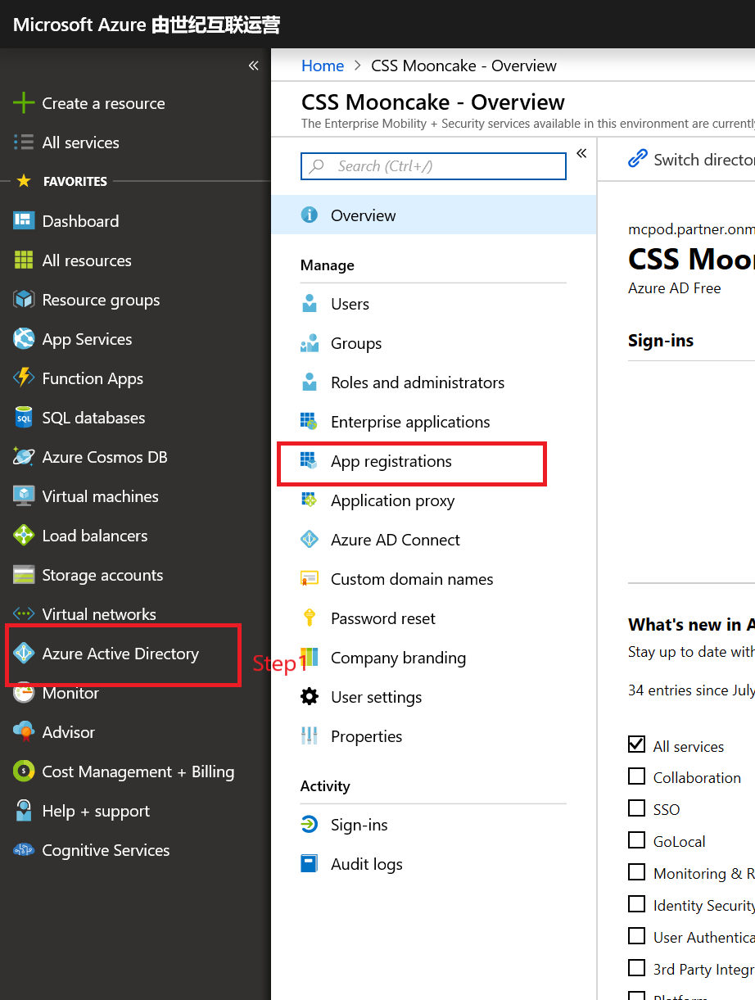
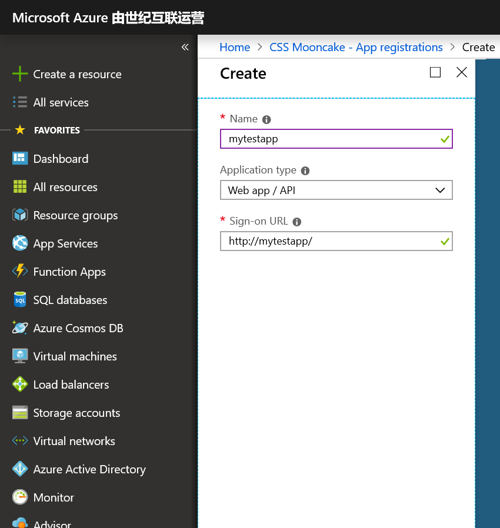
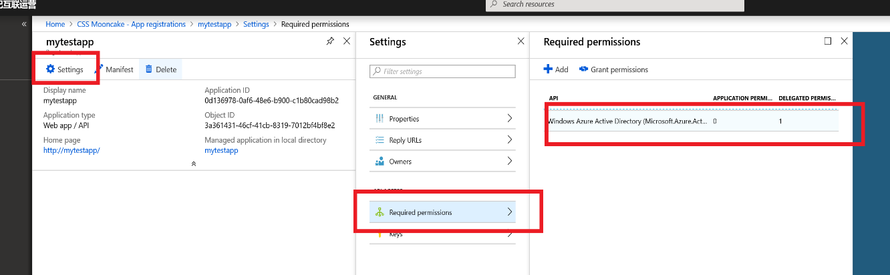
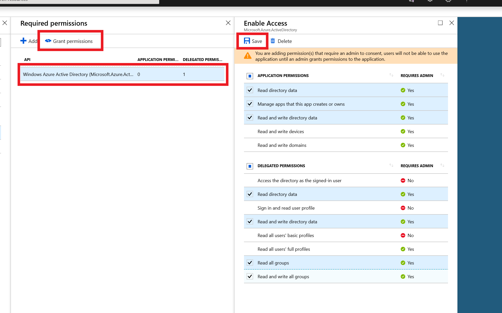
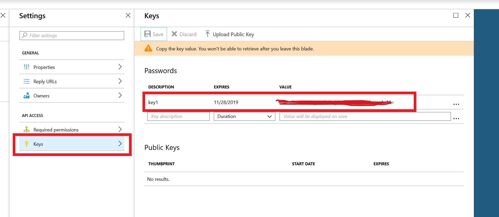
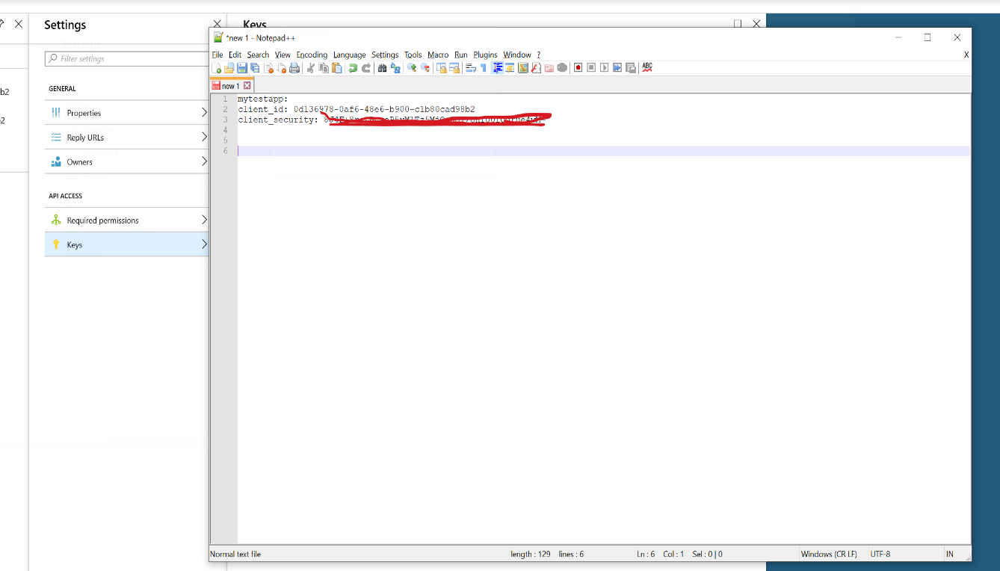
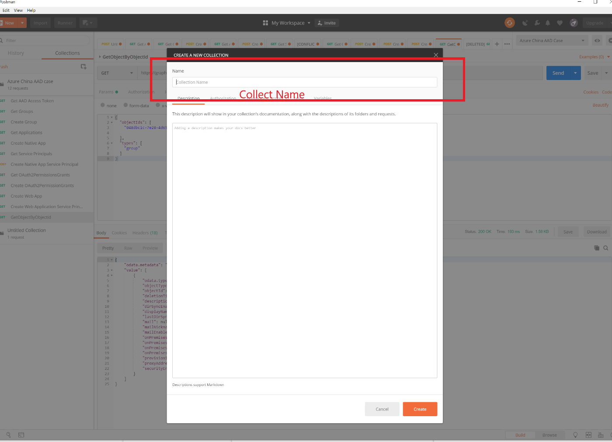
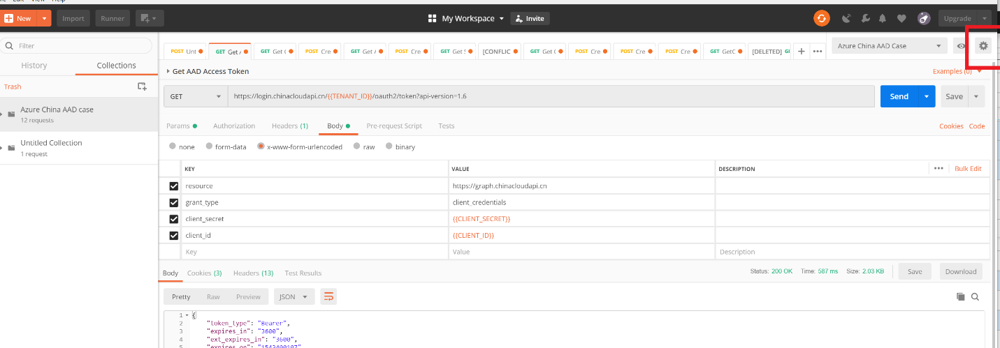
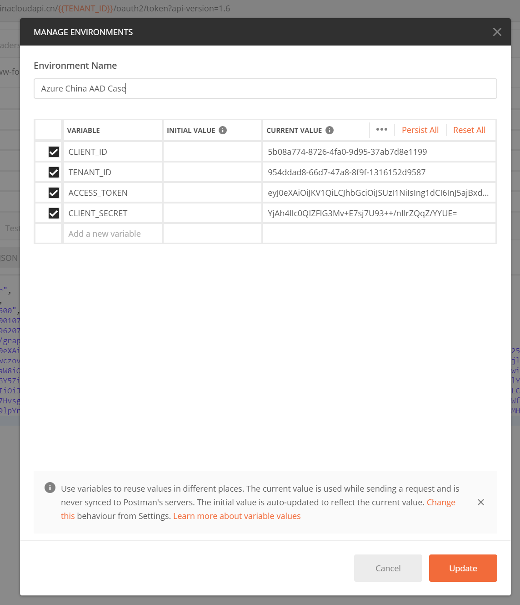
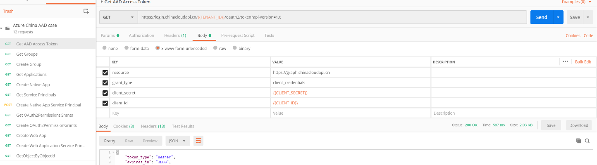

# 如何用 Postman 通过 AAD Graphic API 创建应用程序并赋予权限

## 前言

当用户创建了一个 Tenant 帐号之后，用户就拥有了一个管理员账号，用户可以使用该账号登录到 Azure 门户， 然后通过门户来手动创建其需要的一切资源，这些事情都特别繁琐，如果可以直接通过脚本或者代码来实现自动化，即可以实现快速的部署和快速的管理等需求，当然对于一些应用可以使用 PowerShell 脚本快速的做到这些，但是对于应用集成，比如要使用 Azure Active Directory 集成用户的应用程序到 Azure，仅仅是 PowerShell 也特别繁琐，今天我们介绍一些小技巧和小办法，可以帮助您理解关于 Azure Active Directory 的一些基本的概念和用法。

## 需要提前准备的工具

1. 下载安装好 Postman。
2. 下载安装好 NotePad++。
3. 注册一个 Azure 订阅, 同时保存好您的管理员账号。

## 简要步骤说明

1. 拥有了一个管理员账号之后，如果想使用 Azure Active Directory 提供的 Graphic API 进行一些操作，我们需要一个代理的账号，所以第一步是注册一个应用程序, 拿到该应用程序的 ID，并赋予该应用程序权限。之所以需要注册一个应用程序，因为我们所有对于 API 的操作都使用该应用程序。
2. 拿到创建好的应用程序的应用程序 Id 和应用程序 Security Key 之后，需要取得 Access_Token, 也即对该应用程序进行一个认证，并取得授权，记录下 Access_Token。
3. 通过该 Access_Token， 使用 Postman 分别创建一个 Web/API 的应用程序和一个 Native 应用程序。
4. 通过 API 创建的应用程序, Azure Active Directory 并没有赋予该应用程序 Service Principal，所以这一步我们需要为该应用程序创建并赋予 Service Principal。
5. 只有在拿到了 Service Principal 之后，我们才可以对新创建的应用程序赋予权限，这一步首先拿到需要被赋予的权限的 Object Id。
6. 使用 API 对新创建的应用程序赋予权限。
7. 通过 Azure 门户验证新创建的应用程序权限。

## 详细步骤

### 准备工作

1. 创建应用程序，并授权。

    1. 使用管理员账号登录 Azure 门户，选择左侧导航栏的 “Azure Active Directory”， 然后在概述页面选择 “应用注册”， 如下图：

        

    2. 选择 “新应用程序注册”， 如下图，名称: mytestapp，应用程序类型: 选择 Web/API， 登录 URL : <http://mytestapp/> ，这里说明一下，因为该应用程序是创建出来用于操作 API 的，所以我们无需在这里指定一个实际的登录 URL，这个 URL 更多的是用于作为一个唯一标识。

        

    3. 注册好 mytestapp 之后，需要对该应用程序授权。选择 “设置”， 然后在 “设置” 页面选择 “所需权限”，可以看到默认已经有一个权限项了 “Windows Azure Active”， 如下图：

        

    4. 点击该默认权限后，出现“启用访问权限”， 这里是具体的权限项，根据需要，请选择您需要的权限，然后 “保存”，

        > [!NOTE]
        > 保存了之后，并未完成授权，授权需要点击按钮 “授予权限”，如下图：

        

    5. 给 mytestapp 创建可以访问的 key，在设置页面，选择密钥， 然后直接在栏目里填写 key 的名字，自动会生成一个 key， 注意这个 key 只在第一次生成的时候会显示，所以要在点击 “保存” 之后，立即要保存下来。如下图：

        

        到这一步，请记录下您创建的 "mytestapp" 的应用程序 ID，和刚刚创建的 key 的加密字符串，同时我们也对该应用程序进行了授权。可以使用 notepad++ 将刚刚的信息记录下来，作为一个好习惯，后面有一些信息均可以通过 notepad++ 记录。如下图：

        

2. 设置 Postman

    Postman 是一个非常好的工具，可以对基于 Web 的系统发出各种测试，下载安装好 Postman 之后，我们需要一些小技巧来设定 Postman， 从而让 Postman 更好用。

    这里主要的设定是三步，创建一个 Collection， 设定共享变量，添加 Request， 这三步。 一个 Collection 就是一组集合，这个集合里，可以添加相关的操作。例如我们目前对于 Azure Active Directory 的操作，那么就可以创建一个 Azure Active Directory 的 Collection.

    1. 创建 Collection，启动 Postman 之后，在界面的左侧，添加 Collection. 在弹出的界面填写一个名字就可以了，例如：Azure China AAD，就表明这个 Collection 里全是对 Azure China Active Directory 的操作。如下图：

        

    2. 设定共享变量： 变量是在整个 Collection 里共享的，各种 Request 都可以直接引用。点击右侧的设置按钮，即可以设定共享变量，在弹出的窗口里设定如下的变量：`CLIENT_ID`, `CLIENT_SECRET`, `ACCESS_TOKEN`, `TENANT_ID` 如下图：

        

        

        > [!NOTE]
        > `CLIENT_ID` 是上一步我们创建的应用程序 ID;
        > `CLIENT_SECRET` 是我们创建的 key security;
        > `TENANT_ID` 就是您的租户 ID;
        > `ACCESS_TOKEN` 目前为空。

    3. 添加 Request， 在 Postman 的左侧，选择菜单 “Add Request”，如下图，根据请求的不同设定不同的 request url, header， 起一个容易记忆的名字。即完成了 Postman 的设定，同时要注意共享变量的引用，采用 `{{变量名}}` 的形式引用。如下图（下图是我已经创建好的 Request）：

        

    到这一步，我们有一个可以使用的应用程序，有该应用程序的 ID,KEY，同时也对该应用程序赋予了权限，另外我们已经有一个可以工作的 Postman，同时也启动了 notepad++ 作为辅助工具。剩下的工作，我们都是要通过新建 Postman Request 来完成。因此下面的步骤会详细的解释，Postman 的 Request 的参数，包括 header,body 等等。

### 第二部分

取得 Access Token，通过 API 创建应用程序，并赋予应用程序权限。

1. 取得 Access Token， 向 Postman Collection 创建新的 Request：

    - 命名：`Get AAD Access Token`
    - 请求方法：`GET`
    - 请求 endpoint: `<https://login.chinacloudapi.cn/{{TENANT_ID}}/oauth2/token?api-version=1.6>`
    - 请求的 body:
        - 类型：x-www-form-urlencoded
        - 键值对：
            - client_id:{{CLIENT_ID}}
            - client_secret:{{CLIENT_SECRET}}
            - resource: <https://graph.chinacloudapi.cn>
            - grant_type: client_credentials

    点击 **send**, 返回结果示例如下：

    ```json
    {
        "token_type": "Bearer",
        "expires_in": "3600",
        "ext_expires_in": "3600",
        "expires_on": "1543400107",
        "not_before": "1543396207",
        "resource": "https://graph.chinacloudapi.cn",
        "access_token": "eyJ0eXAiOiJKV1QiLCJhbGciOiJSUzI1NiIsIng1dCI6InJ5ajBxdFlSd0M2QUxqRzRSb253X0NySVFCNCIsImtpZCI6InJ5ajBxdFlSd0M2QUxqRzRSb253X0NySVFCNCJ9.eyJhdWQiOiJodHRwczovL2dyYXBoLmNoaW5hY2xvdWRhcGkuY24iLCJpc3MiOiJodHRwczovL3N0cy5jaGluYWNsb3VkYXBpLmNuLzk1NGRkYWQ4LTY2ZDctNDdhOC04ZjlmLTEzMTYxNTJkOTU4Ny8iLCJpYXQiOjE1NDMzOTYyMDcsIm5iZiI6MTU0MzM5NjIwNywiZXhwIjoxNTQzNDAwMTA3LCJhaW8iOiJZMlJnWUdCdmNmNHV6S3c1TDJBK3U1cklEM2xPQUE9PSIsImFwcGlkIjoiNWIwOGE3NzQtODcyNi00ZmEwLTlkOTUtMzdhYjdkOGUxMTk5IiwiYXBwaWRhY3IiOiIxIiwiaWRwIjoiaHR0cHM6Ly9zdHMuY2hpbmFjbG91ZGFwaS5jbi85NTRkZGFkOC02NmQ3LTQ3YTgtOGY5Zi0xMzE2MTUyZDk1ODcvIiwib2lkIjoiZmMyNTIyYTYtM2Q1OC00N2EwLWFlZWEtMjQyYzkzZGE0NWU2Iiwicm9sZXMiOlsiRGlyZWN0b3J5LlJlYWQuQWxsIiwiRGlyZWN0b3J5LlJlYWRXcml0ZS5BbGwiLCJBcHBsaWNhdGlvbi5SZWFkV3JpdGUuT3duZWRCeSJdLCJzdWIiOiJmYzI1MjJhNi0zZDU4LTQ3YTAtYWVlYS0yNDJjOTNkYTQ1ZTYiLCJ0aWQiOiI5NTRkZGFkOC02NmQ3LTQ3YTgtOGY5Zi0xMzE2MTUyZDk1ODciLCJ1dGkiOiJYMWRjcVExb1BVeUNBQ0V4MmZaQkFBIiwidmVyIjoiMS4wIn0.YfHErGmwZ_pWe4a7Hvsg3GrBkFSH-xBliKvKeN9_FkwTVQ1dGdatjHpzWS9KI1u0661dy6huL0tcp9VP6UMYaERpBXX8Z_8evVMDZmX588S_aqhHOdcovoTBBHYeNaalmWfZT1gFZOVyhQO1OvQSmeOtCVyeaY7FgvVskG4ig8Mope-z5EMyrTyyRwvNO3vie_Y3uI7ToY-sss65xpOLW05y-Z9lpYrxKuEPdHLMqp51DrWmRwMryPTqIaj_p09wDAjVtJLCuvcy_zBrYQaavEKb9L7cwnlgWUQNRlfAZRHYVZoFse6vzKnKhz98W1dPTpuxy2l9hoWPMHBu738Rmw"
    }
    ```

    拷贝 `access_token`, 点击 Postman Setting 按钮，更新上述步骤所设置的 `ACCESS_TOKEN` 变量，这样其他 Request 可以共享该变量。

2. 使用 ACCESS_TOKEN， 创建 web/api 应用程序和 native 应用程序。

    1. 创建 web/api 应用程序

        - 命名：`Create Web App`
        - 请求方法：`POST`
        - 请求 endpoint: `<https://graph.chinacloudapi.cn/myorganization/applications?api-version=1.6>`
        - 请求 header:
            - Authorization: `{{ACCESS_TOKEN}}`
            - Content-Type: `application/json`
        - 请求 body 类型：`raw`
        - 请求 body 内容：

            ```json
            {
                "odata.type":"Microsoft.DirectoryServices.Application",
                "objectType":"Application",
                "availableToOtherTenants": false,
                "publicClient": false,
                "replyUrls": [
                    "http://myrootwebapp7/"
                ],
                "displayName":"myrootwebapp7",
                "homepage": "http://myrootwebapp7/",
                "identifierUris": [
                    "https://mcpod.partner.onmschina.cn/813ef8cc-69b5-43b4-b1b5-bc86b78792f5"
                ],
                "requiredResourceAccess": [
                {
                    "resourceAppId": "00000002-0000-0000-c000-000000000000",
                    "resourceAccess": [
                    {
                        "id": "311a71cc-e848-46a1-bdf8-97ff7156d8e6",
                        "type": "Scope"
                    },
                    {
                        "id": "5778995a-e1bf-45b8-affa-663a9f3f4d04",
                        "type": "Role"
                    },
                    {
                        "id": "78c8a3c8-a07e-4b9e-af1b-b5ccab50a175",
                        "type": "Role"
                    },
                    {
                        "id": "b55274d3-3582-44e3-83ae-ed7873d1111d",
                        "type": "Role"
                    },
                    {
                        "id": "5778995a-e1bf-45b8-affa-663a9f3f4d04",
                        "type": "Scope"
                    },
                    {
                        "id": "78c8a3c8-a07e-4b9e-af1b-b5ccab50a175",
                        "type": "Scope"
                    },
                    {
                        "id": "6234d376-f627-4f0f-90e0-dff25c5211a3",
                        "type": "Scope"
                    },
                    {
                        "id": "970d6fa6-214a-4a9b-8513-08fad511e2fd",
                        "type": "Scope"
                    }]
                }]
            }
            ```

        > ![!NOTE]
        > `ReplyUrls` 即登录之后的 URL， `DisplayName` 是应用名字。`Homepage` 该 Web 应用的首页，`IdentifierUris` 这个唯一的非常重要，可以自己起一个。
        > `RequiredResourceAccess` 这个就是我们想给该 Web 应用要赋予的权限，如何取得这个权限的内容，还记得我们在第一步的时候，通过门户授予权限么？ 在那个界面，选择 mainfest, 即可以得到这个部分的内容。

        点击 **send** 按钮创建 web/api 应用程序。

    2. 创建 native app， 和 web/api 只有在 body 这里不一样。请参考如下的 body 内容：

        ```json
        {
            "odata.type":"Microsoft.DirectoryServices.Application",
            "objectType":"Application",
            "availableToOtherTenants": false,
            "publicClient": true,
            "replyUrls": [
            "http://localhost/"
            ],
            "displayName":"myrootapp7",
            "requiredResourceAccess":[]
        }
        ```

        不一样的地方 Publicclient: true， homepage 和 IdentifierUris 都不需要。RequiredResourceAccess 是一样的。

3. 使用创建好的应用程序 ID 来为该应用程序创建 Service Principal

    - 命名：`Create Service Principal`
    - 请求方法：`POST`
    - 请求 URL: `<https://graph.chinacloudapi.cn/myorganization/servicePrincipals?api-version=1.6>`
    - 请求 HEADER：
        - Authorization: `{{ACCESS_TOKEN}}`
        - Content-Type: `application/json`
    - 请求 body 类型： `raw`
    - 请求 body 内容：

        ```json
        {
            "odata.type":"Microsoft.DirectoryServices.ServicePrincipal",
            "objectType":"ServicePrincipal",
            "appId":"41a02f6a-a36d-4c95-95a6-e3fa0fd98c14",
            "displayName":"myrootwebapp7",
            "servicePrincipalNames":[
                "41a02f6a-a36d-4c95-95a6-e3fa0fd98c14"
            ],
            "servicePrincipalType":"Application",
            "tags":[
            "WindowsAzureActiveDirectoryIntergratedApp"
            ]
        }
        ```

    > [!NOTE]
    > 为 web/api 创建 Service Principal 去掉参数：`ServicePrincipalNames`。

    创建 Service Principal 成功后，记录下该 Service Principal 的 Object ID。

4. 取得要赋予权限的 Service Principal 的 Object ID

    返回检查第二步创建应用程序时的定义，这里有一个 Resource 的 ResourceAppId：

    "resourceAppId": "00000002-0000-0000-c000-000000000000",

    其实这就是我们权限应用程序的 Resource ID, 我们要根据这个 id，取得该权限 Resource 的 Service Principal 然后得到其 Object ID。

    - 命名：Get Service Principals
    - 请求方法：GET
    - 请求 URL: <https://graph.chinacloudapi.cn/myorganization/servicePrincipals?api-version=1.6&$filter=appId+eq+'00000002-0000-0000-c000-000000000000'>

        > [!NOTE]
        > 此处参数为该 Resource App Id。

    - 请求头：
        - Authorization: {{ACCESS_TOKEN}}
        - Content-Type: application/json

    发送请求之后，拿到 Object ID。

5. 使用新建的应用程序的 Service Principal 的 Object ID 和权限应用程序的 Service Principal 的 Object ID， 为该新建的应用程序赋予权限， 一定要注意这里的都是 Service Principal 的 Object ID, 而不是对应的应用程序, 即应用程序的 Service Principal 的 Object ID ， 和权限的 Service Principal 的 Object ID。

    - 命名：Create OAuth2PermissionGrants
    - 请求方法：POST
    - 请求 URL： <https://graph.chinacloudapi.cn/myorganization/oauth2PermissionGrants?api-version=1.6>
    - 请求头：
        - Authorization: {{ACCESS_TOKEN}}
        - Content-Type: application/json
    - 请求 body 类型：raw
    - 请求 body 内容参考：

    ```json
    {
        "odata.type":"Microsoft.DirectoryServices.OAuth2PermissionGrant",
        "clientId":"4168b804-651e-4bdb-9098-1a8bfa81690c",
        "consentType":"AllPrincipals",
        "principalId":null,
        "resourceId":"e81f0642-6c06-410b-b67d-1737e4a01618",
        "scope":"Directory.AccessAsUser.All",
        "startTime":"0001-01-01T00:00:00",
        "expiryTime":"9000-01-01T00:00:00"
    }
    ```

    > [!NOTE]
    > 此处 clientId 是应用程序的 Service Principal 的 Object ID，resourceId 是权限的 Service Principal 的 Object ID。

    至此，我们完成了全部的动作，但是这里有一些要注意的是：

    > [!NOTE]
    > 1. 权限赋予是在 Service Principal 之间进行的。
    > 2. 新建应用程序的时候就需要指定正确的权限。
    > 3. 权限也是一个 Resource，它也有自己的 Service Principal。

6. 验证权限：只需登录到门户，查询到该应用程序，然后进入设置，所需权限，查看权限是否已经被成功赋予。

## 参考文档

- [Entity and complex type reference | Graph API reference](https://msdn.microsoft.com/library/azure/ad/graph/api/entity-and-complex-type-reference#)
- [Azure AD How To Create OAuth2PermissionGrant using Graph API](https://blogs.msdn.microsoft.com/arsen/2017/07/30/azure-ad-how-to-create-oauth2permissiongrant-using-graph-api-grant-permissions-and-consent-for-application/)