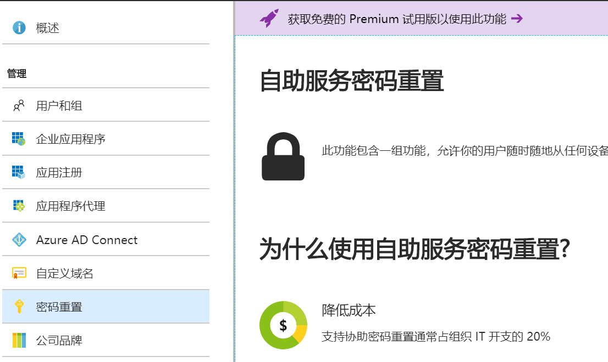
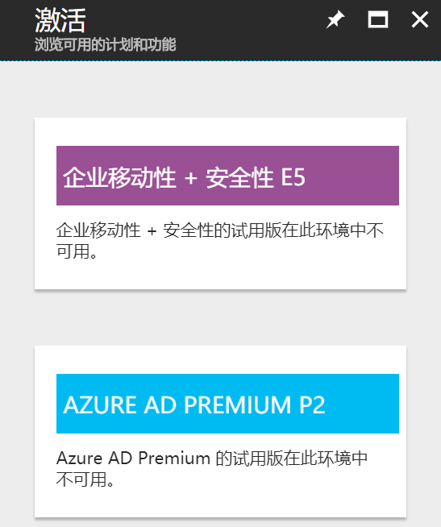
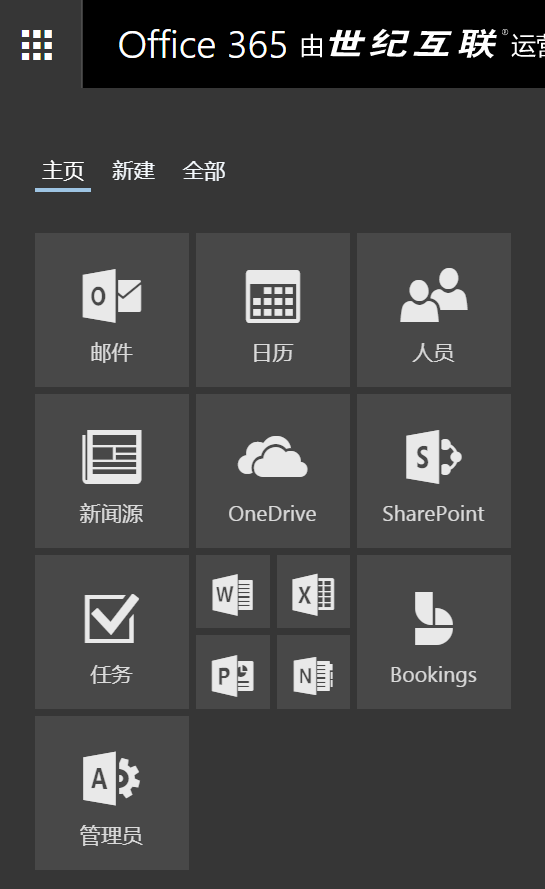
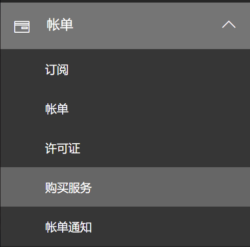
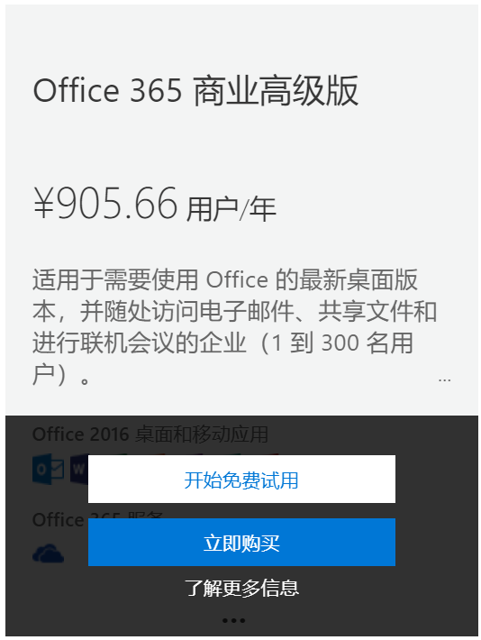
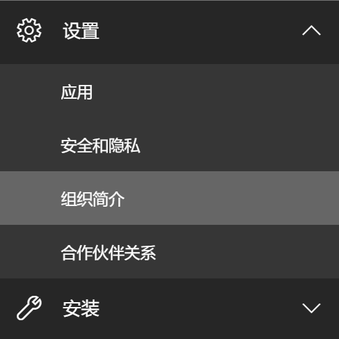
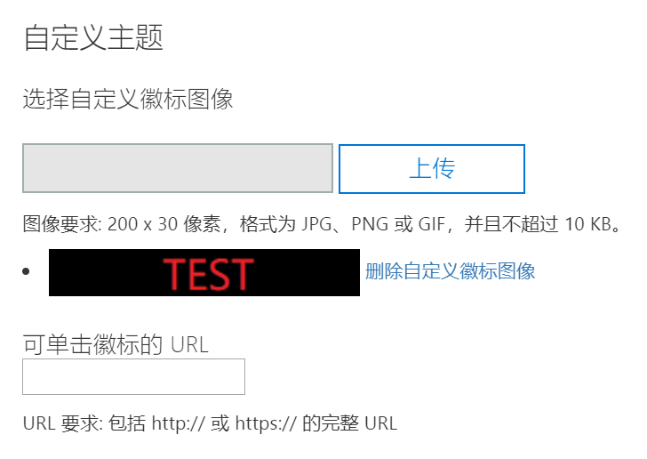
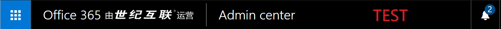
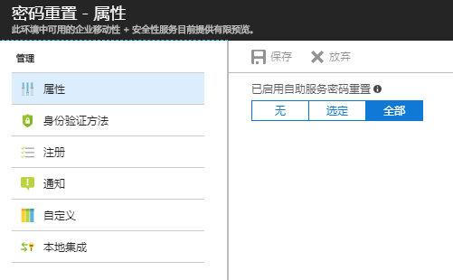
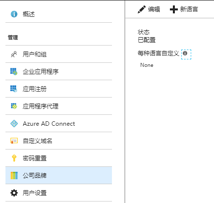

# 如何为中国区 Azure AD 开启自定义公司品牌和用户自助密码重置功能

自定义公司品牌允许用户使用自己的公司徽标和自定义的颜色方案来自定义登录页外观。 
自助密码重置允许用户自助重置或解锁其密码或帐户，而不需要 Azure AD 管理员的介入（ Azure AD 管理员始终能重置自己账号的密码）。

由于中国区的 Azure AD 只支持有限功能的免费版，许多 Azure AD 的功能在中国区无法实现。在 Azure 管理门户中，用户可能会发现点击对应的功能时，门户显示需要 Premium 试用版：

如果点击紫色链接，或下方的 “获取免费高级试用版” 按钮，门户会提示 Azure AD 高级试用版在此环境中不可用。

虽然这两个功能无法从 Azure 侧开启，但是由于 Office 365 与 Azure 使用的是同一套 Azure AD ，这两个功能可以通过购买或试用 Office 365 商业高级版订阅开启。

## 详细步骤

1. 使用 Azure AD 全局管理员登录 [Office 365 门户](https://portal.partner.microsoftonline.cn)。

2. 在左侧菜单中选择 “管理员” 按钮。

    

3. 在左侧菜单中，选择 “账单” -> “购买服务”。

    

4. 选择 Office 365 商业高级版并点击开始免费使用。

    

5. 当 Office 365 订阅购买完成后，回到 Office 365 管理员界面，在左侧菜单中选择 “设置” -> “组织简介”。

    

6. 选择管理您组织的 “自定义主题”，并上传任意符合格式要求的图片，点击 “保存”。

    

7. 当图片上传完成后，确认 Office 365 页面上方的徽标图像已经变化为上传的图片。

    

8. 由于 Office 365 的这个功能与 Azure AD 中的自定义公司品牌为同一个服务，在 Office 365 门户中进行配置会开启在 Azure AD 中的此功能。不过需要注意的是，Azure AD 中的服务开启需要较长时间，一般预计开启完成需要 24 小时。

9. 登录 [Azure 门户](https://portal.azure.cn)，查看对应功能是否已经开启。

    
    

## 相关功能文档

- [快速入门： 在 Azure AD 登录页中添加公司品牌元素](https://docs.microsoft.com/zh-cn/azure/active-directory/customize-branding)
- [Azure AD 自助密码重置快速部署](https://docs.microsoft.com/zh-cn/azure/active-directory/active-directory-passwords-getting-started)
