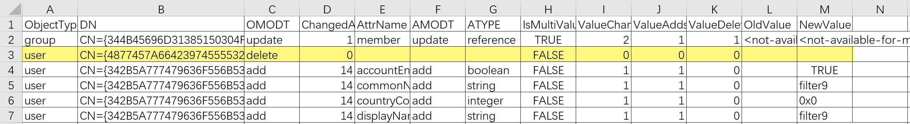

# 如何验证待同步至 Azure Active Directory 中的待删除用户信息

## 问题描述

在对本地域中用户、同步规则等作出修改后，在将更改应用至 Azure Active Directory(以下简称 AAD) 之前，我们可以[导出所有更改信息，验证更改是否正确](https://docs.azure.cn/zh-cn/active-directory/connect/active-directory-aadconnectsync-configure-filtering#%E5%BA%94%E7%94%A8%E5%B9%B6%E9%AA%8C%E8%AF%81%E6%9B%B4%E6%94%B9-a-nameapply-and-verify-changesa)。但在导出后的文件只能查看到待删除用户的 GUID，无法获得用户的 `display name`, `UPN` 等信息，以验证待删除用户是否正确。



## 解决方法

在 AAD Connect 运行了 Full Synchornization 之后，将更改应用至 AAD 之前，AAD Connector Space 中仍然保存了待删除用户上次同步/导入后的信息。因此用户可以在安装了 AAD Connect 的虚拟机中通过 PowerShell 命令 `Get-ADSyncCSObject`，根据 `csexport` 导出文件中的用户 GUID 查询 AAD Connector Space 中的详细用户信息。

示例脚本如下，用户可以根据需求更改想要显示的属性

```powershell
#custom object
function User()
{
    param ($UPN,$name,$CN)

    $user = new-object PSObject

    $user | add-member -type NoteProperty -Name UserPrincipalName -Value $UPN

    $user | add-member -type NoteProperty -Name DisplayName -Value $name

    $user | add-member -type NoteProperty -Name DistinguishedName -Value $CN

    return $user
}

$connectName = "xxxxxxxx.onmschina.cn - AAD"
$result = New-Object -TypeName System.Collections.ArrayList

$xmldatadelete = [xml](Get-Content C:\Users\contoso\Desktop\delUsers.xml)

#获取即将被删除的 user CN list
$todelete = $xmldatadelete.'cs-objects'.'cs-object'| Where-Object { $_.'export-delta-operation' -match "delete" }

#遍历每一个 user
foreach($user in $todelete){

    #根据 CN 获取 AAD connector space 中留存的 user info
    $CN = $user.'cs-dn'
    $object = Get-ADSyncCSObject -DistinguishedName $CN -ConnectorName $connectName

    #获取 user 属性，本例中选择了 UPN, display name
    $xml = $object.SerializedXml
    $xmldata = [xml]$xml
    $info = $xmldata.'cs-objects'.'cs-object'.'synchronized-hologram'.entry.attr
    $UPNattr = $info | Where-Object { $_.Name -match "userPrincipalName" }
    $userUPN = $UPNattr.value
    $nameattr = $info | Where-Object { $_.Name -match "DisplayName"}
    $userName = $nameattr.value
    $todeleteuser = user -UPN $userUPN -name $userName -CN $CN
    $result.Add($todeleteuser)
}

#输出至 txt 文件中
$result | Out-File C:\todeleteusers.txt
```

## 相关文档

- [查看同步服务待导出的更改](https://docs.microsoft.com/zh-cn/azure/active-directory/hybrid/how-to-connect-sync-operations#verify)
