# 如何对中国区 Azure 分析服务模型进行异步刷新

## 问题描述

中国区 Azure 的官方文档中并没有如何对 Azure 分析服务(以下简称 AAS)模型进行刷新的介绍：

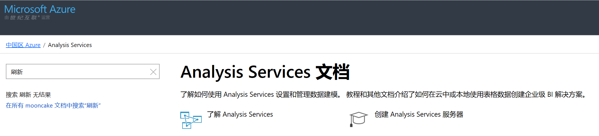

客户如若希望对 AAS 模型执行异步刷新，可参考以下文档并对相应的 URI 做一些修改：

- [使用 REST API 进行刷新](https://docs.microsoft.com/zh-cn/azure/analysis-services/analysis-services-async-refresh)

由于上述文档是针对国际版 Azure，若要适用于中国区 Azure 需参考以下文档修改 URI：

- [中国区 Azure 应用程序开发说明](https://docs.azure.cn/zh-cn/articles/guidance/developerdifferences)

## 操作步骤

客户可以参考以下示例执行模型的异步刷新：

1. 参照文档：[Azure Analysis Services - Adventure Works 教程](https://docs.azure.cn/zh-cn/analysis-services/tutorials/aas-adventure-works-tutorial) 内容，部署名为 “stanleysqldb1400”，数据源为 Azure SQL 数据库的 AAS 模型。Management Studio 上查得表 dbo.Products 的记录如下：

    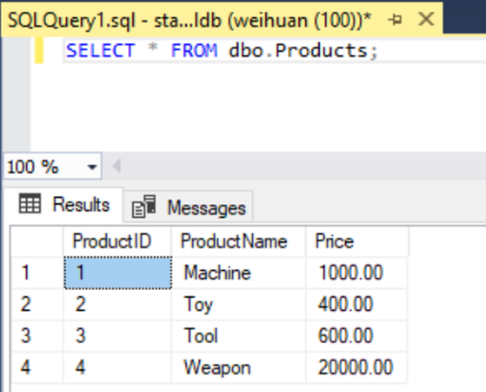

    在 Power BI 桌面版上用 connect live 方式连接 AAS 数据库后，查到的此表结果如下：

    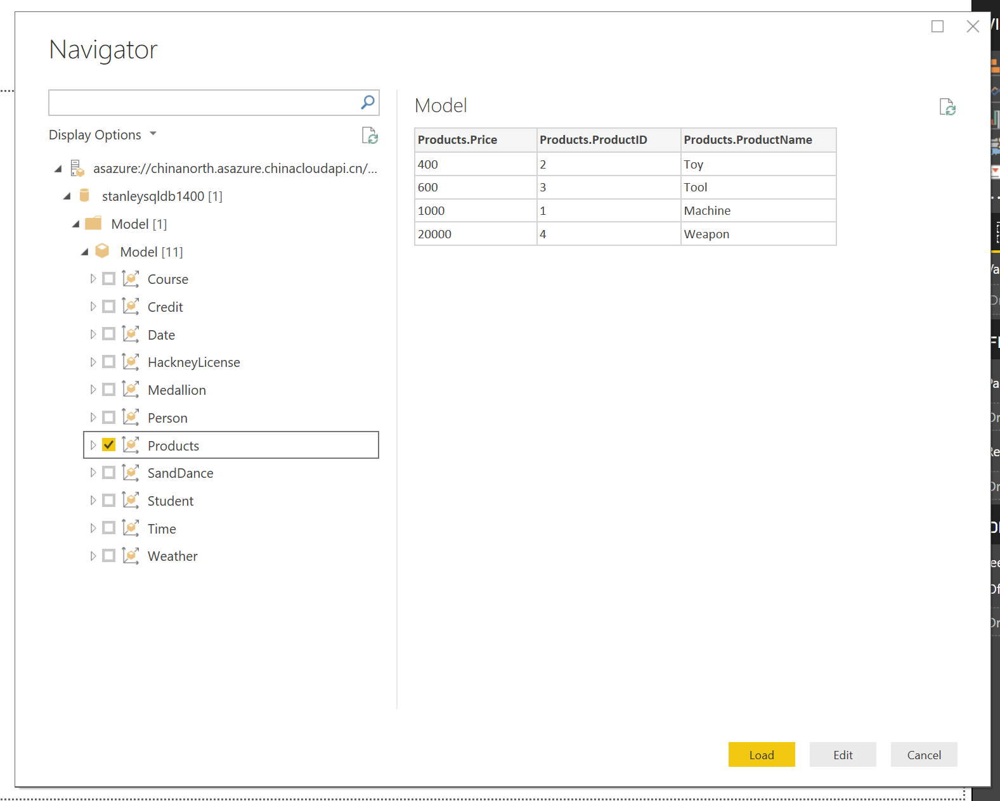

    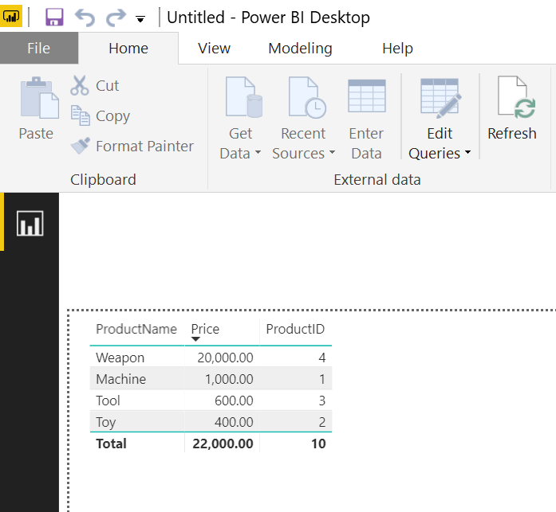

2. 参照文档：[使用 REST API 执行异步刷新](https://docs.microsoft.com/zh-cn/azure/analysis-services/analysis-services-async-refresh) 执行以下操作：

    1. 在 Azure 门户上注册 AAD 本机应用，重定向 URI 填入 `urn:ietf:wg:oauth:2.0:oob`。

        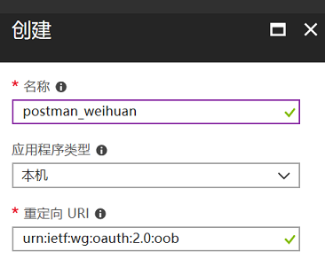

    2. 记录应用程序 ID：

        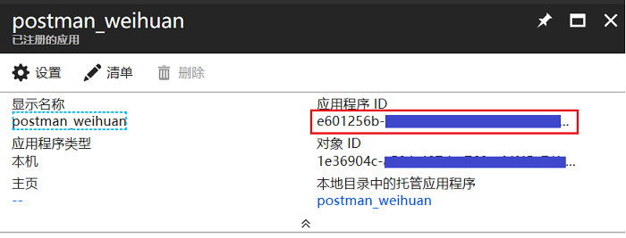

    3. 设置所有者和添加 Azure Analysis Services 权限：

        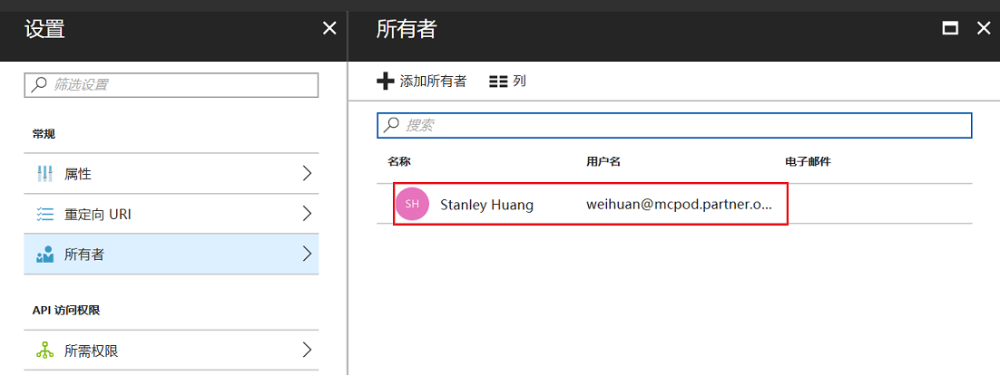

        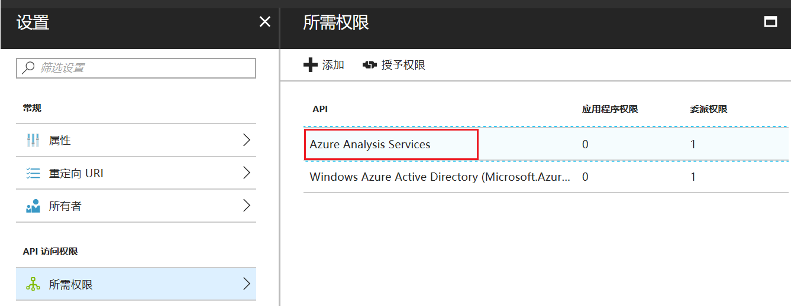

3. 从 [Analysis Services](https://github.com/Microsoft/Analysis-Services) 处下载示例代码，打开 RestApiSample 并做以下更改：

    1. 将代码中所有的 `windows.net` 均改为 `chinacloudapi.cn`；

        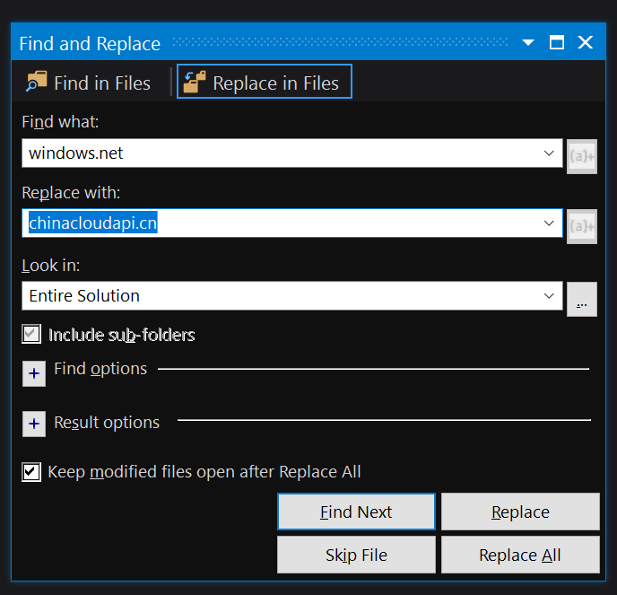

    2. 填入 base url，格式如下所示：

        ```
        https://chinanorth.asazure.chinacloudapi.cn/servers/<server_name>/models/s<model_name>/
        ```

        

    3. 更新之前记录的应用 ID：

        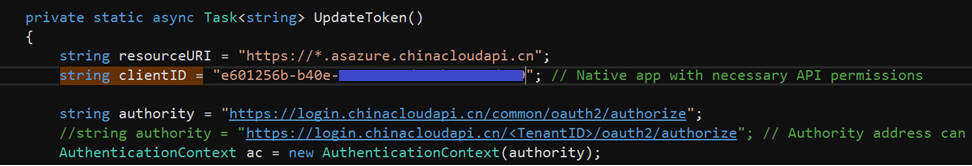

    4. 点击 Tools > NuGet Package Manager > Package Manager Console 执行以下命令，然后再 build:

        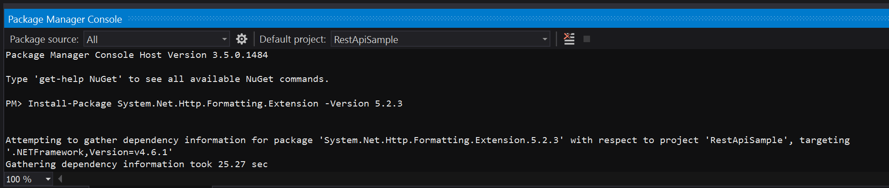

        然后对 dbo.Products 表删除记录，运行 RestApiSample 等待刷新成功，便可在 Power BI Desktop 上看到刷新后的结果了：

        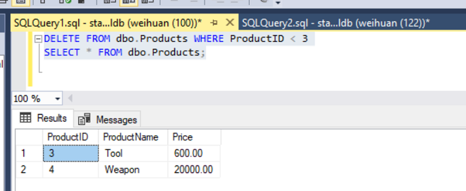

        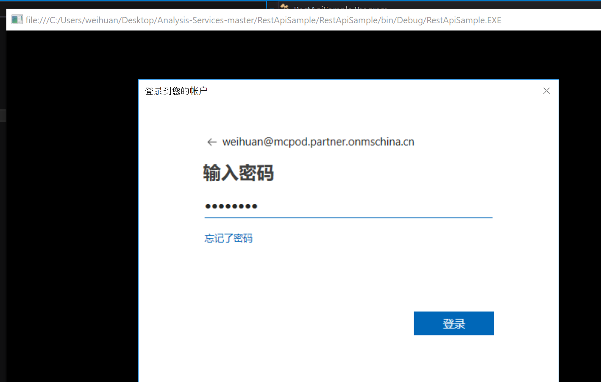

        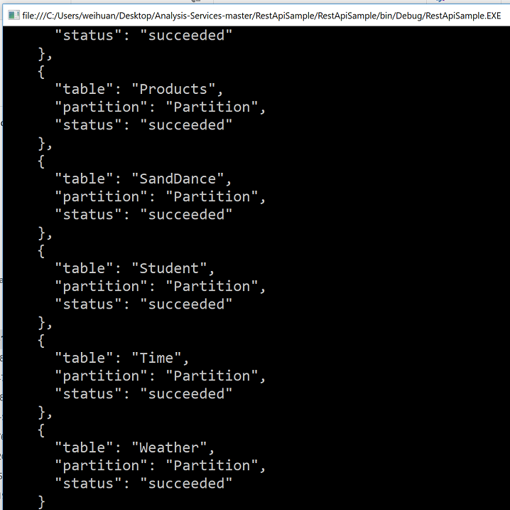

        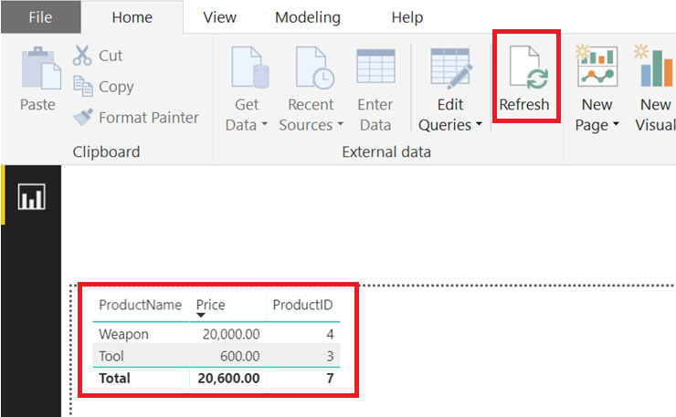
