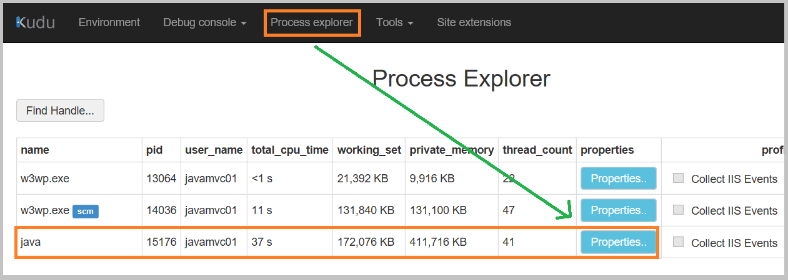
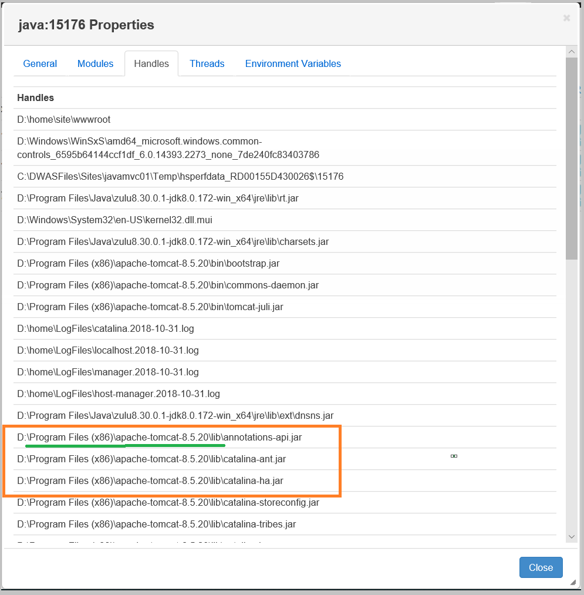
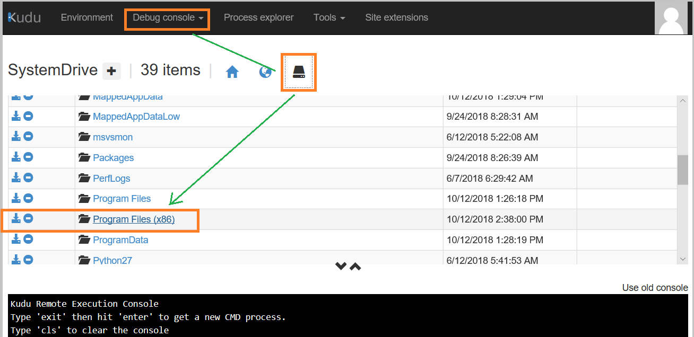
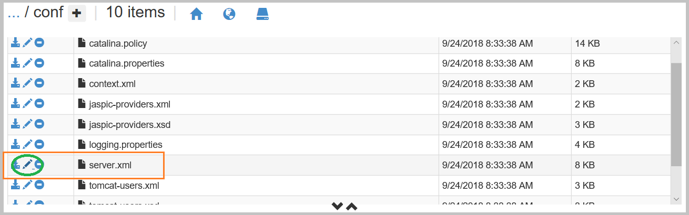

# 如何通过kudu查看/修改java tomcat服务端的配置文件 #
由于Azure App Service可以在门户中选择tomcat的版本，当我们需要查看服务端的配置文件时，可以通过以下的5个步骤来实现：

1. 登陆kudu
![login-kudu] (media/aog-app-howto-modify-with-kudu/login-kudu.png "login-kudu")
    
    有如下两种方式登陆kudu\
        a.  在当前web 应用的URL 中加入 .scm [插入位置在site名与chinacloudsites之间]\
        b.  在当前web 应用的Azure门户中操作，点击 **“ 开发工具 -> 高级工具 -> 转到 ”** 及可进入kudu页面

2. 查看当前java 进程信息，获取到当前tomcat 路径

   点击Process Expolorer 在java的进程上点击 Properties 查看详细信息
   

    这一步中，获取到当前tomcat的路径为D:\Program Files (x86)\apache-tomcat-8.5.20 文件夹

3. 通过Debug console导航并进入到服务端的配置文件夹

    
    逐步点击，找到conf文件夹

4. 点击文件名边的编辑按钮，查看及修改文件内容

5. 保存并重启site
