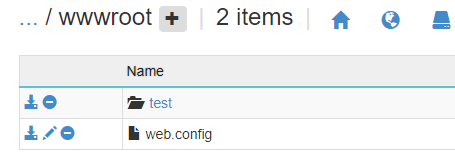

# 如何配置网站 Always ON 的默认访问 URL

## 问题描述

如果网站开启了 Always ON 特性，则后台会默认访问网站的根目录来保障网站进程不被卸载，如何配置后台访问其它路径。

## 问题现象

如果我们部署了一个 API 服务，网站的根路径本身就是没有内容的，这样开启 Always ON 特性后，会看到一些和 `40x` 相关的错误日志。

## 解决方法

如果想让后台的 Always ON 功能访问其它路径，则需要配置 web.config 如下：

```XML
<?xml version="1.0" encoding="UTF-8"?>
<configuration>
  <system.webServer>
       <rewrite>
            <rules>
                <rule name="For user agent AlwaysOn and Root of site" stopProcessing="true">
                    <match url="^$"/>
               <conditions>
                 <add input="{HTTP_USER_AGENT}" pattern="^AlwaysOn$" />
               </conditions>
                    <action type="Rewrite" url="test/test.html" />
                </rule>
            </rules>
        </rewrite>
  </system.webServer>
</configuration>
```

其中 test/test.html 是 wwwroot 中的相对路径：

