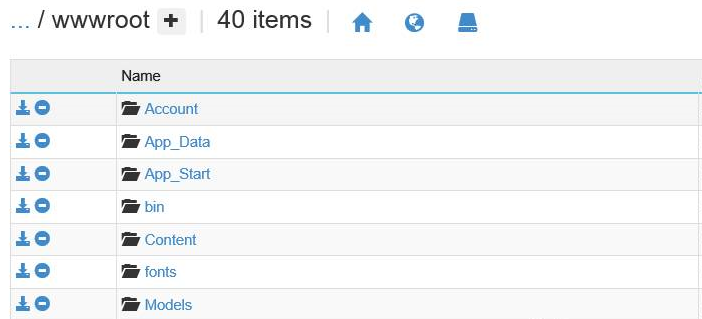
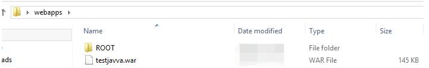
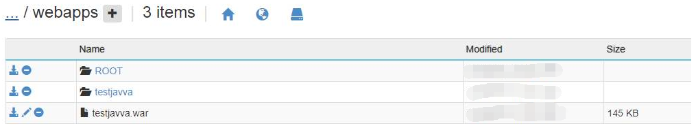

# Web 应用如何使用 PowerShell 脚本进行自动化部署

如果想要自动创建网站并进行自动部署，解决方案如下：

## 部署 .net 网站

```powershell
$DeploymentName = "test1"//此次部署的名字可以自定义
$ResourceGroupName = "test0822";//需要创建一个资源组，保证下面的存储账户以及网站在这个资源组里面
$TemplateFile = "F:/springboot/template.json"; //创建网站所需要的参数信息以及关联的其他服务的信息，这个路径是本地测试的路径，可以自定义
$ParameterFile = "F:/springboot/param.json";
$storageAccountName = "teststorage0822";//需要创建一个存储账户以及 container ，因为文件是首先上传到存储账户中之后再上传到 web app
$containerName = "msdeploypackages";
$WebDeployPackage ="F:/springbootsample.zip";//上传的文件所在的路径
$blobName = (Get-Date -Format 'ssmmhhddMMyyyy') + '-' + '-springbootsample.zip';
$StorageAccountKey = (Get-AzureRmStorageAccountKey -ResourceGroupName $ResourceGroupName -Name $storageAccountName)[0].Value;
$StorageAccountContext = (Get-AzureRmStorageAccount -ResourceGroupName $ResourceGroupName -Name $storageAccountName).Context;

Set-AzureStorageBlobContent -Blob $blobName -Container $containerName -File $WebDeployPackage -Context $StorageAccountContext

$webDeployPackageUri = (New-AzureStorageBlobSASToken -Container $containerName -Blob $blobName -Permission r -FullUri -context $StorageAccountContext).ToString();
$parameters = New-Object -TypeName hashtable;
$jsonContent = Get-Content $ParameterFile -Raw | ConvertFrom-Json;
$jsonContent.parameterValues | Get-Member -Type NoteProperty | ForEach-Object {
$parameters.Add($_.Name, $jsonContent.parameterValues.($_.Name));
};
$parameters.msdeployPackageUri = $WebDeployPackageUri;

New-AzureRmResourceGroupDeployment -ResourceGroupName $ResourceGroupName -Name $DeploymentName -TemplateFile $TemplateFile -TemplateParameterObject $parameters -Force -Verbose; //使用 New-AzureRmResourceGroupDeployment 命令进行部署
```

测试后可以在 **site/wwwroot** 目录下看到上传的文件：



## 部署 Java 网站

如果想要用上面的脚本部署 war 包，可以尝试下面的步骤：

1. 创建如下目录的文件： **webapps/ROOT** ，将 war 包放在 **webapps** 目录下，再将 **webapps** 文件夹压缩成 .zip 文件。

    

2. 再按照之前的脚本进行上传操作，可以看到已经有 war 文件包括解压后的文件。

    