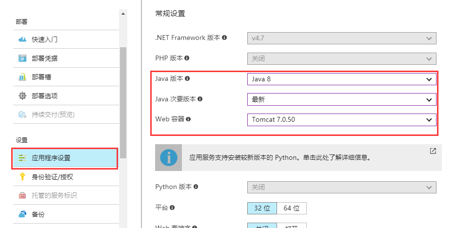
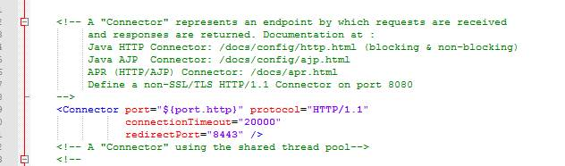
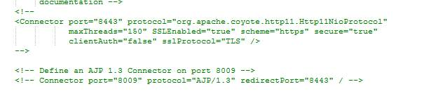
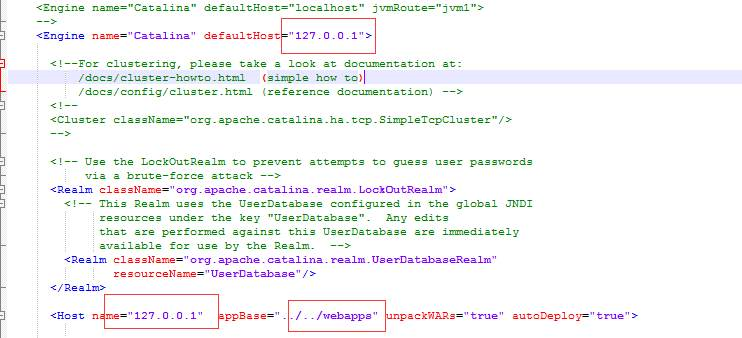
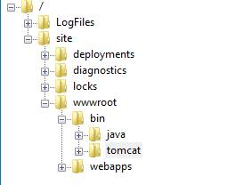

# 如何为 Web 应用配置自定义 Tomcat 环境

1. 在门户上选择打开 Java 环境，选择 JDK 版本和 Tomcat 版本。

    

2. 从官网下载要使用的 tomcat 版本，解压到本地目录。

3. 修改 `conf/server.xml` 配置文件：

    > [Tip]
    > 可以在此文件中自定义自己的配置

    1. 将 `port` 改成 `-1`：                   

        

    2. 将 `Http-connect port` 改成 `${port.http}`：

        

    3. 注释 AJP 和 HTTPS 连接

        

    4. 将 `host` 改变为 `127.0.0.1`，并将 appBase 定位到 wwwroot 下的 webapps 目录：

        若 appbase 定位的是 `../../webapps`，那项目文件应该放在 `site-->wwwroot-->webapps-->ROOT` 目录下。</br>
        若 appbase 定位的是 `webapps`，那项目文件应该放在 `/site/wwwroot/bin/apache-tomcat-<version>/webapps/ROOT`。

        

4. 修改 `conf/catalina.properties` 文件，末尾加入 `java.net.preferIPv4Stack=true`。

5. 上传 `Tomcat/java` 目录到 `site/wwwroot/bin`：

    

6. 在 `site/wwwroot` 目录下上传 web.config 内容如下：

    ```XML
    <?xml version="1.0" encoding="UTF-8"?>
    <configuration>
      <system.webServer>
        <handlers>
          <add name="httpPlatformHandler" path="*" verb="*" modules="httpPlatformHandler" resourceType="Unspecified" />
        </handlers>
        <httpPlatform processPath="%HOME%\site\wwwroot\bin\tomcat\bin\startup.bat"  arguments="">
          <environmentVariables>
            <environmentVariable name="CATALINA_OPTS" value="-Dport.http=%HTTP_PLATFORM_PORT%" />
            <environmentVariable name="CATALINA_HOME" value="%HOME%\site\wwwroot\bin\tomcat" />
            <environmentVariable name="JRE_HOME" value="D:\home\site\wwwroot\bin\java\jdk1.6.0_45\jre6" />   <!-- 这个是指定 jre 的路径-->
            <environmentVariable name="JAVA_OPTS" value="-Djava.net.preferIPv4Stack=true" />
          </environmentVariables>
        </httpPlatform>
      </system.webServer>
    </configuration>
    ```

7. 重启网站进行检查配置是否生效。