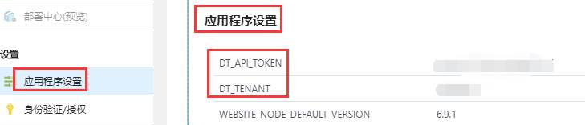
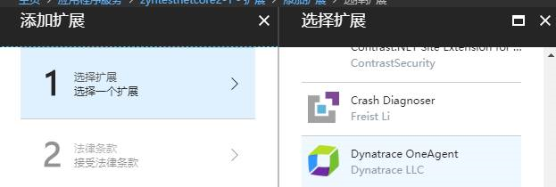
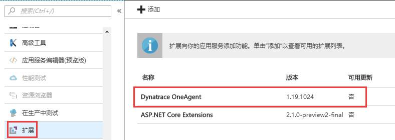
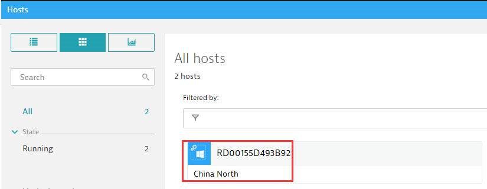
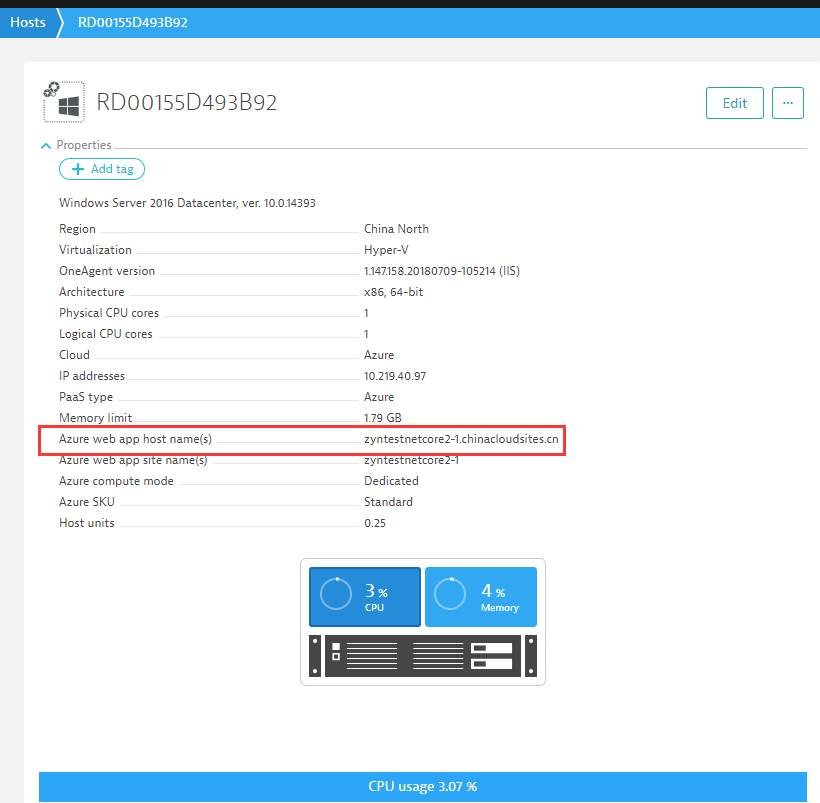

# Azure Web 应用如何配置 Dynatrace 监测

## 问题描述

Azure Web 应用作为一款 PaaS 服务，对 Host 环境的配置提供了有限的访问权限，因此您无法像往常一样直接安装 Dynatrace OneAgent。

然而，现在您可以通过安装 Dynatrace 扩展的方式进行实现。

## 操作步骤

请通过以下步骤进行配置：

1. 注册一个 Dynatrace 账户并登录。
2. 登录进去之后选择 **Deploy Dynatrace** -> **Set up PaaS integration**，在跳转出来的页面找到 `Environment ID` 以及 `PaaS token`。
3. 在门户网站的应用程序设置界面，添加 `DT_TENANT`（就是 `Environment ID`）和 `DT_API_TOKEN` （`PaaS token`），添加完之后点击页面的 **保存** 按钮。

    

4. 在 [Azure 门户](https://portal.azure.cn)页面点击 **扩展** 选项，点击 **添加**，在跳转出来的页面找到 Dynatrace 进行添加。

    

    添加好了之后可以在扩展页面看到：

    

    > [!NOTE]
    > 一定要先配置 `Environment ID` 以及 `PaaS token` 再安装扩展，若顺序颠倒会提示安装失败。

5. 上述步骤完成之后，在 Azure 门户上重启 Web 应用。

6. 返回到 Dynatrace，点击 **dashboard** -> **host* 会出现所连接的主机。

    

    点击截图中的选项就可以看到监测的网站的信息：

    

## 参考文档

- [如何监测 Azure Web 应用](https://www.dynatrace.com/support/help/cloud-platforms/azure/how-do-i-monitor-microsoft-azure-web-apps/)