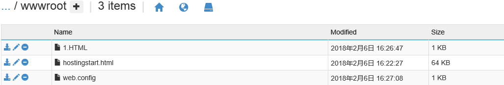
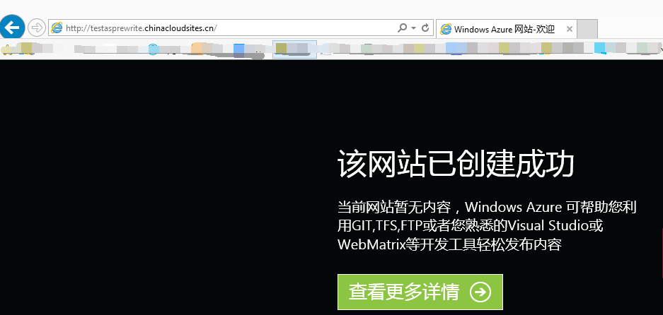
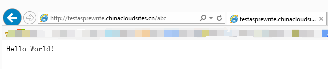

# Web 应用如何配置伪静态

在 Azure 平台上，可以通过 URL Rewrite 的机制实现。它的配置是基于相关站点的 web.config 文件配置实现的。
 
基于 ASP .NET 进行如下测试：

1. 在根目录下，上传 web.config 文件，设置 Rewrite URL 为 1.HTML:

    > [!NOTE]
    > 此处的 1.HTML 静态网页为输出 Hello World！的测试页面。

    ```xml
    <?xml version="1.0" encoding="UTF-8"?>
    <configuration>
    <system.webServer>    
        <rewrite>
                <rules>
                    <rule name="Main Rule" stopProcessing="true">
                        <match url=".*" />
                        <conditions logicalGrouping="MatchAll">
                            <add input="{REQUEST_FILENAME}" matchType="IsFile" negate="true" />
                            <add input="{REQUEST_FILENAME}" matchType="IsDirectory" negate="true" />
                        </conditions>
                        <action type="Rewrite" url="1.HTML" />
                    </rule>
                </rules>
            </rewrite>
    </system.webServer>
    </configuration>
    ```

2. site --> wwwroot 目录下，1.HTML 即为要处理的页面：

    


3. 访问 URL：`http://testasprewrite.chinacloudsites.cn/` 默认页面如下：

    

    在 web.config 中配置了 Rewrite Rule 之后，访问 `http://testasprewrite.chinacloudsites.cn/xxx` 会输出 Hello World! ，而这个 **xxx** 是不存在的且可以任意定义。

    

    如果想要 `http://testasprewrite.chinacloudsites.cn/xxx` 中的 **xxx** 是固定的，例如：域名之后一定要是 **adminpanel** 才可以访问到 1.HTML 页面，那只要更改 match url 的值，将 `<match url=".*" />` 修改为 `<match url="adminpanel" />` 即可。