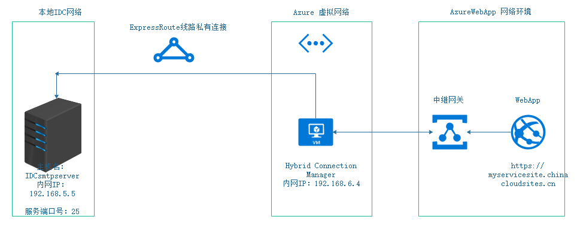
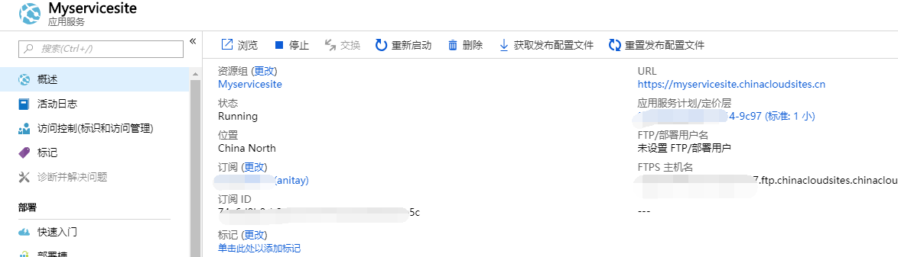
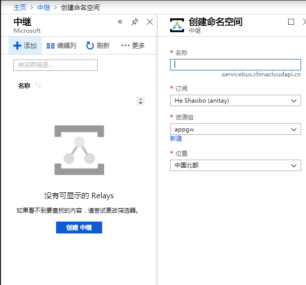
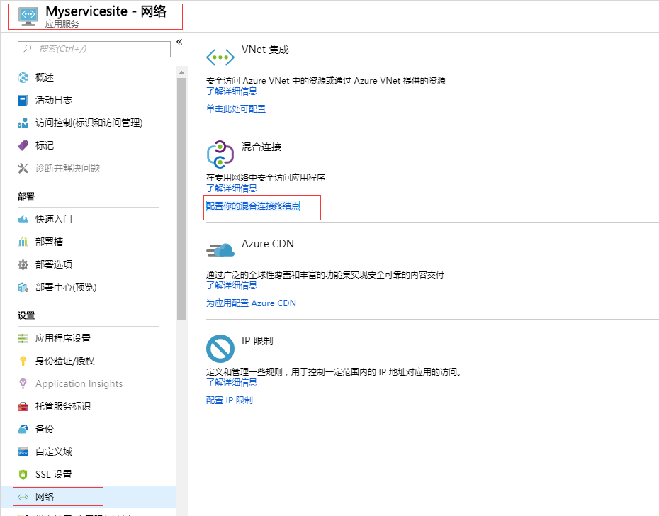
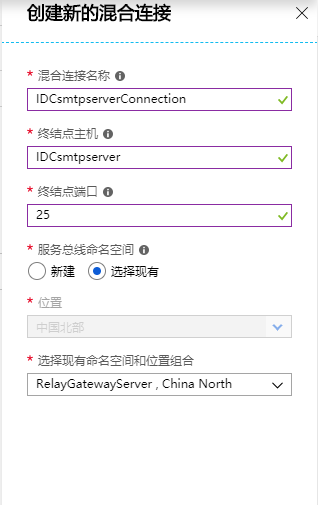
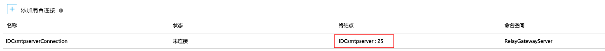
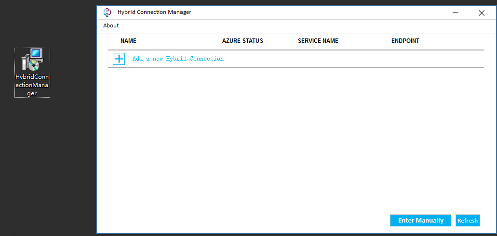
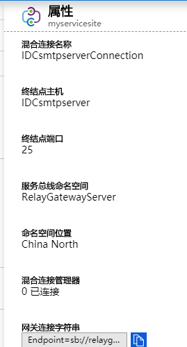
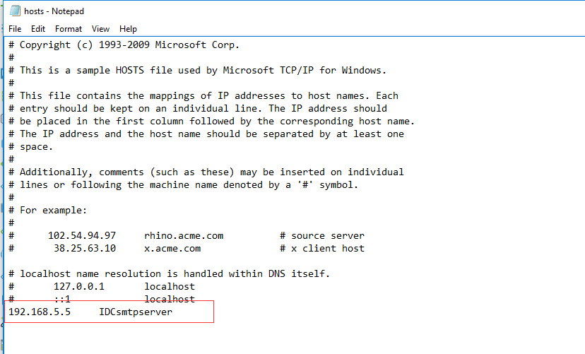
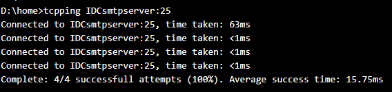

# Web 应用程序连接本地数据库的解决方案

## 实验目的

实现 Web 应用程序通过 Express Route 访问本地 IDC 的资源。

## 实验拓扑

## 前期准备

* 本地 IDC 中的 SMTP,DB 等服务正常运行。图中以 SMTP 服务为例， 侦听 25 端口。
* 本地 IDC 与 Azure 虚拟网络之间并完成 peer 的互通
* 在与本地 Express Route 互通的 Azure 虚拟网络中部署一台混合连接管理器（HCM）服务器。图中为虚拟机：192.168.6.4。

## 详细步骤

1. 创建 Web 应用程序

    

2. 新建"中继"服务，为后续的混合连接准备：

    1. 在门户“所有服务”下，选择“集成”板块下的“中继”，点击进入创建。

    2. 配置“名称”，“订阅”，“资源组”，“位置”等参数。"位置"必须和 Web 应用程序的一致，即位于同一个数据中心。

    

3. 配置 Web 应用程序的混合连接

    进入 Web 应用程序的概述下，在“网络”模块，选择“配置你的混合连接终结点”。

    

    1. 添加混合连接，并创建新的混合连接。

    2. 配置“混合连接名称”，“终结点主机”，“终结点端口”，“服务总线命名空间”等参数。“终结点主机” 即为本地 IDC 的服务器主机名，“终结点端口”即为本地 IDC 的服务器的业务端口号，“服务总线命名空间” 选择现有的命名空间，选择上述步骤中创建的命名空间。

        

        根据示例，配置参数：

        * 混合连接名称：为该连接配置一个友好的名称，`IDCsmtpserverConnection`
        * 终结点主机：本地 IDC 服务 Server 的主机名，`IDCsmtpserver`
        * 终结点端口：服务对应的端口号，`25`
        * 服务总线命名空间：即上述步骤中创建的中继服务，选择”选择现有”，选中在此配置

        配置生效后，显示配置的混合连接为“未连接”如下：

        

4. 在 Azure 虚拟机上配置混合连接管理器（HCM）：

    1. 接下来需要在 Azure 虚拟网络下部署一台 Windows Server 2012 或更高版本的虚拟机，该虚拟网络是连接到 Express Route 线路的。

    2. 部署完成后，需要在此虚拟机上安装 HCM 的客户端，该中继代理称为混合连接管理器 (HCM)。需要下载 HCM，请在 Azure 门户上的应用中，选择 “网络” > “配置混合连接终结点” 。

        

    3. 选择手动输入终结点字符串，字符串可以在 Azure 门户上的应用中获取，选择 “网络” > “配置混合连接终结点”。

        

    此步骤可以参考 Azure 官方文档，[混合连接管理器](https://docs.azure.cn/app-service/app-service-hybrid-connections#hybrid-connection-manager)。

5. Azure 虚拟机上写入终结点的主机解析记录

    1. 接下来配置 Host 文件，为了使得加解密后的终结点数据流能够被解析，在 Express Route 线路中传递到本地。

    2. Host 文件默认路径为 `C:\Windows\System32\drivers\etc\hosts`

    3. 配置解析记录，示例如下：

        

6. 完成以上配置后，再检查 Web 应用程序中的混合连接的状态会从“未连接”变成“已连接”， 且从 Web 应用程序 Console 界面可以正常 TCPping 通本地 IDC 的 SMTP 服务端口。如下图：

    在 Web 应用程序中以 **终结点：端口号** 的方式进行访问

    

    以上，部署完备。

## 连接方案总结

### 检测混合连接-ExpressRoute 线路连通性

1. 在 Azure HCM 虚拟机上，可以使用 Telnet 或 Psping 工具来检测本地 IDC 服务是否能够被 Azure 虚拟机通过 Express Route 访问。可以使用 nslookup 解析终结点主机名，来检测 Azure 虚拟机是否能够正常解析该终结点名称到本地 IDC 服务器的内网地址。
2. HCM 客户端的连接状态表示该终结点实现了 Azure HCM 虚拟机到 Azure Web 应用程序之间的连接状态。Azure 门户上混合连接的连接状态表示了中继服务到 Azure Web 应用程序之间的连接状态。
3. 在应用服务中，可以通过高级工具 (Kudu) 控制台调用 tcpping 工具。此工具可以告知你是否能够访问 TCP 终结点，但不会告知你是否能够访问混合连接终结点。

### 连接说明

1. 中继服务可以认为是 Web 应用程序前端的网关设备，HMC 可以认为是本地 IDC 在此连接的网关设备。网关之间使用 443 端口进行连接，加密传输。
2. 每个混合连接与单个“主机:端口”组合匹配，这非常有利于安全性。流量会被根据主机名进行标记，路由到 Relay 网关上进行加密传输。

## 后续步骤

1. 由于通过 Relay-HCM 将数据包加密卸载、重新封装，转换后的数据包由 HCM 自身发出，因此该流量可以在 Express Route 线路、VPN 隧道、Vnet Peering 中进行传输。
2. 可以将多个 Web 应用程序，API 应用程序连接到同一个 Relay 网关上。
3. 可以配置双冗余 HCM Client 避免单点故障。

## 参考文档

* [Azure 应用服务混合连接](https://docs.microsoft.com/azure/app-service/app-service-hybrid-connections)
* [在应用中添加和创建混合连接](https://docs.azure.cn/app-service/app-service-hybrid-connections#add-and-create-hybrid-connections-in-your-app)
* [创建和修改 ExpressRoute 线路](https://docs.azure.cn/expressroute/expressroute-howto-circuit-portal-resource-manager)
* [创建和修改 ExpressRoute 线路的对等互连](https://docs.azure.cn/expressroute/expressroute-howto-routing-portal-resource-manager)
* [将虚拟网络连接到 ExpressRoute 线路](https://docs.azure.cn/expressroute/expressroute-howto-linkvnet-portal-resource-manager)