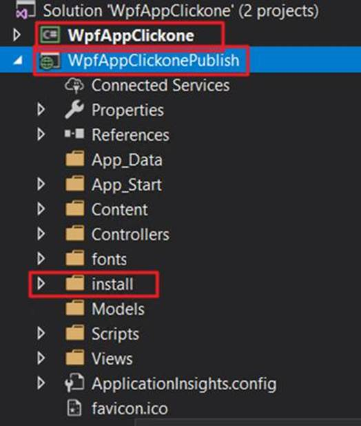
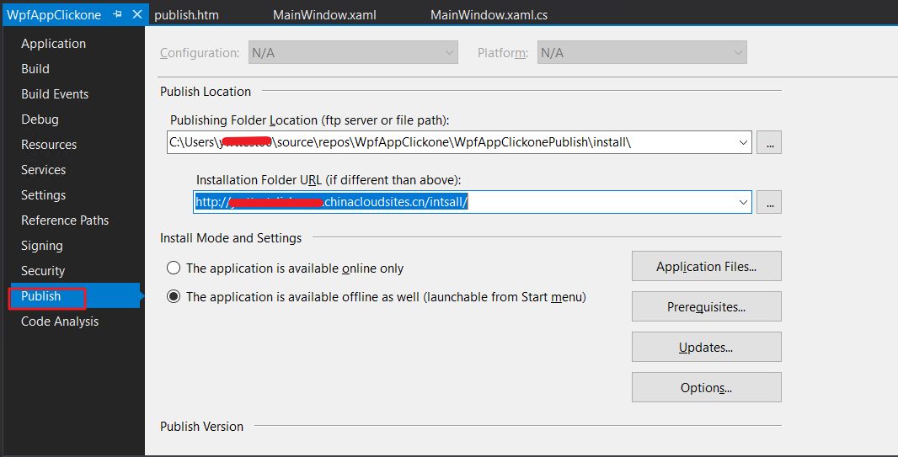
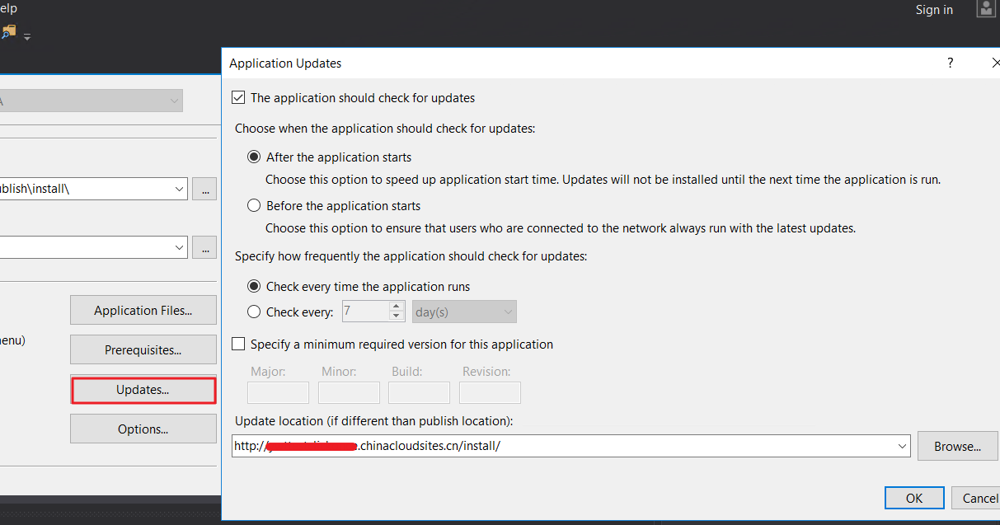
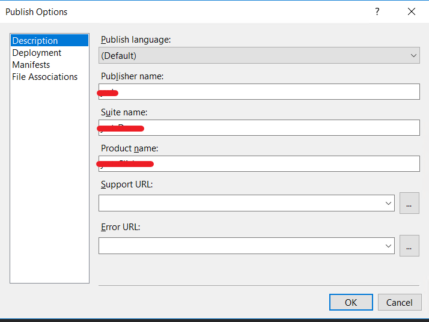
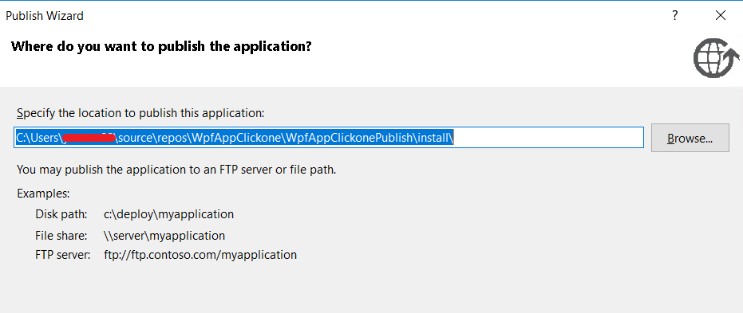
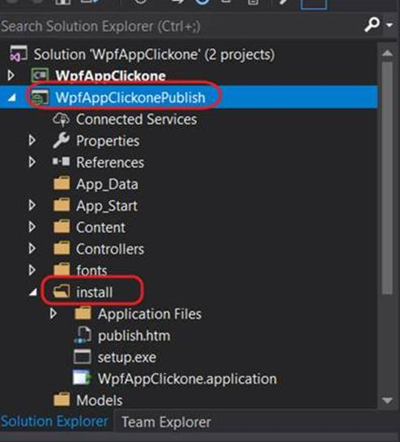
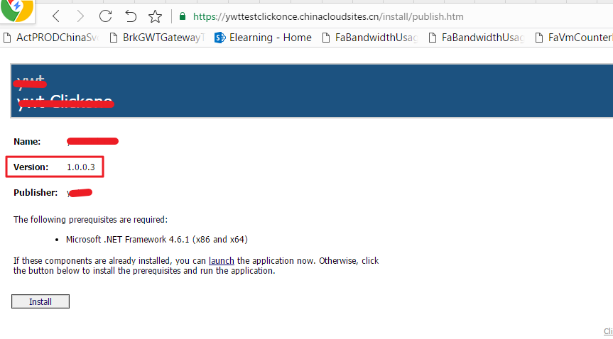

# 如何部署 clickonce 的项目到 Azure Web 应用

可以通过以下步骤在 Web 应用上完成 clickonce 项目的部署

具体操作如下：

1. 创建一个 Web 应用项目 WpfAppClickoncePublish 和一个窗体项目 WpfAppClickonce，在该 Web 应用项目中添加一个 install 文件夹。

    

2. 在窗体项目 WpfAppClickonce 中点击右键选择属性，修改发布配置。在发布中修改

    - **Publishing Folder**:`…\WpfAppClickonce\install\(this configuration publishes ClickOnce files directly to the Web site project directory)`
    - **Installation Folder**: `http://xxx.chinacloudsites.cn/install/`

    

3. 在 updates 中，重新定义升级路径为 Azure Webapp url。

    

4. 在 Options 选项中，完成相关的配置。

    

5. 点击右键，选择发布。之后将会在 web 应用的项目中 install 文件夹看到发布的内容。

    

    

6. 选择应用程序的项目，点击右键选择发布，将该 web 应用发布到 Azure Web 应用。

    

## 参考文档

- [如何发布 webapp 项目链接](https://docs.azure.cn/zh-cn/app-service/app-service-web-get-started-dotnet-framework)