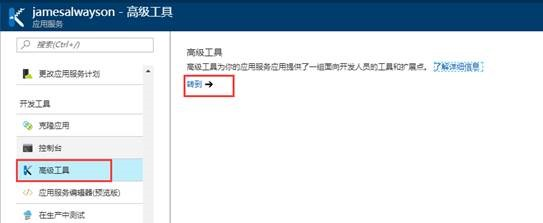
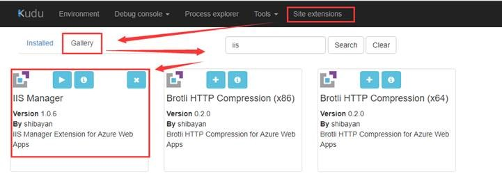
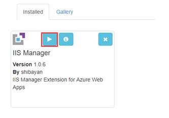
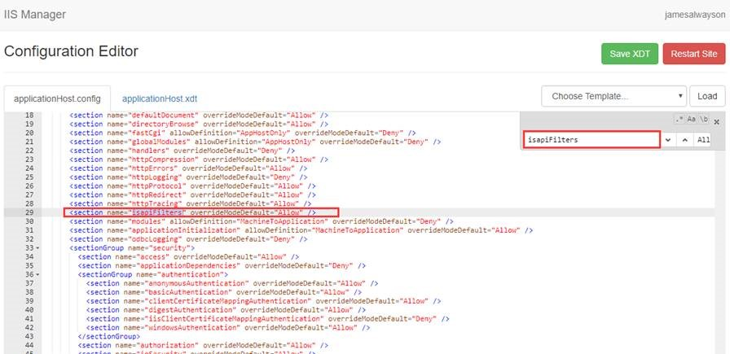
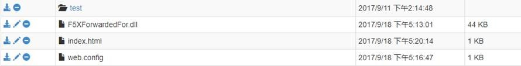
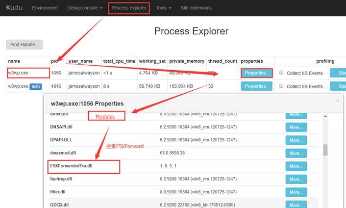

# 如何在 Web 应用上安装自定义 ISAPI Filter

以下步骤以安装用于获取真实 IP 的 F5XForwardedFor.dll 为例。

## 操作步骤

1. 进入您网站的 kudu 站点：

    

2. 安装 IIS Manager 模块：

    进入 kudu 的 “**Site extensions**”-> “**Gallery**” -> 输入 **iis** 进行搜索 -> 安装**IIS Manager**。

    

3. 安装完毕后，在门户上重启该网站。

4. Kudu 站点进入到上图中的 “**Installed**” 页面，点击运行。

    

5. 在打开的页面中，全局搜索 “**isapiFilters**”,找到对应的行，然后修改其值，并点击右上角“**Save XDT**”。

    

6. 修改完成以后，点击上图中的 “**Restart Site**” 重启 Kudu 站点，确保 Kudu 可以正常运行。

7.	在目录 “**wwwroot**” 中上传合适的 dll 文件，并修改 web.config 文件。例如：F5XForwarded.dll

    

    Web.config 文件内容范例如下：

    ```XML
    <configuration>
        <system.webServer>
            <isapiFilters>
                <filter name="ForwardFilter" enabled="true" enableCache="false" path="D:\home\site\wwwroot\F5XForwardedFor.dll" />
            </isapiFilters>
        </system.webServer>
    </configuration>
    ```
8. 配置完成以后，在门户中重启该网站。回到 Kudu 站点的 “**Process Explorer**” 中即可看到 w3wp 进程加载的模块中已有该模块。

    

