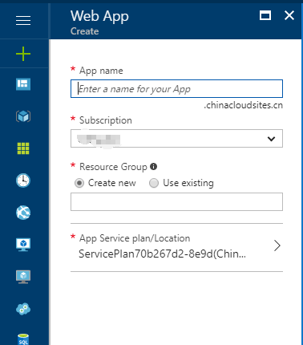
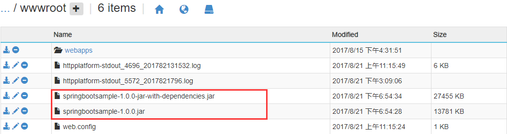

# 如何在 Web 应用上部署 Spring Boot 项目

可以通过以下步骤在 Web 应用上完成 Spring Boot 项目的部署：

1. 构建 SpringBoot 项目，您可以在此下载[示例代码](https://github.com/wacn/AOG-CodeSample/tree/master/AppServiceWeb/Java/SpringBootMavenSampleForWebapp-1.0.0)。

2. 在 Azure 中创建一个 Web 应用。

    

3. 配置 Java 运行环境。

    

4. 上载 Spring Boot 的可执行 jar 文件到 wwwroot 下。

    

5. 配置 web.config 文件，内容如下, 相关参数请按照实际情况进行编写：

    ```
    <?xml version="1.0" encoding="UTF-8"?>
    <configuration>
        <system.webServer>
            <handlers>
                <add name="httpPlatformHandler" path="*" verb="*" modules="httpPlatformHandler" resourceType="Unspecified" />
            </handlers>
            <httpPlatform processPath="%JAVA_HOME%\bin\java.exe" stdoutLogEnabled ="true" arguments="-Djava.net.preferIPv4Stack=true -Dserver.port=%HTTP_PLATFORM_PORT% -jar &quot;%HOME%\site\wwwroot\springbootsample-1.0.0.jar&quot;">
            </httpPlatform>
        </system.webServer>
    </configuration>
    ```
6. 启动应用执行。

    

## 链接资源

[在 App Service 中配置 Web 应用](https://docs.microsoft.com/zh-cn/azure/app-service-web/web-sites-java-custom-upload)