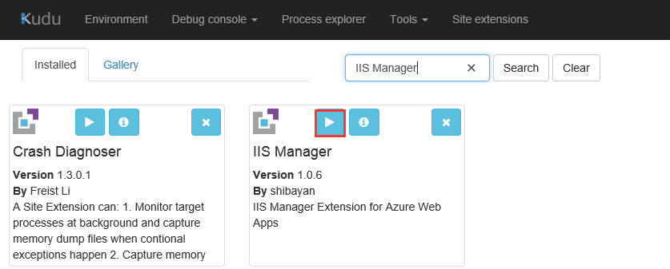
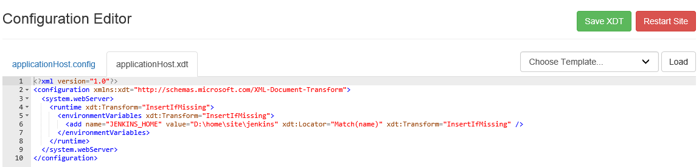
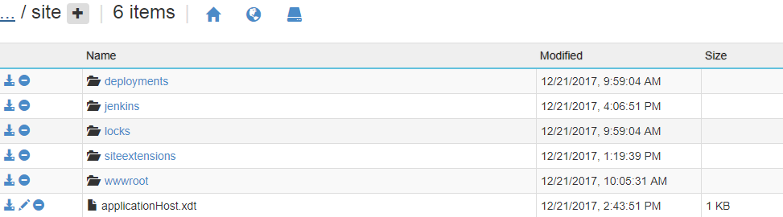
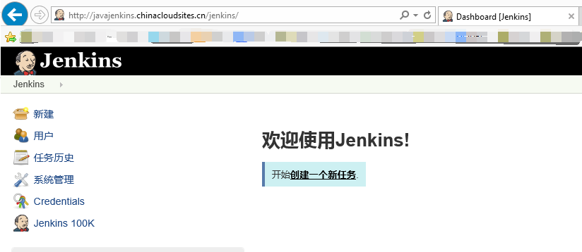

# 如何部署 Jenkins 网站

## 先决条件

1. 可以通过[Jenkins 官网](https://jenkins.io/download/)下载 war 包，再通过 FTP 的方式将 war 包上传到 "**site\wwwroot\webapps**" 下。
2. 需要添加环境变量，是因为 Jenkins 有些本地配置默认是在 C 盘，而 paas webAPP 的默认路径是 "**D:\home\xxx**"。

## 具体步骤

1. 登录到 Kudu,点击 "**Site Extension**" ，在搜索框中搜索 **IIS Manager** ,并点击 **IIS Manager** 中的 "**+**" 进行安装，安装好了之后可以在 **Installed** 中看到,如下所示：

    

2. 点击上图中的红色位置中的按钮启动 **IIS Manager**,会跳转到如下截图的页面:

    

3. 选择其中的一个 Template，点击 "**Load**" 和 "**Save XDT**"，返回到 Kudu 页面，可以看到在 Site 目录下已经生成一个 applicationHost.xdt，点击 "**编辑**" 按钮进行编辑，把下面的内容复制到这个文件中。

    ```xml
    <?xml version="1.0"?>
    <configuration xmlns:xdt="http://schemas.microsoft.com/XML-Document-Transform">
    <system.webServer>
        <runtime xdt:Transform="InsertIfMissing">
        <environmentVariables xdt:Transform="InsertIfMissing">
            <add name="JENKINS_HOME" value="D:\home\site\jenkins" xdt:Locator="Match(name)" xdt:Transform="InsertIfMissing" />
        </environmentVariables>
        </runtime>
    </system.webServer>
    </configuration>
    ```

    

4. 返回到 [Azure 门户](https://portal.azure.cn)上重启网站进行访问。

    