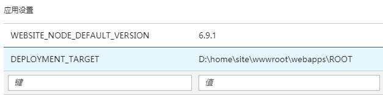

# 如何使用 Git 部署 Java Web 应用

由于 Azure Web 应用默认的根目录为 `site\wwwroot`，通过 Git 进行部署的路径也是 `wwwroot`。 
对于 Java 环境而言，网站的根目录为 `site\wwwroot\webapps\ROOT`，这时我们可以使用 `DEPLOYMENT_TARGET` 环境变量来指定 Java 的部署路径。

在网站的应用程序设置页面，App Settings 应用设置位置进行设置，如下所示：

