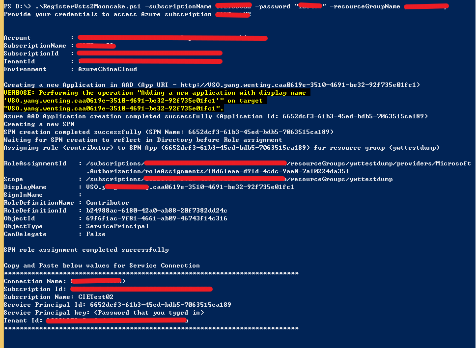
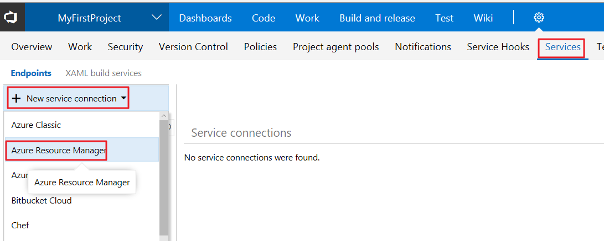
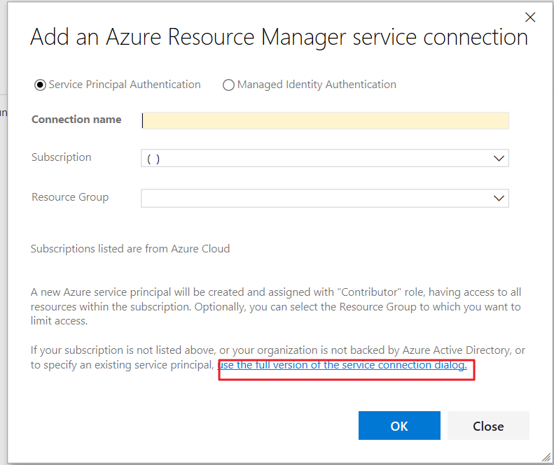
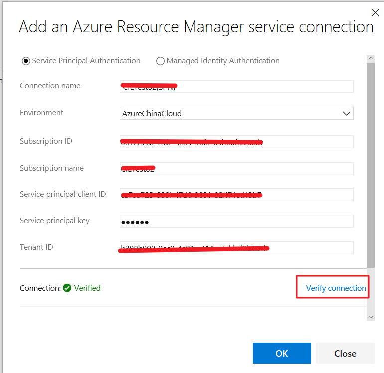
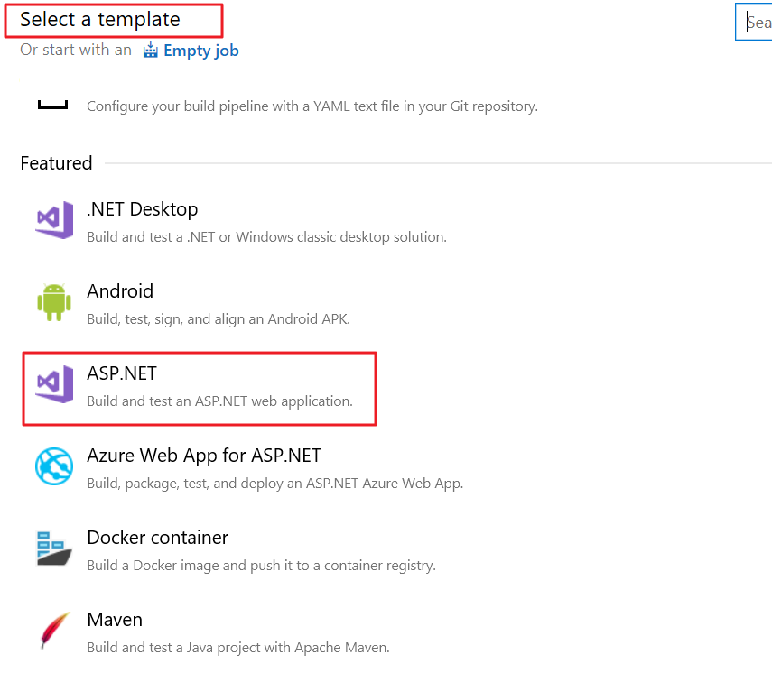
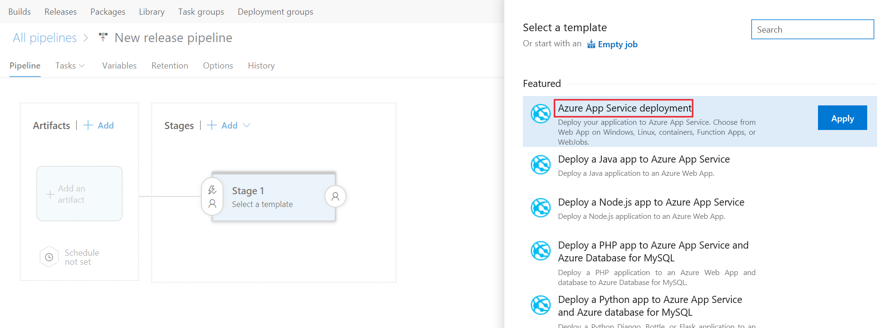
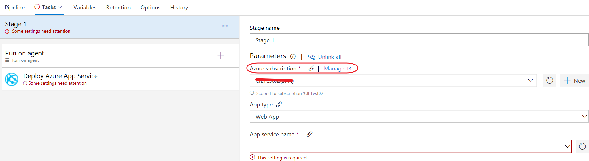
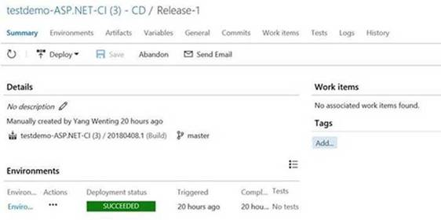
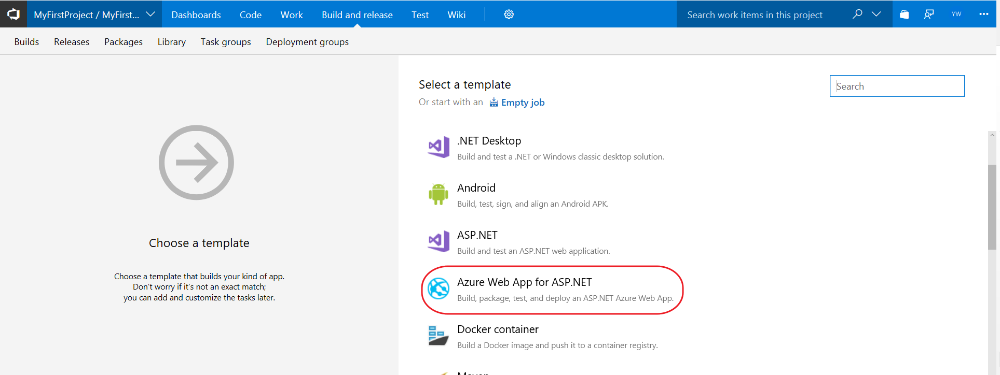

# 如何使用 VSTS 发布 Web 应用

本文展示了如何构建 VSTS 与中国 Azure 账户之间的连接。开发人员在 Github 上集成后，编译并测试通过，再发布到 Azure Web 应用上，期望的是持续集成持续发布，也就是 CICD。我们可以通过 [Visual Studio Online](https://www.visualstudio.com/zh-hans/vso/)（简称 VSO），与 Azure 服务的集成，使用非常方便。

具体步骤如下：

1. 登陆 VSO 并创建 VSTS 项目。

2. 构建 VSTS 与中国 Azure 账户之间的连接。

    1. 首先调用 Powershell 脚本来注册当前 VSTS 服务到 AzureAD 里面，并授予它相应 Azure 资源的 Contributor 权限，比如资源组或者整个订阅，当然也可以是某个资源。

    2. 安装 [Azure PowerShell](https://docs.microsoft.com/zh-cn/powershell/azure/install-azurerm-ps?view=azurermps-6.8.0), 并将以下 PowerShell 脚本保存为：RegisterVstsMooncake.ps1。

        ```PowerShell
        param
        (
            [Parameter(Mandatory=$true, HelpMessage="Enter Azure Subscription name. You need to be Subscription Admin to execute the script")]
            [string] $subscriptionName,
            [Parameter(Mandatory=$true, HelpMessage="Provide a password for SPN application that you would create")]
            [string] $password,
            [Parameter(Mandatory=$false, HelpMessage="Provide a SPN role assignment")]
            [string] $spnRole = "contributor",
            [Parameter(Mandatory=$false, HelpMessage="If assign role for target resource group, provide its name")]
            [string] $resourceGroupName
        )
        #Initialize
        $ErrorActionPreference = "Stop"
        $VerbosePreference = "SilentlyContinue"
        $userName = $env:USERNAME
        $newguid = [guid]::NewGuid()
        $displayName = [String]::Format("VSO.{0}.{1}", $userName, $newguid)
        $homePage = "http://" + $displayName
        $identifierUri = $homePage
        #Initialize subscription
        $isAzureModulePresent = Get-Module -Name AzureRM* -ListAvailable
        if ([String]::IsNullOrEmpty($isAzureModulePresent) -eq $true)
        {
        Write-Output "Script requires AzureRM modules to be present. Obtain AzureRM from https://github.com/Azure/azure-powershell/releases. Please refer https://github.com/Microsoft/vsts-tasks/blob/master/Tasks/DeployAzureResourceGroup/README.md for recommended AzureRM versions." -Verbose
            return
        }
        Import-Module -Name AzureRM.Profile
        Write-Output "Provide your credentials to access Azure subscription $subscriptionName" -Verbose
        Login-AzureRmAccount -SubscriptionName $subscriptionName -Environment 'AzureChinaCloud'
        $azureSubscription = Get-AzureRmSubscription -SubscriptionName $subscriptionName
        $connectionName = $azureSubscription.Name
        $tenantId = $azureSubscription.TenantId
        $id = $azureSubscription.Id
        $securePASS = ConvertTo-SecureString -String $password -AsPlainText -Force
        #Create a new AD Application
        Write-Output "Creating a new Application in AAD (App URI - $identifierUri)" -Verbose
        $azureAdApplication = New-AzureRmADApplication -DisplayName $displayName -HomePage $homePage -IdentifierUris $identifierUri -Password $securePASS -Verbose
        $appId = $azureAdApplication.ApplicationId
        Write-Output "Azure AAD Application creation completed successfully (Application Id: $appId)" -Verbose
        #Create new SPN
        Write-Output "Creating a new SPN" -Verbose
        $spn = New-AzureRmADServicePrincipal -ApplicationId $appId
        $spnName = $spn.ServicePrincipalNames[0]
        Write-Output "SPN creation completed successfully (SPN Name: $spnName)" -Verbose
        #Assign role to SPN
        Write-Output "Waiting for SPN creation to reflect in Directory before Role assignment"
        Start-Sleep 20
        if ([String]::IsNullOrEmpty($resourceGroupName) -eq $true)
        {
            Write-Output "Assigning role ($spnRole) to SPN App ($appId)" -Verbose
            New-AzureRmRoleAssignment -RoleDefinitionName $spnRole -ServicePrincipalName $appId
        }
        else
        {
            Write-Output "Assigning role ($spnRole) to SPN App ($appId) for resource group ($resourceGroupName)" -Verbose
        New-AzureRmRoleAssignment -ResourceGroupName $resourceGroupName -RoleDefinitionName $spnRole -ServicePrincipalName $appId
        }
        Write-Output "SPN role assignment completed successfully" -Verbose
        #Print the values
        Write-Output "`nCopy and Paste below values for Service Connection" -Verbose
        Write-Output "***************************************************************************"
        Write-Output "Connection Name: $connectionName(SPN)"
        Write-Output "Subscription Id: $id"
        Write-Output "Subscription Name: $connectionName"
        Write-Output "Service Principal Id: $appId"
        Write-Output "Service Principal key: <Password that you typed in>"
        Write-Output "Tenant Id: $tenantId"
        Write-Output "***************************************************************************" 
        ```

    3. 执行以下命令：

        ```PowerShell
        .\RegisterVsts2Mooncake.ps1 -subscriptionName '[YourAzureChinaSubscriptionName]' -password '[YourPassword]' -resourceGroupName '[YourAzureChinaResourceGroup]'
        ```

        > [!NOTE]
        > 第一个参数 subscriptionName 是订阅名称，password 是密码。注意这个密码不一定是 AzureChina 登录的密码，我们可以设置为其他的密码。请牢记这个密码，我们会在后续步骤中使用， resourceGroupName 是资源组名称。

        

    4. 登录 VSTS，在创建的项目的主页上，点击 设置 -> Services -> New Service Endpoint -> Azure Resource Manager。

        

3. 在弹出的对话框里，点击文字链接 “**use the full version of the endpoint dialog.**”，会出现如下对话框，输入前面脚本的输出值，然后可以点击 “**Verify connection**” 验证连接。

    

    

    此时创建好连接之后，便可以进行持续发布了。

4. 发布 Azure Web 应用。

    在 build and release 标签页下的 Builds 选项中选择 template 为 **ASP.net** (如果项目为 .netcore 选择 Asp.net core)。

    

    在 Releases 选项中选择 Azure App Service Deployment 即可成功发布。

    

    

    

    或者在 build 选项中选择 template 为 Azure Web App for ASP.NET，直接进行发布。

    

## 参考链接

[如何通过 VSTS 部署 Web 应用到 Azure Web 应用中](https://docs.microsoft.com/zh-cn/vsts/build-release/apps/cd/deploy-webdeploy-webapps?view=vsts)