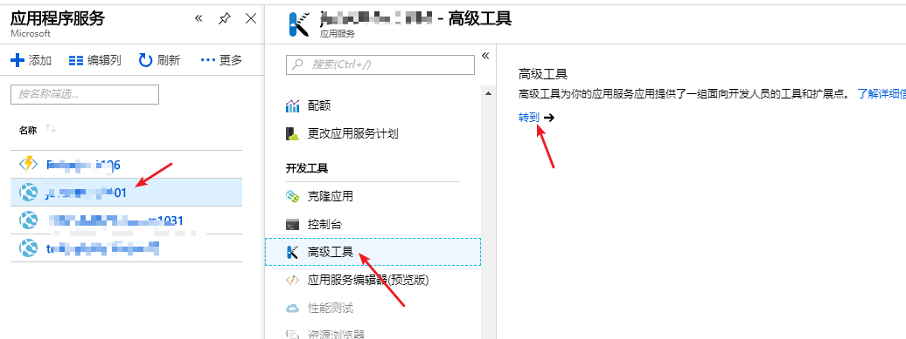
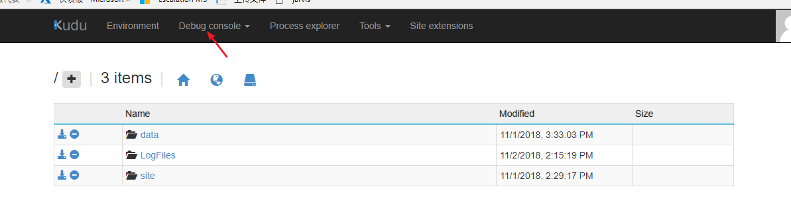
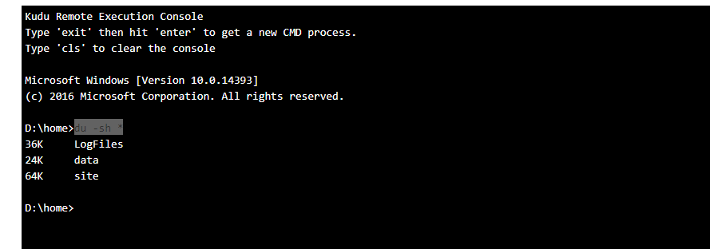

# 如何检测 Web 应用沙盒环境文件系统存储量

## 问题描述

有些时候应用服务计划中的文件系统会被“莫名其妙”占满，而无法看到具体是哪个文件或者文件夹占用了大量的存储空间，使用命令可以检测各个应用的各个文件夹的容量。

## 解决方法

1. 找到该应用服务计划下的占用存储空间比较大的应用，在应用程序服务中选择该应用，然后进入 Kudu 界面：

    

2. 进入之后点击 Debug Console，然后选择 `cmd` ，如下图：

    

3. 在下面的 Console 界面中输入命令 `du -sh *` 查看具体文件占用大小，如图所示：

    