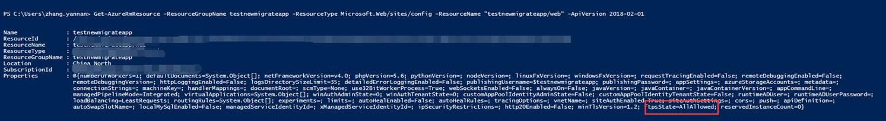
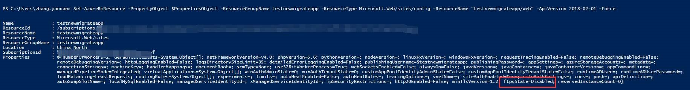

# 如何禁掉 FTPS 或者强制使用 FTPS

目前中国区 Azure Web 应用程序无法直接从 Azure 门户直接禁掉 FTPS 或者强制使用 FTPS。

可以尝试使用 PowerShell 命令进行相关的操作：

1. 使用 `Login-AzureRmAccount -EnvironmentName AzureChinaCloud` 命令进行登陆：

    

2. 使用下面的命令获取一个所需要修改的资源组下的站点的配置信息，可以看到 ftpsState 的默认值是 AllAlowed ：

    ```powershell
    Get-AzureRmResource -ResourceGroupName testnewmigrateapp -ResourceType Microsoft.Web/sites/config -ResourceName "testnewmigrateapp/web" -ApiVersion 2018-02-01
    ```

    

3. 修改该默认值为 FtpsOnly 或者 Disable，以禁掉 FTPS 为例：

    ```powershell
    PS C:\Users\zhang.yannan> $PropertiesObject = @{
      ftpsState = `Disabled`;
    }
    ```

    FTPS 可以设置的参数如下:

    

    参数具体含义可以参考: [FtpsState Class](https://docs.microsoft.com/dotnet/api/microsoft.azure.management.appservice.fluent.models.ftpsstate?view=azure-dotnet)。

4. 执行下面的参数：

    ```powershell
    Set-AzureRmResource -PropertyObject $PropertiesObject -ResourceGroupName testnewmigrateapp -ResourceType Microsoft.Web/sites/config -ResourceName "testnewmigrateapp/web" -ApiVersion 2018-02-01 –Force  
    ```

    可以看到修改成功了。

    

    > [!NOTE]
    > 将上述的 ResourceGroupName 换成所需要进行配置的资源组名称即可。