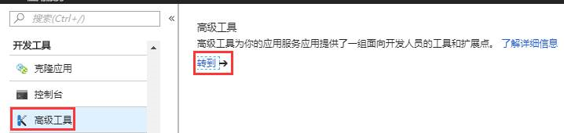
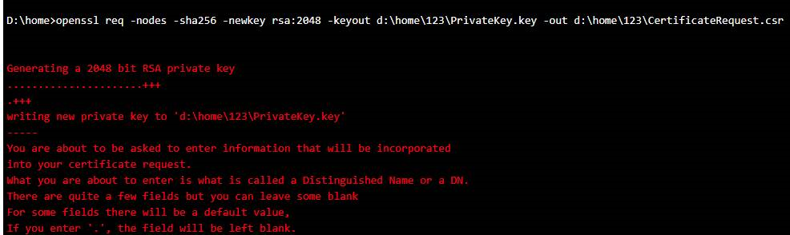
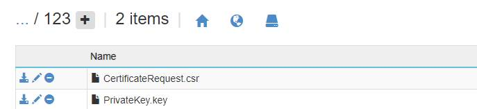

# 应用程序服务申请 https 证书如何导出 CSR 文件

## 场景描述

当为网站服务申请 SSL 证书的时候，证书服务商需要用户提供 CSR（certificate signing request）文件。

## 解决方法

通过网站的 “**高级管理**” 工具，我们可以基于 `openssl` 命令来生成 CSR 文件，比如： `openssl req -nodes -sha256 -newkey rsa:2048 -keyout d:\home\123\PrivateKey.key -out d:\home\123\CertificateRequest.csr`。

按照提示完成操作之后可以在指定的文件夹中看到有 .csr 文件生成。

