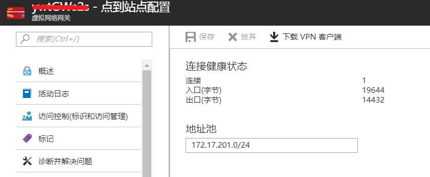
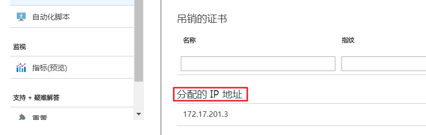
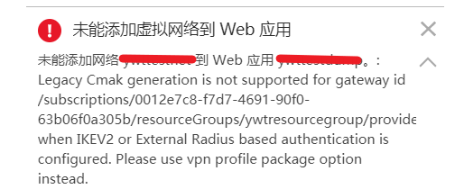
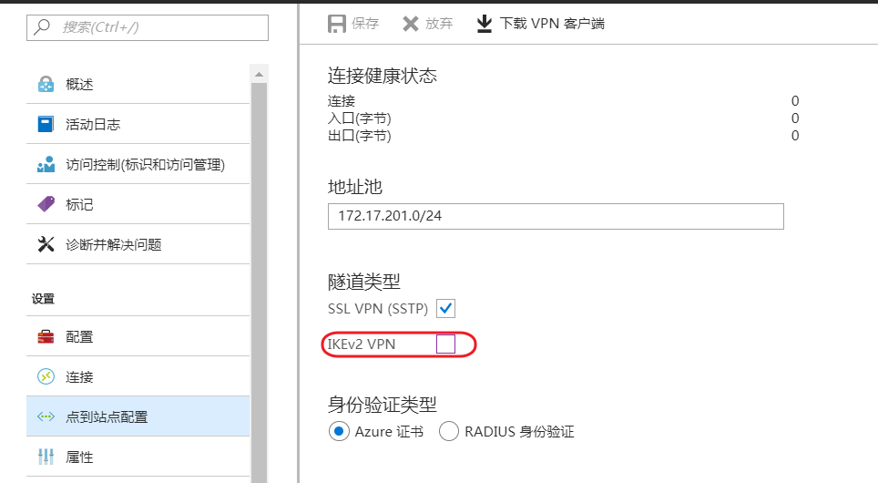
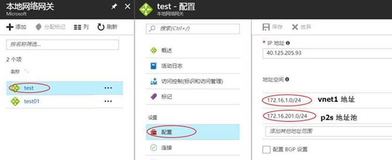
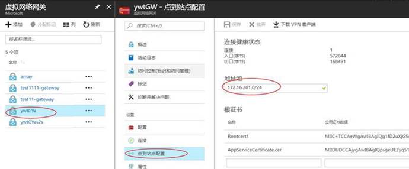
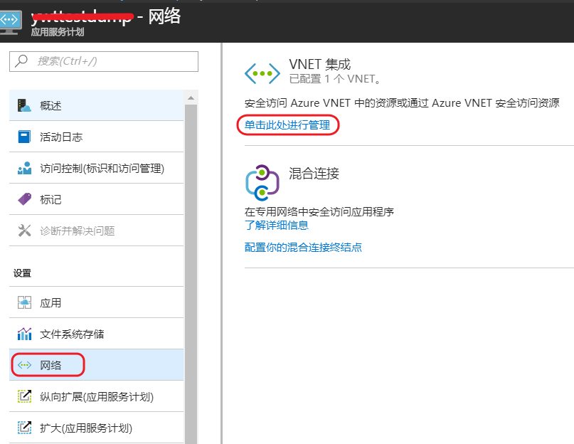
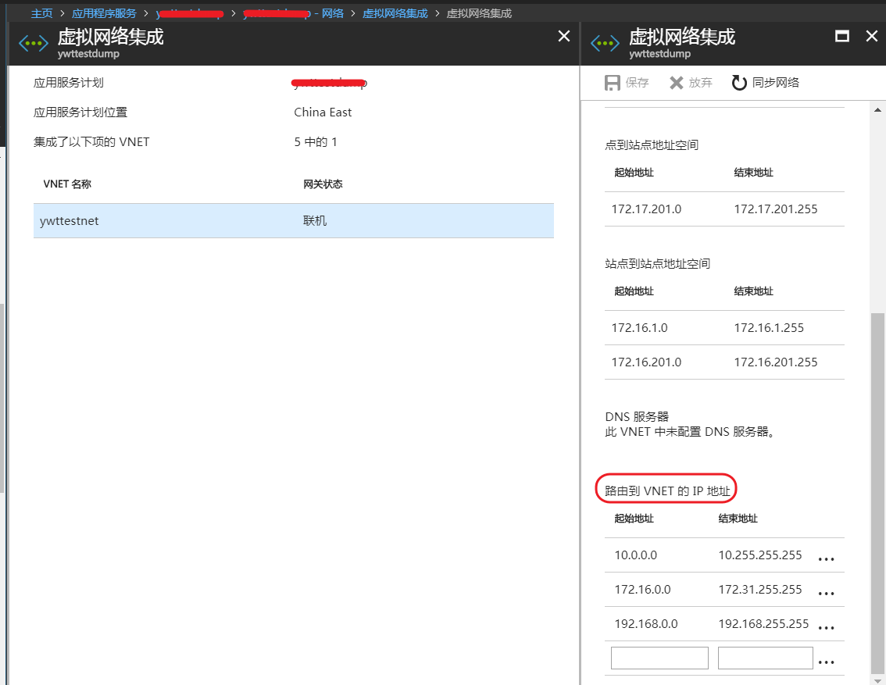
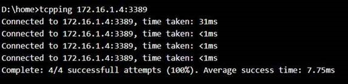
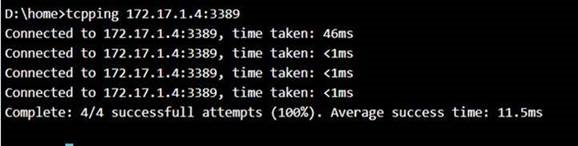

# Web 应用如何集成两个不同虚拟网络

## 问题描述

Web 应用如何既能访问虚拟网络 Vnet1 虚拟机中运行的数据库或 Web 服务
，也可以访问虚拟网络 Vnet2 的服务。

## 问题分析

Web 应用与虚拟网络的集成是借助动态路由网关启用点到站点的 VPN。 如果网关由静态路由配置，则无法启用点到站点虚拟专用网络 (VPN)。因此 Web 应用 想要访问 Vnet2 的服务，必须要将 Vnet1 点到站点地址池 IP 加入到 Vnet2 网段中。而虚拟网络 Vnet1 和虚拟网络 Vnet2 则需要通过站点到站点的配置来连通。

有关如何将虚拟网络 Vnet1 和虚拟网络 Vnet2 需要通过站点到站点的连接，请参阅：[在 Azure 门户中创建站点到站点连接](https://docs.azure.cn/zh-cn/vpn-gateway/vpn-gateway-howto-site-to-site-resource-manager-portal)。

## 操作步骤

本文是基于成功将虚拟网络 Vnet1 和虚拟网络 Vnet2 需要通过站点到站点的连通后，在 Web 应用中做的一些操作。

1. 将已经配置了点到站点网关的 Vnet1 连接到 Azure Web 应用 中，具体内容请参阅：[将应用与 Azure 虚拟网络进行集成](https://docs.azure.cn/zh-cn/app-service/web-sites-integrate-with-vnet)。

    连接成功后，可以在虚拟网关的点到站点配置查看到连接状态和虚拟网络中分配 IP 地址。

     
    

    如果在集成虚拟网络的时候发生如下的错误：

    

    需要在虚拟网关的点到站点配置中隧道类型中只勾选 SSL VPN（SSTP），这是由于 Web 应用只支持基于 SSTP 加密协议的网关，而管理门户创建出来的网关默认同时支持了 SSTP 和 IKEV2。

    

2. 为 Vnet2 配置本地网关 test(本文设置为 test)，添加 Vnet1 地址段和 Vnet1 的点到站点的网关地址池。

     
    

3. 手工设置应用服务计划的目标网段路由信息 ，目前默认情况是包含 `10.0.0.0 – 10.255.255.255` , `172.16.0.0 – 172.31.255.255` , `192.168.0.0 – 192.168.255.255` 这些网段。

    在应用服务计划中选择网络：

     
    

    > [!NOTE]
    > 如果更改了这些证书或网络信息，则需单击 “**同步网络**”。单击 “**同步网络**” 会导致应用与 VNet 之间的连接出现短暂的中断。虽然应用不会重新启动，但失去连接会导致站点功能失常。

4. 在 Web 应用 控制台中通过 tcpping ip:port 来测试 Vnet2 和 Vnet1 的虚拟机服务联通性，测试结果如下：

    Vnet1 的虚拟机 IP 为 `172.16.1.4`：

    

    Vnet2 的虚拟机 IP 为 `172.17.1.4`：

    
