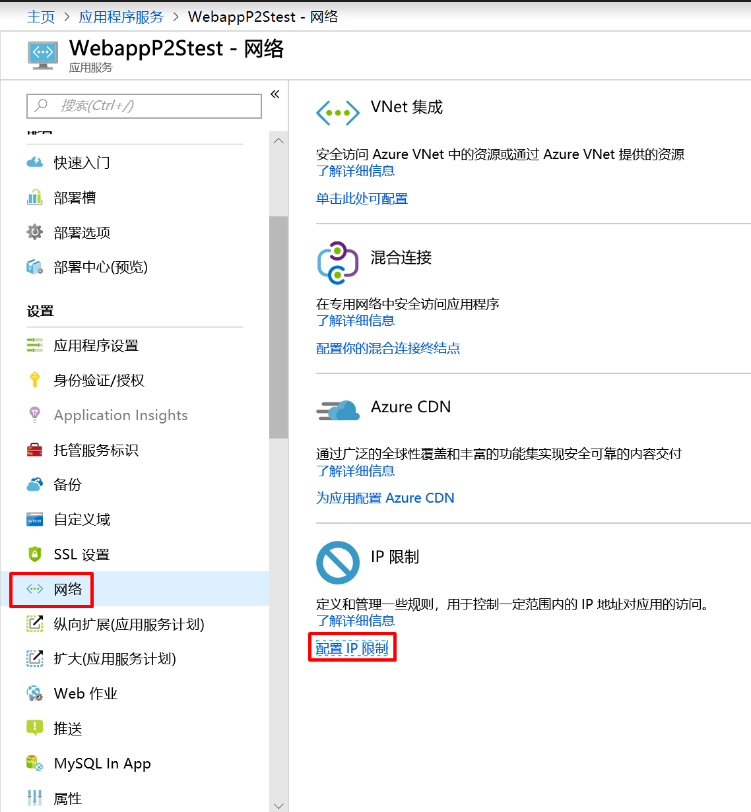
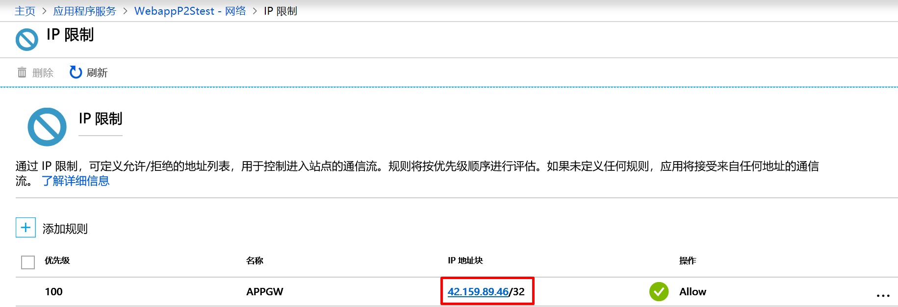
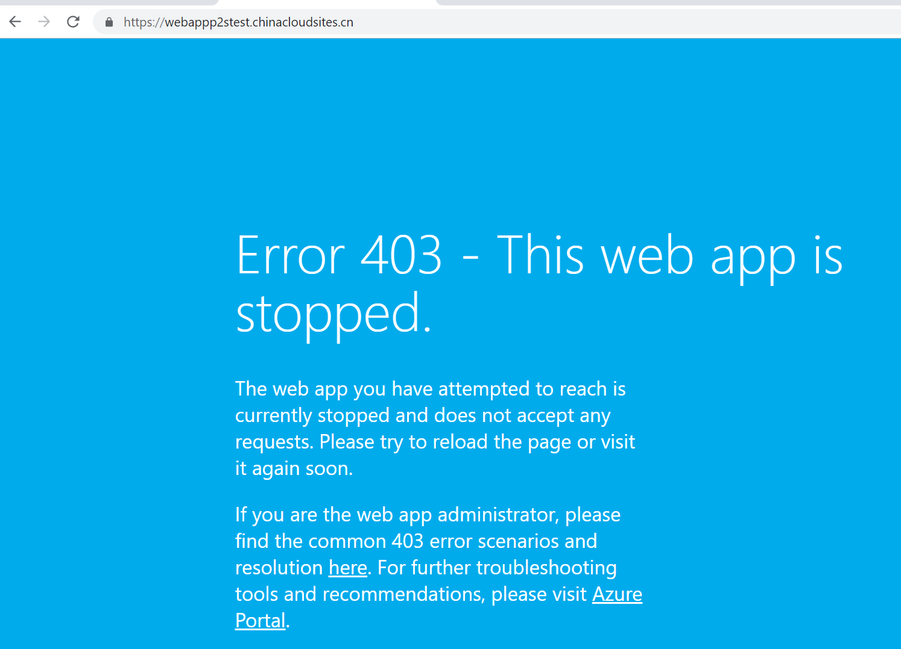
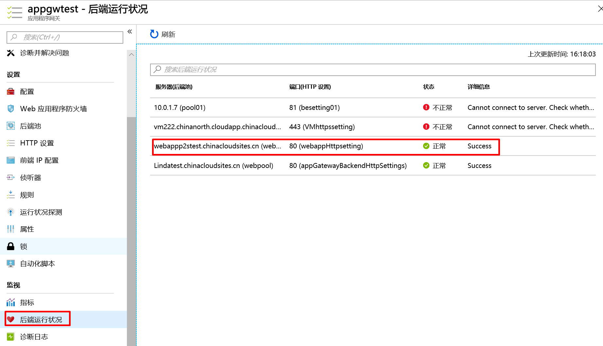
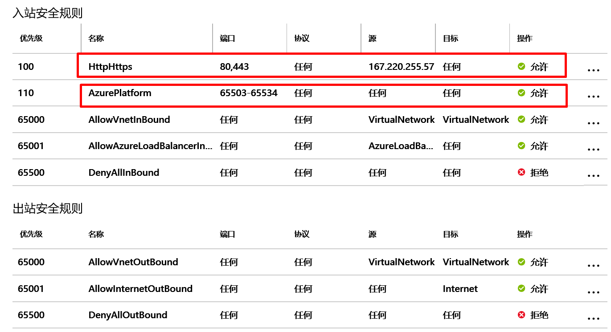
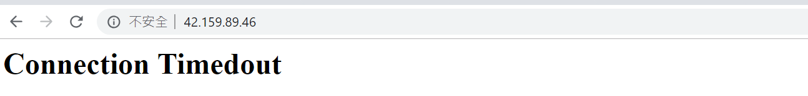

# 应用程序网关和后端 Azure Web 限制访问 IP

本文介绍如何通过设置应用程序网关和后端 Azure Web 应用限制访问 IP。

## Azure App 应用静态 IP 限制

通过 IP 限制，可定义允许访问应用的 IP 地址的允许/拒绝列表（按优先级排序）。此允许列表可能包含 IPv4 和 IPv6 地址。如果存在一个或多个条目，则在列表末尾会存在一个隐式的“拒绝所有”。

向应用发出请求时，将针对 IP 限制列表评估 FROM IP 地址。 如果列表中的规则不允许访问该地址，则服务会以 HTTP 403 状态代码进行答复。

## 在门户中添加并编辑 IP 限制规则只允许前端应用程序网关访问

向应用添加 IP 限制规则，请使用菜单打开网络>IP 限制，然后单击配置 IP 限制。

从 IP 限制 UI 可以查看为应用定义的 IP 限制规则列表。

如果规则的配置情况如图所示，则应用只接受来自 42.159.89.46/32 的流量，并会拒绝所有来自其他的 IP 地址的流量。其中 42.159.89.46 为前端应用程序网关公网 IP 地址。

配置完成后通过其他公网地址访问 Azure Web 应用返回 HTTP 403 状态代码拒绝访问。

此时因为 Azure web 应用 IP 限制规则配置为允许来自前端应用程序网关的访问请求，应用程序网关探测后端 Azure Web 应用为 Healthy 状态。

同时通过访问前端应用程序网关公网地址或域名可以成功访问 Azure Web 应用。

同时可以使用网络安全规则对访问应用程序网关的源地址进行限制。

一般来说，在使用应用程序网关的环境下配置 NSG 有以下几个注意事项。

* 应用程序网关实例所在的子网 NSG 需要允许互联网对前端服务端口的访问。
* 应用程序网关实例所在的子网需要能够与后端服务器所在的子网进行通讯。
* 对于应用程序网关必须允许目的端口 65503-65534 上的流量传人， 此端口范围是进行 Azure 基础结构通信所必需的。 它们受 Azure 证书的保护（处于锁定状态）。 如果没有适当的证书，外部实体（包括这些网关的客户）将无法对这些终结点做出任何更改。
* 不能阻止出站 Internet 连接。
* 必须允许来自 AzureLoadBalancer 标记的流量。

查询应用程序网关后端池状态是否为 Healthy，如果网关安全规则配置错误，可能会出现后端池为 unknown 状态。

此时通过客户端 167.220.255.57 可以正常访问应用程序网关后端 Azure Web 应用。

通过其他地址访问失败。

