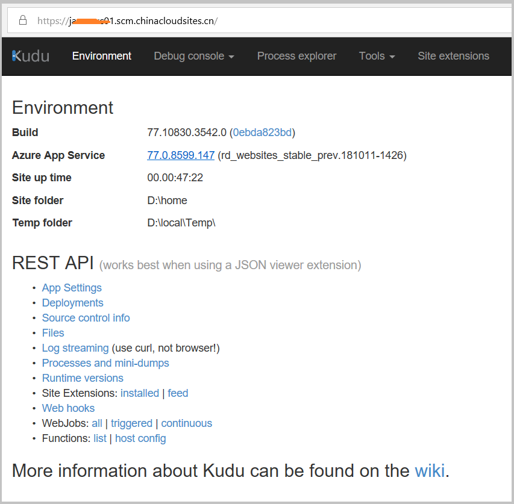
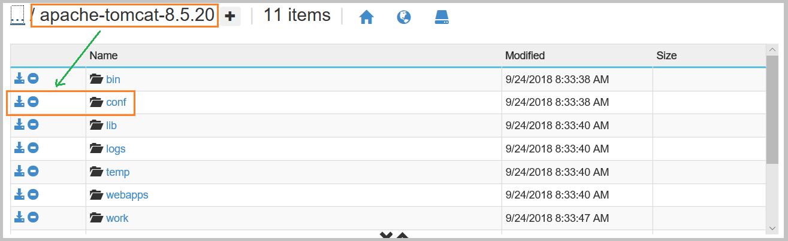

# 如何通过 Kudu 查看/修改 Java Tomcat 服务端的配置文件

由于 Azure App Service 可以在 Azure 门户中选择 Tomcat 的版本，当我们需要查看服务端的配置文件时，可以通过以下的 5 个步骤来实现：

1. 登录 Kudu ：

    

    有如下两种方式登陆 Kudu ：

    1. 在当前 Web 应用的 URL 中加入 *.scm* (插入位置在 site 名与 chinacloudsites 之间)。
    2. 在当前 Web 应用的 Azure 门户中操作，点击 **“ 开发工具 -> 高级工具 -> 转到 ”** 即可进入 Kudu 页面。

2. 查看当前 Java 进程信息，获取到当前 Tomcat 路径：

    

    点击 **"Process Expolorer"** 在 Java 的进程上点击 **"Properties"** 查看详细信息：

   

    这一步中，获取到当前 Tomcat 的路径为 D:\Program Files (x86)\apache-tomcat-8.5.20 文件夹。

3. 通过 Debug Console 导航并进入到服务端的配置文件夹：

    

    逐步点击，找到 conf 文件夹：

    

4. 点击文件名边的编辑按钮，查看及修改文件内容：

    

5. 保存并重启 Web 应用。