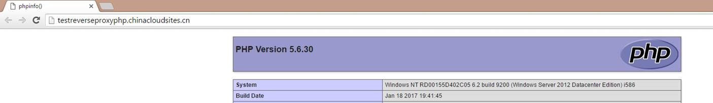
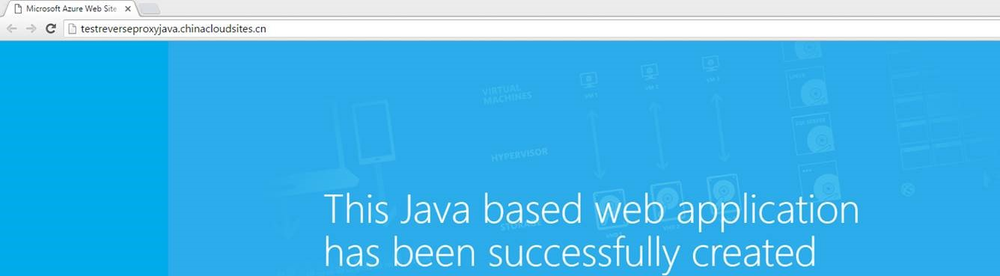
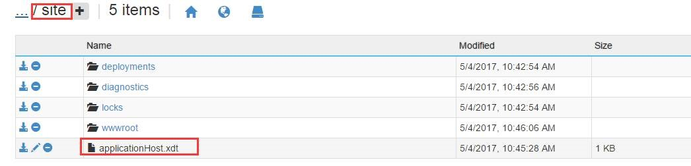
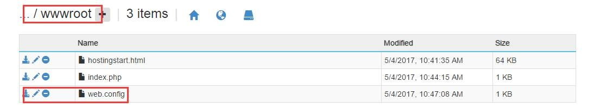
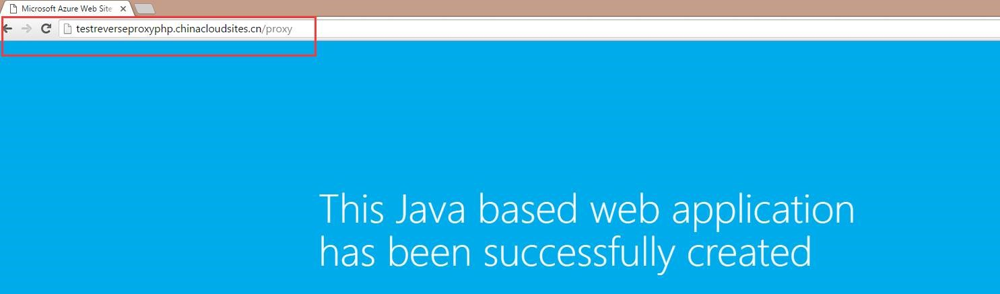

# Web 应用如何实现类似 Nginx 反向代理转发功能

## 问题描述

对于 2 个不同开发语言的网站如何实现通过一个 URL 转发访问到另一个网站。

## 解决办法

1. 创建了 2 个 Web 应用以 PHP 和 Java 语言为例，此处 URL 分别为：`http://testreverseproxyphp.chinacloudsites.cn/` 和`http://testreverseproxyjava.chinacloudsites.cn/`。

    2 个 URL 的返回结果如下：

    

    

2.	在 `http://testreverseproxyphp.chinacloudsites.cn/` 这个网站 `site` 目录下加上 `applicationHost.xdt`。

    

    内容如下：

    ```XML
    <?xml version="1.0"?>  
    <configuration xmlns:xdt="http://schemas.microsoft.com/XML-Document-Transform">  
    <system.webServer>  
    <proxy xdt:Transform="InsertIfMissing" enabled="true" preserveHostHeader="false"  
    reverseRewriteHostInResponseHeaders="false" />  
    </system.webServer>  
    </configuration>  
    ```
3. 在管理门户重启网站。

4. 同时也在 `http://testreverseproxyphp.chinacloudsites.cn/` 这个网站下 `site -> wwwroot` 目录下，加上 web.config 文件。

    

    内容如下：

    ```XML
    <configuration>  
    <system.webServer>  
    <rewrite>  
    <rules>  
    <rule name="Proxy" stopProcessing="true">  
    <match url="^proxy/?(.*)" />  
    <action type="Rewrite" url="http://testreverseproxyjava.chinacloudsites.cn/{R:1}" />  
    </rule>  
    </rules>  
    </rewrite>  
    </system.webServer>  
    </configuration>
    ```
    其中的 `rule name="Proxy"`，这个 Proxy 可以自定义。

    配置好之后，回到管理门户重启网站。

5. 测试结果，当访问 `http://testreverseproxyphp.chinacloudsites.cn/` 这个网站时，返回的是 PHP 页面，访问 `http://testreverseproxyphp.chinacloudsites.cn/proxy` 时返回的是 Java 页面，实现转发功能。

    