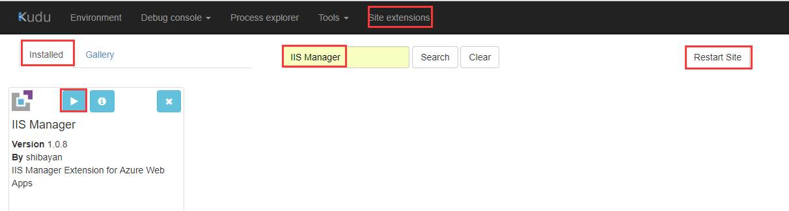
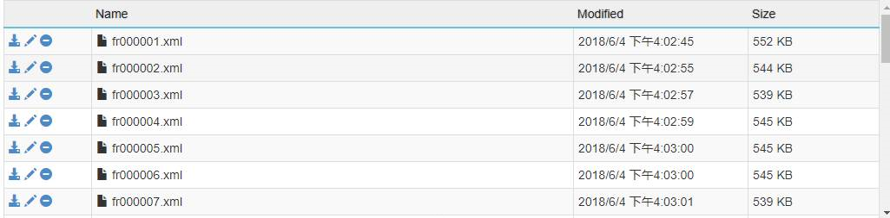
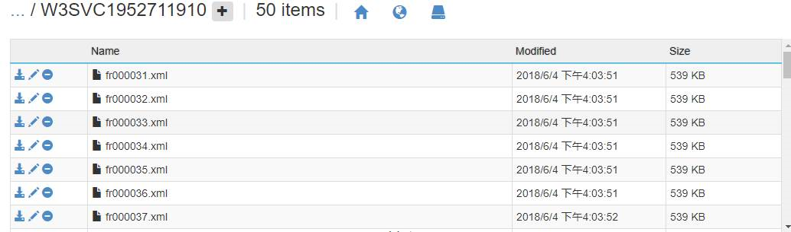

# 请求跟踪失败日志能否持续输出到 Storage 或者其他存储位置？

## 场景描述

网站日志中的请求失败日志会随着网站的不断访问一直记录相关的信息会占据网站的存储空间，对于这种现象我们可以考虑下面的方法。

## 问题分析

可以从下面的两个方向来解决这个问题：

1. 设置 `traceProviderDefinitions` 以选择性输出请求跟踪失败日志(Failed Request Logging)。
2. 设置 `maxLogFiles` 以增大可保存的日志文件数量。

## 解决方法

1. 首先登录到 kudu 上，在 **site extension** 页面，在搜索框中搜索 **IIS Manager** 进行安装，安装成功之后在 **installed** 页面进行查看，点击截图中红色区域进行启动 IIS Manager,若启动的过程报错，请您在 kudu 的页面点击 **restart site** 之后再尝试启动。

    

2. 在跳转出来的页面，按照截图点击保存之后，会在 site 目录下看到 applicationhost.xdt 文件。

    

3. 将下面的内容 copy 到 applicationhost.xdt 中：

    ```xml
    <?xml version="1.0" encoding="utf-8"?>
    <configuration xmlns:xdt="http://schemas.microsoft.com/XML-Document-Transform">
    <system.applicationHost>
        <sites>
        <site name="testfailrequestzyn" xdt:Locator="Match(name)">
            <traceFailedRequestsLogging maxLogFiles="60" xdt:Transform="SetAttributes(maxLogFiles)" />
        </site>
        </sites>
    </system.applicationHost>
    <system.webServer>
        <tracing>
        <traceFailedRequests>
            <add path="/test/*" xdt:Transform="SetAttributes(path)">
            <failureDefinitions statusCodes="200,404" xdt:Transform="Replace" />
            </add>
        </traceFailedRequests>
        </tracing>
    </system.webServer>
    </configuration>
    ```

    其中的 `maxLogFiles="60"` 参数也就是当您的文件达到最大之后，再生成下一条 log 之前系统会删除前一半的文件。

    下面是没达到最大值之前：

    

    达到设置的值后，效果如下：（例如我设置的 `maxlogfiles` 是 60，当达到上限之后，会删除 1~30 的文件）。

    

4. 配置完之后在门户上重启一下网站再进行测试。

## 参考链接

- [TraceFailedRequestsLogging - Configuration Sample](https://docs.microsoft.com/zh-cn/iis/configuration/system.applicationhost/sites/site/tracefailedrequestslogging#configuration-sample)
- [FailureDefinitions - Configuration Sample](https://docs.microsoft.com/zh-cn/iis/configuration/system.webserver/tracing/tracefailedrequests/add/failuredefinitions#configuration-sample)