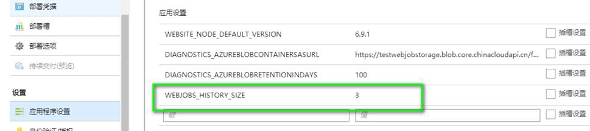
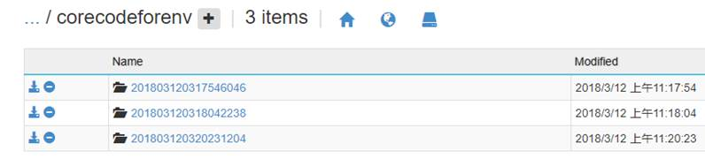

# Trigger 模式的 Web 作业如何控制日志数量

## 问题描述

Trigger 模式的 Web 作业 ，每次被触发会生成日志文件夹，因为 FTP 容量有限，如何控制日志文件夹的数量？

## 解决办法

通过 [Azure 门户](https://portal.azure.cn) 配置文件夹的个数信息，具体如下：

1. 通过 Azure 门户基于 `WEBJOBS_HISTORY_SIZE` 进行配置个数：

    

2. 配置的参数是 3 个，则只会有 3 个最新的日志文件夹存在，旧的文件夹会被自动删除。

    

具体请参考：[WebJobs - Configuration Settings](https://github.com/projectkudu/kudu/wiki/WebJobs)。