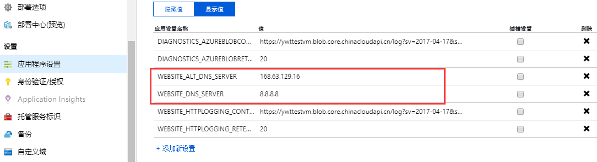

# 如何为 Web 应用程序指定新的域名解析服务器

在 **【应用程序设置】** 菜单里，可以添加键值对：

|应用设置名称 |值|
|:---:|:---:|
|WEBSITE_DNS_SERVER|8.8.8.8（公网的域名解析服务器 IP 地址）|

另外，我们还可以增加备用的域名解析服务器以备不时之需，如下：

|应用设置名称 |值|
|:---:|:---:|
|WEBSITE_ALT_DNS_SERVER|168.63.129.16 （Azure 域名解析服务器 IP 地址）|

