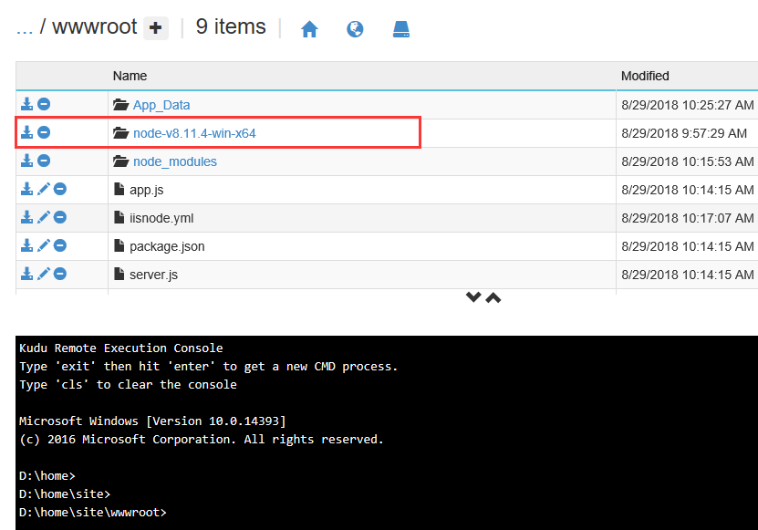
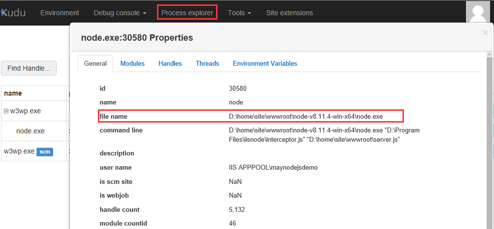

# 如何为 Azure Web 应用自定义 NodeJS 64 位版本

请按照以下步骤进行配置：

1. 下载 64 位的 [Node JS](https://nodejs.org/en/download/)。

    需要下载 zip 包。示例下载版本为：`node-v8.11.4-win-x64`。

2. 将该压缩包解压并上传到 Web 应用的 wwwroot 下。

    

3. 在 web.config 中配置 node 的启动路径。

    关键配置内容为：
    ```xml
    <configuration>
        <system.webServer>
            <handlers>
                <add modules="iisnode" verb="*" path="server.js" name="iisnode"/>
            </handlers>
            <iisnode nodeProcessCommandLine="D:\home\site\wwwroot\node-v8.11.4-win-x64\node.exe"/>
        </system.webServer>
    </configuration>
    ```

4. 配置完毕以后，重新启动 Web 应用。

    之后就可以在 **高级工具** -> **kudu** 页面查看到 NodeJS 所使用的 Node 的版本。

    
    
以上配置也可以通过 iisnode.yml 实现，请参考文档：[YAML configuration support in iisnode](https://tomasz.janczuk.org/2012/05/yaml-configuration-support-in-iisnode.html)。


## 参考文档

- [在 Azure 应用程序中指定 Node.js 版本](https://docs.azure.cn/zh-cn/nodejs-specify-node-version-azure-apps)
