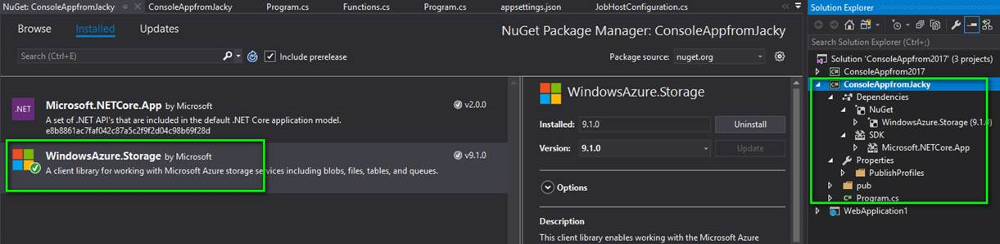
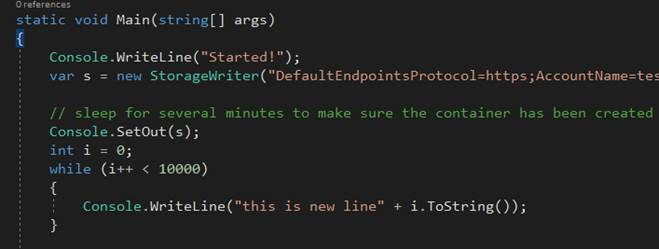
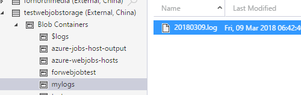

# 如何将 Web 作业中控制台信息写入到存储账号中

## 问题描述

在 Web 作业中通过 `Console.WriteLine` 打印日志，如何将打印的信息写入到存储账号中。

## 解决办法

1. 创建 .net core 控制台程序，添加 Storage package:

    

2. 关联存储账号如下，设置Console.SetOut()，Publish 发布到本地：

    
    
    其中，StorageWriter实现代码如下所示：
    
        class StorageWriter : TextWriter
        {
            private CloudAppendBlob appBlob = null;
            public override Encoding Encoding
            {
                get { return Encoding.Default; }
            }
            public StorageWriter(string connectionString) : base()
            {
                CloudStorageAccount storageAccount = CloudStorageAccount.Parse(connectionString);
                CloudBlobClient blobClient = storageAccount.CreateCloudBlobClient();

                //Setup our container we are going to use and create it.
                CloudBlobContainer container = blobClient.GetContainerReference("mylogs");
                container.CreateIfNotExistsAsync();

                DateTime date = DateTime.Today;
                DateTime dateLogEntry = DateTime.Now;
                // This creates a reference to the append blob we are going to use.
                appBlob = container.GetAppendBlobReference(
                string.Format("{0}{1}", date.ToString("yyyyMMdd"), ".log"));
            }

            private async Task WriteLineCustom(string input)
            {
                // Now we are going to check if todays file exists and if it doesn't we create it.
                if (!await appBlob.ExistsAsync())
                {
                    await appBlob.CreateOrReplaceAsync();
                }
                // Add the entry to our log.
                await appBlob.AppendTextAsync(input + "\r\n");
            }
            public override void WriteLine(string input)
            {
                Task.Run(async () => { await WriteLineCustom(input); }).GetAwaiter().GetResult();
            }
         }

3. 创建 cmd 文件，内容是 `dotnet.exe xxxxx.dll` 并压缩上传到 Web 作业中。

4. 对应的存储账号就会保存 `Console.WriteLine` 的输出内容，而不会保存到网站 FTP 中。

    
    
