# 将 Web 应用服务集成到虚拟网络后的连通性测试

本文是基于成功将 Web 应用服务(PaaS)集成到已有的虚拟网络(IaaS)后，为使用者提供了一些做网络连通性测试的方法。

有关如何将 Web 应用服务集成到已有的虚拟网络中，请参阅：[将 Azure 应用与虚拟网络进行集成](https://docs.azure.cn/zh-cn/app-service/web-sites-integrate-with-vnet)。

1. 从 [Azure 门户](https://portal.azure.cn)上确认 Web 应用服务是否已经连接到虚拟网络中：

    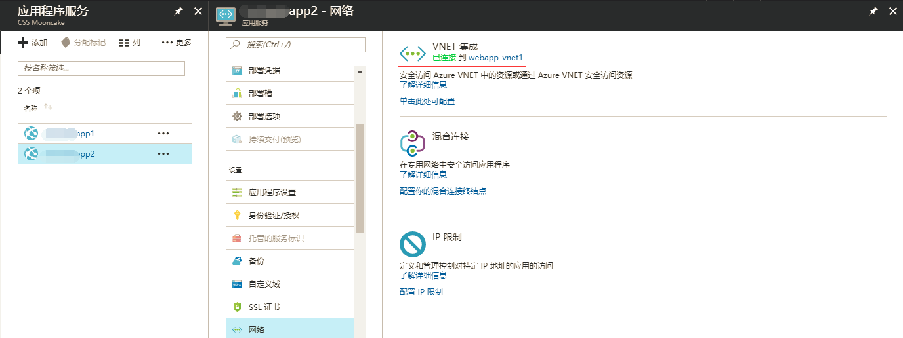

2. 在**概述**页中的**应用服务计划/定价层**下点击对应的“**网络名称**”：

    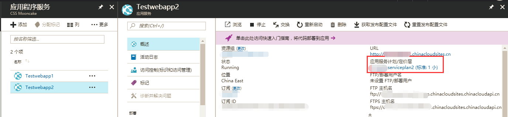

3. 在跳转页中，点击“**单击此处进行管理**”，如下图所示：

    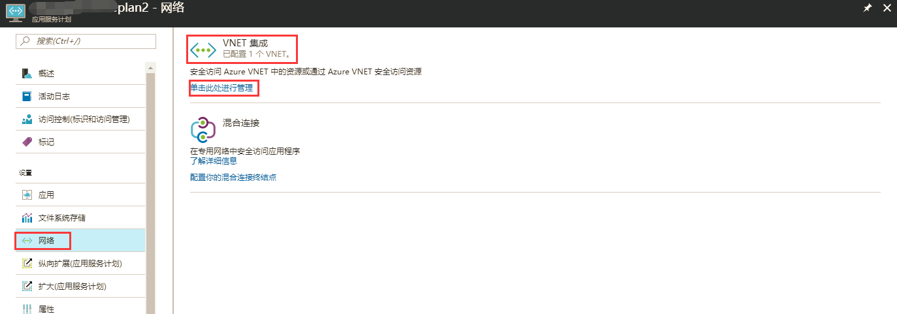

4. 点击对应的 **VNET 名称**，此处以 `webapp_vnet1` 为例：

    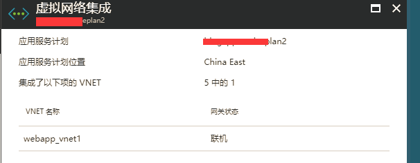

5. 此处可以看到 Web 应用服务的确是通过之前配置的点到站点 VPN 的方式拨入虚拟网络中的，并且可以为其配置到虚拟网络的路由中。

    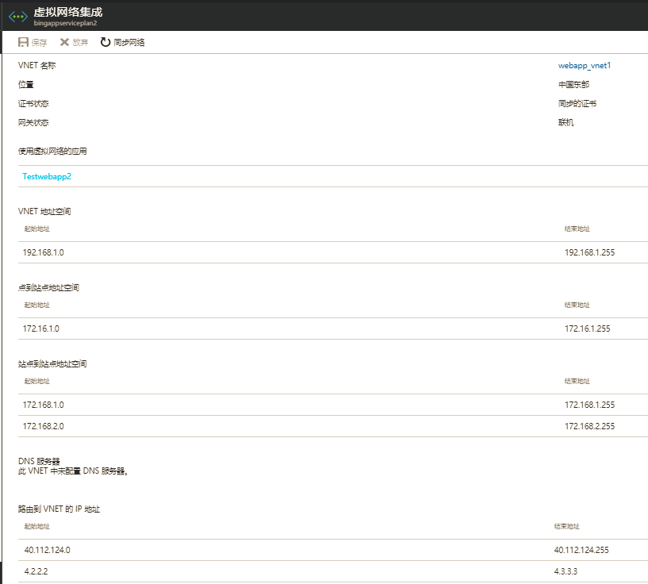

通过以上步骤就可以从 [Azure 门户](https://portal.azure.cn)中确认所有必要的配置。

下文为使用者介绍测试网络连通性的方法：

Azure Web 应用服务为使用者提供了**控制台** (console)访问方式以及高级工具 - **Kudu 站点**：

- 控制台

    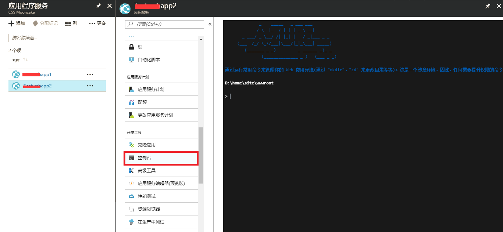

- Kudu 站点

    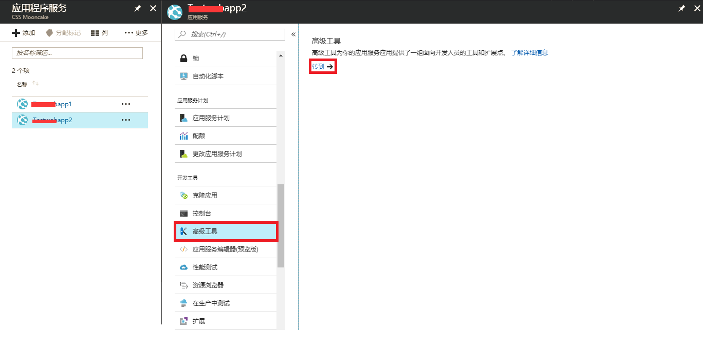


    当然您也可以通过在 Web 应用服务的 URL 中间添加 scm 的方式链接访问 Kudu 站点, 形式如下：

    ```
    http://<yoursite>.scm.azurewebsites.net
    ```

接下来以 PowerShell 或 CMD 为例，演示测试网络连通性的方法：

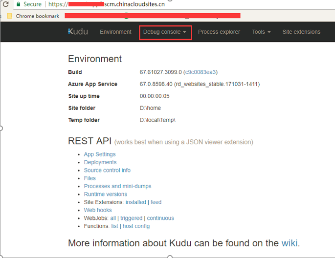
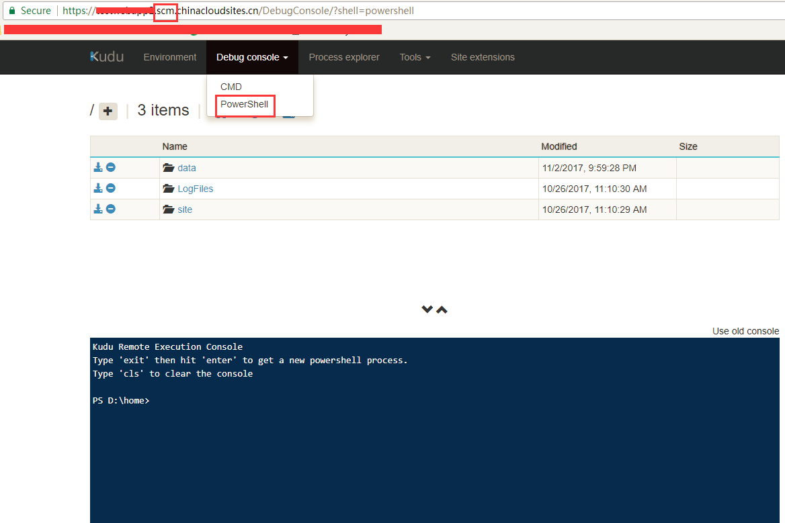

由于 Web 应用服务是属于 PaaS，故此 PowerShell 或 CMD 为用户提供的权限有限。

有关网络层面的测试工具，本文为使用者介绍 tcpping:

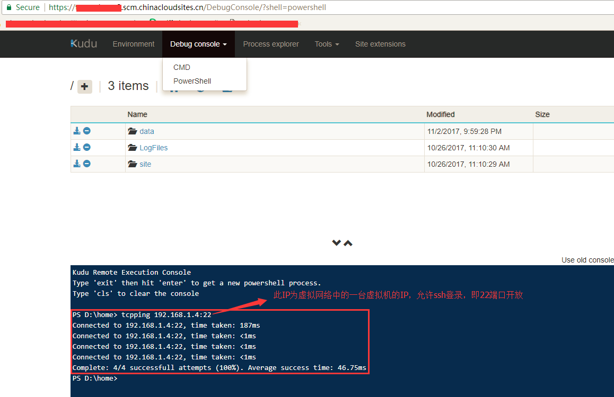

> [!NOTE]
> Web 应用服务的 PowerShell 或是 CMD 均不提供 ICMP Ping 工具，仅提供如上基于 TCP 层的测试工具。

另外，Kudu 的 CMD 中或是控制台中，可以运行 curl 工具，测试到虚拟网络或者到 internet 的 HTTP/HTTPS 连通性，但 curl 目前仅支持在 CMD 下运行：

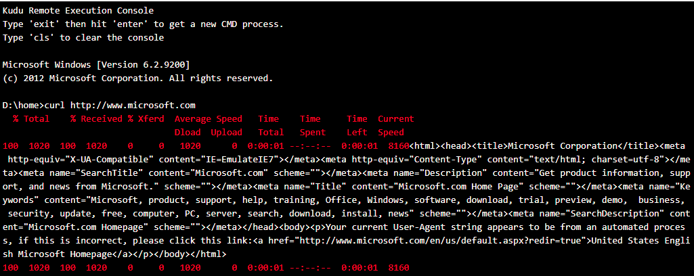

有关 CMD 中可以执行的其他命令，可以通过 `help` 命令获取。

有关 Kudu 的详细介绍，请参阅：[Kudu 站点](https://github.com/projectkudu/kudu/wiki)。