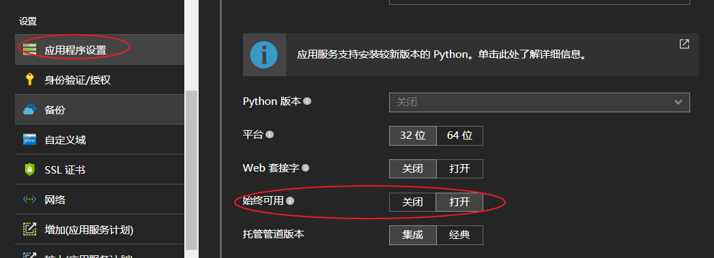

# 如何运行 idle 时间大于 2 分钟的计划作业

## 问题描述

当 WebJobs 空闲时间超过 2min，Azure 将会中止运行的工作进程，导致 WebJobs 运行失败。

## 解决方案

在 [Azure 门户](https://portal.azure.cn)中修改 **WEBJOBS_IDLE_TIMEOUT** 设置并开启了“**始终可用**”。

默认的 **WEBJOBS_IDLE_TIMEOUT** 为 120 秒，WebJobs 空闲时间超过了此数值，将会被中止工作进程，导致 WebJobs 运行失败。

> [!NOTE]
> 空闲时间指的是 WebJobs 在 2min 内，没有 CPU 时间或者 output 输出，长时间在等待请求，没有任何的数据交互。

可以通过以下的内容来修改 **WEBJOBS_IDLE_TIMEOUT**，保证 WebJobs 正常运行。

在应用程序设置中修改 **WEBJOBS_IDLE_TIMEOUT** 的配置（此处修改的时间为 20 分钟）:

开启“**始终可用**”功能 :

## 参考链接

[Kudu - WebJobs](https://github.com/projectkudu/kudu/wiki/WebJobs)