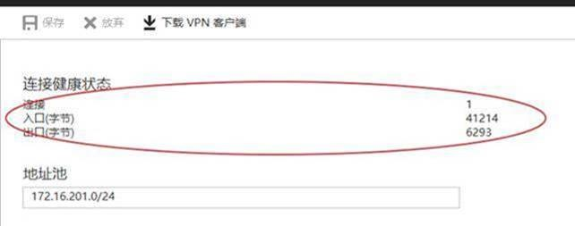
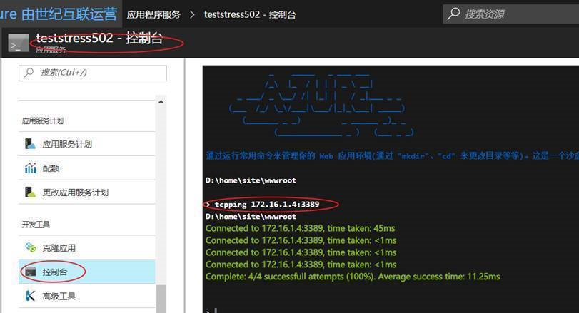

# 如何验证 Web 应用是否通过 Vnet 成功连接到其它服务

## 问题描述

Web 应用配置 Vnet 成功后，无法通过内网访问其他服务。

## 解决方案

检查 Web 应用连接到虚拟网络时，连接数是否有正常值，有正常值则表示可以正常访问。可以在网关中“**点到站点配置**”查看连接健康状态。

当连接数有值时，可以通过 tcpping 验证是否连接 VM 。

在 [Azure门户](https://portal.azure.cn)中选中需要验证的 web 应用，选择“**开发工具**”下的“**控制台**”，通过 `tcpping ip:port`命令进行验证。

为了保证您的 web 应用能够连接 VNET ，建议您在应用程序设置中开启 “**始终可用**” 功能。

参考文档：[从 Azure Web 应用访问内网资源](https://blogs.msdn.microsoft.com/showkat/2017/02/20/access-on-premises-resource-from-azure-app-services/)
