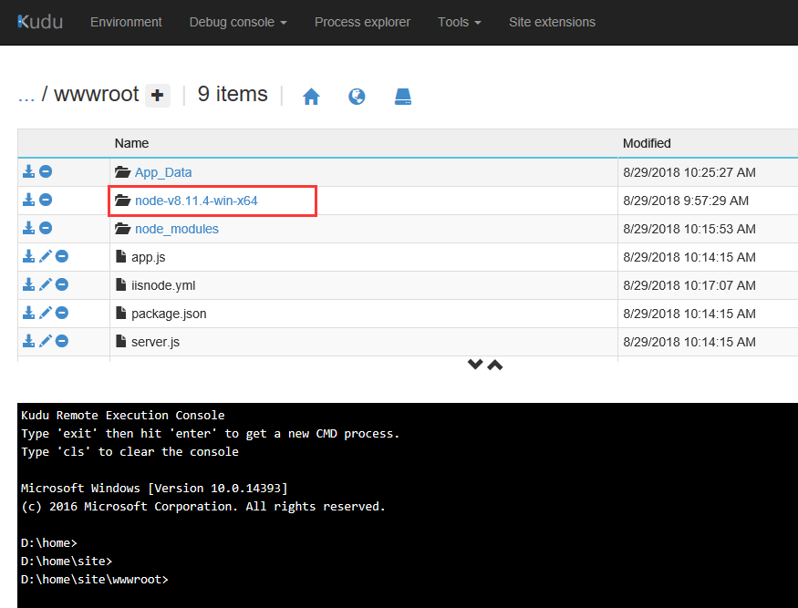
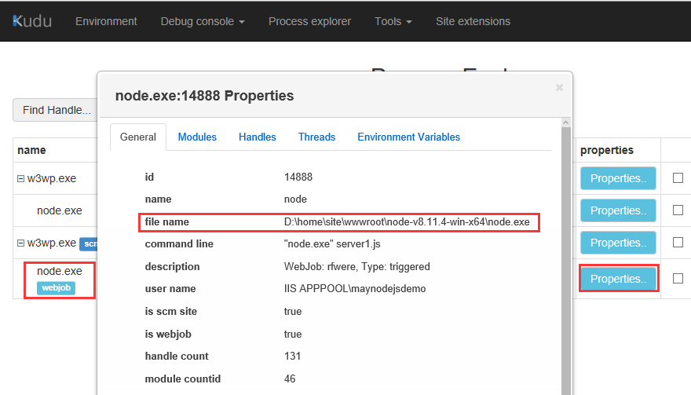

# 如何为 Azure Web 应用的 Web Jobs 自定义 NodeJS 64 位版本

请按照以下步骤进行配置：

1. 下载 64 位的 [Node JS](https://nodejs.org/en/download/)。

    需要下载 zip 包。示例下载版本为：`node-v8.11.4-win-x64`。

2. 将该压缩包解压并上传到 Web 应用的 wwwroot 下。

    

3. 配置 PATH 路径，添加自定义 NodeJS 路径在前 `%PATH%` 前。

    在 `Site` 目录下添加文件：`applicationHost.xdt`, 内容为：

    ```xml
    <?xml version="1.0"?>
    <configuration xmlns:xdt="http://schemas.microsoft.com/XML-Document-Transform">
        <system.webServer>
            <runtime xdt:Transform="InsertIfMissing">
                <environmentVariables xdt:Transform="InsertIfMissing">
                    <add name="FOO" value="BAR" xdt:Locator="Match(name)" xdt:Transform="InsertIfMissing" />
                    <add name="PATH" value="%HOME%\site\wwwroot\node-v8.11.4-win-x64;%PATH%" xdt:Locator="Match(name)" xdt:Transform="InsertIfMissing" />
                </environmentVariables>
            </runtime>
        </system.webServer>
    </configuration>
    ```

4. 配置完毕以后，重新启动 Web 应用，并且重新启动 Web Jobs。

    之后就可以在 **高级工具** -> **kudu** 页面查看到 NodeJS 所使用的 Node 的版本。

    

## 参考文档

- [Kudu 问题库 - 如何部署 Node JS 64 位版本](https://docs.microsoft.com/zh-cn/iis/configuration/system.webServer/staticContent/clientCache)