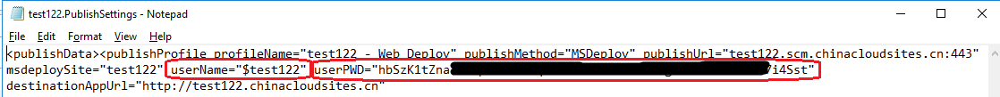
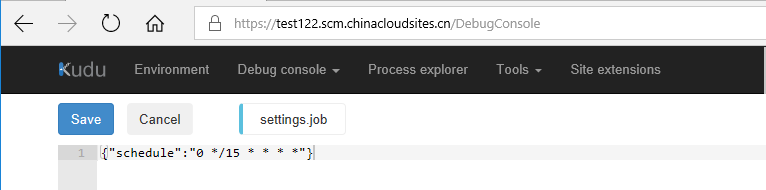
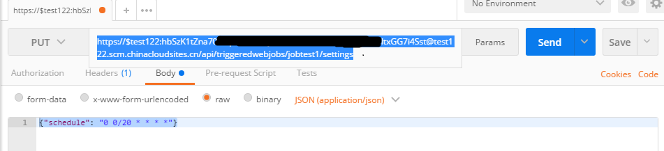
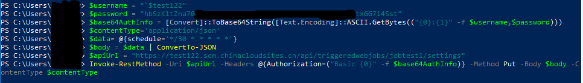

# 如何更改计划 Web 作业的 Schedule 时间

## 问题描述

在添加完计划 Web 作业之后，如何更改 Web 作业的 Schedule 时间。

## 问题分析

通过在门户中输入 CRON 表达式，或者在 Web 作业 .zip 文件的根目录中包含一个 settings.job 文件可以去设置 Web 作业的 Schedule 时间， 如果想要更改 Schedule 时间，可以通过 Kudu 在根目录中找到 settings.job 文件进行修改。另外也可以通过 [WebJobs API](https://github.com/projectkudu/kudu/wiki/WebJobs-API) 修改 settings.job 配置。

## 前提/要求

使用 CRON 表达式创建计划的 Web 作业可用于在基本、标准或高级模式下运行的 Web 应用，但需要应用上启用 “ **AlwaysOn** ”设置。

如果使用 WebJobs API 修改 settings.job，需要下载网站的发布配置文件，获取用户名和密码。



## 解决方案

### 方案一：通过 Kudu 修改 settings.job 文件。

使用以下 URL: `https://<site_name>.scm.chinacloudsites.cn` 登录到 Kudu 。

导航到：`D:\home\site\wwwroot\app_data\jobs\triggered\<job_name>\bin\Debug>` , 找到 settings.job 文件。

修改 settings.job 中的 CRON 表达式， 例如：若要每 15 分钟触发一次 WebJobs，可以改为：

```json
{
    "schedule": "0 */15 * * * *"
}
```

截图如下：



### 方案二： 通过调用 WebJobs API 修改 settings.job 配置。

该方案可以有多种方式去实现，这里主要包含了三种方法去调用 WebJobs API.

#### 方法1. 使用 C# 调用 WebJobs API , 代码如下：

```C#
HttpClient client = new HttpClient();
// 从网站发布配置文件中获取用户名和密码。
var byteArray = Encoding.ASCII.GetBytes("<username>:<password>");
client.DefaultRequestHeaders.Authorization = new AuthenticationHeaderValue("Basic", Convert.ToBase64String(byteArray));
var content = new StringContent("{\"schedule\": \"0 */50 * * * *\"}", Encoding.UTF8, "application/json");
// 使用 Put 方法调用 API。
var response = await client.PutAsync("https://<site_name>.scm.chinacloudsites.cn/api/triggeredwebjobs/<job_name>/settings", content);
```

#### 方法2. 使用 Postman 调用 WebJobs API 。

URL：`https://<username>:<password>@<site_name>.scm.chinacloudsites.cn/api/triggeredwebjobs/<job_name>/settings`

截图如下：



#### 方法3. 使用 Windows PowerShell 调用 WebJobs API , 代码如下：

```PowerShell
PS C:\Users\dillion> $username = "`<username>"
PS C:\Users\dillion> $password = "<password>"
PS C:\Users\dillion> $base64AuthInfo = [Convert]::ToBase64String([Text.Encoding]::ASCII.GetBytes(("{0}:{1}" -f $username ,$password)))
PS C:\Users\dillion> $contentType='application/json'
PS C:\Users\dillion> $data= @{schedule='0 */30 * * * *'}
PS C:\Users\dillion> $body = $data | ConvertTo-JSON
PS C:\Users\dillion> $apiUrl = "https://<site_name>.scm.chinacloudsites.cn/api/triggeredwebjobs/<job_name>/settings"
PS C:\Users\dillion> Invoke-RestMethod -Uri $apiUrl -Headers @{Authorization=("Basic {0}" -f $base64AuthInfo)} -Method Put -Body $body -ContentType $contentType
```



修改后可以使用 Kudu 查看修改后的结果。

## 参考文档

- [通过 cron 表达式计划 Azure Web 作业](http://blog.amitapple.com/post/2015/06/scheduling-azure-webjobs/#.Wf_ULNeWaM9)
- [创建的 WebJobs 无法按照 CRON 的设置来启动](https://docs.azure.cn/articles/azure-operations-guide/app-service-web/aog-web-apps-qa-webjob-cron-boot-error)
- [Web Job API](https://github.com/projectkudu/kudu/wiki/WebJobs-API)