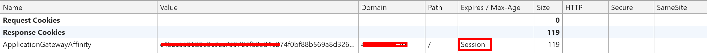

# 开启 Cookie based affinity 对应用程序网关有什么影响

首先从 cookie 的有效期的角度区分 cookie 的分类:

- **session cookies**： 
    如果 cookie 不包含过期日期, 它被视为 **session cookie**。Session cookie 存储在内存中, 从不写入磁盘。当浏览器关闭时, cookie 将从此被永久丢失。
- **persistent cookies**： 
    如果 cookie 包含过期日期, 则它被视为持 **persistent cookie**。在指定的日期到期时, 此 cookie 将从磁盘中删除。

cookie 可以包含几个不同的字段, 用分号隔开。定义如下:

expires: `*expires="Wdy, DD-Mon-YYYY HH:MM:SS GMT"*` 确定何时删除 cookie。

当应用程序网关开启 Cookie based affinity 后，它会在收到客户端请求后返回并要求客户端此 http session 后续请求 header 中携带此 cookie。

具体可以参考如下的 http dump:

如上，我们的 应用程序网关如果开启 Cookie based affinity，会生成 session cookie。

如果同一客户端向 Web 应用程序服务器的一个 URL 发起新的请求, 应用程序网关将附加一个新的会话 cookie 来 "记住" 此次基于 hash 的分发 (假设后端池有 server1,2,3，本次请求会被分发到 server1), 随后在此会话中来自此客户端（源 IP 不变）的相同 domain 的请求将被始终定向分发到 server1。

> [!NOTE]
> 目前，Cookie based affinity 所生成的虽然是 session cookie，但是，尽管清空缓存，关闭浏览器，只要客户端源 IP 不变，所请求的 domain 不变，session cookie 值是不会改变的。