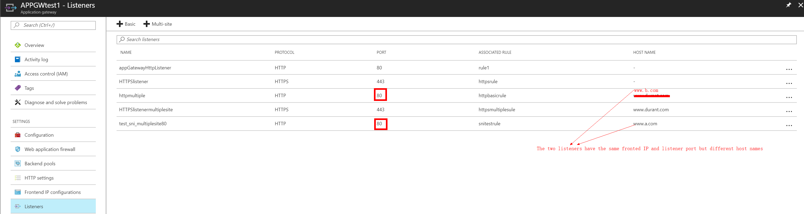

# 如何确定后端多站点网站服务请求的主机名

## 场景描述

客户在 Azure 云平台部署了多台虚拟机来发布多个网站，每一台虚拟机均发布多个网站。并且通过 Azure 云平台应用程序网关做前端侦听，安全过滤以及负载均衡服务。

## 需求分析

目前，应用程序网关只能通过单个前端 IP 地址来侦听流量，因此不支持使用多个自带 IP 地址的应用程序（即每个应用程序拥有各自的 IP）。
应用程序网关可以通过每个应用程序在不同的端口上进行侦听的方式支持托管多个应用程序，但此方案要求应用程序接受非标准端口上的流量，通常情况下不建议用户这样配置。<br>
应用程序网关可以使用 HTTP 1.1 主机标头实现在相同的前端 IP 地址和端口上托管多个网站。<br>
在应用程序网关上托管的站点也可以通过服务器名称指示 (Server Name Indication-SNI) TLS 扩展来支持 SSL 卸载。<br>
这种情况下，客户端浏览器和后端 Web 服务器群必须支持 RFC 6066 中定义的 HTTP/1.1 和 TLS 扩展。

## 示例说明

在应用程序网关配置了两个多站点类型的侦听器，均侦听在同一个前端 IP 以及 80 或 443 端口，侦听器的主机名分别配置为 `www.a.com` 和 `www.b.com`，后端池添加好若干台 Web 服务器，每一台后端服务器均部署好了这两个站点 (`www.a.com` 和 `www.b.com`) 的 Web 服务。<br>
在所有应用程序网关相关必要配置（包含后端池，HTTP 设置，规则，运行状况探测）完成后，来自前端客户端的请求经过 DNS 解析后，到达应用程序网关的前端 IP。<br>
应用程序网关会根据请求中的 HTTP1.1 的主机标头 (host header) 去匹配侦听器的主机名将请求分配给对应的侦听器，侦听器接收后应用程序网关开始对此请求做内部处理，处理完成后会根据关联的规则经过负载均衡计算后发给对应后端池中的后端服务器，至此整个应用请求交付完成。

配置举例如下（以下两个侦听器对应的规则所关联的后端池是相同的）：



但是此前用户会遇到一个问题，由于是多站点，使用同一个前端 IP，来自客户端的到达不同站点的请求经过 DNS 解析后，均是到达此应用程序网关的前端 IP，用户需要进一步统计到达这个应用程序网关前端 IP 的请求中哪些是访问 `www.a.com` 的，哪些是访问 `www.b.com` 的。

此时用户期望通过参考应用程序网关访问日志来统计到达不同站点的不同请求的具体信息，但发现日志中并没有依据，即访问日志中不会记录客户端请求中的主机名，这是由于此前应用程序网关基于 w3c 格式的日志条目中，包含了相对路径的 URI，以及发送到后端服务器的 IP 地址或 FQDN 主机名等基本信息，但是不包含客户端请求的主机标头（host header）。

> [!IMPORTANT]
> 经过产品组的后续更新，目前在访问日志中已经加入 host name 字段。

```json
{
    "records": [
        {
            "GatewayId": "xxxxxxxx-9a3d-4c06-bc99-xxxxxxxxxx", 
            "Region": "China East", 
            "resourceId": "/SUBSCRIPTIONS/SUBID/RESOURCEGROUPS/resourcegroupname/PROVIDERS/MICROSOFT.NETWORK/APPLICATIONGATEWAYS/APPGWname", 
            "operationName": "ApplicationGatewayAccess", 
            "time": "2017-12-28T07:52:04Z", 
            "category": "ApplicationGatewayAccessLog", 
            "properties": {
                "instanceId": "ApplicationGatewayRole_IN_1", 
                "clientIP": "xxx.220.255.xx", 
                "clientPort": 54566, 
                "httpMethod": "GET", 
                "requestUri": "/", 
                "requestQuery": "X-AzureApplicationGateway-CACHE-HIT=0&SERVER-ROUTED=192.168.1.110&X-AzureApplicationGateway-LOG-ID=b50d17ca-3cba-4545-ab07-c4be726d647b&SERVER-STATUS=304", 
                "userAgent": "Mozilla/5.0+(Windows+NT+10.0;+Win64;+x64)+AppleWebKit/537.36+(KHTML,+like+Gecko)+Chrome/63.0.3239.84+Safari/537.36", 
                "httpStatus": 304, 
                "httpVersion": "HTTP/1.1", 
                "receivedBytes": 526, 
                "sentBytes": 142, 
                "timeTaken": 207, 
                "sslEnabled": "off", 
                "host": "HOSTNAME"
            }
        }
    ]
}
```

以上是开启了应用程序网关诊断日志后，从存储账号中下载的应用程序网关的访问日志。有关如何开启应用程序网关的访问日志，请参考[应用程序网关的后端运行状况、诊断日志和指标](https://docs.azure.cn/zh-cn/application-gateway/application-gateway-diagnostics)。<br>
在日志中的最后一个条目即 `"host":"HOSTNAME`，此处如果客户端请求是以 IP 发起的，那么此处记录的会是 IP 地址，如果请求是以主机名发起的，那么此处会记录主机名，即客户端请求中的 header 实际内容，这样就实现了在应用程序网关的日志中区分到后端相同服务器但是不同主机名或域名的请求，满足了客户对于应用请求的统计，维护等日常分析需求。
