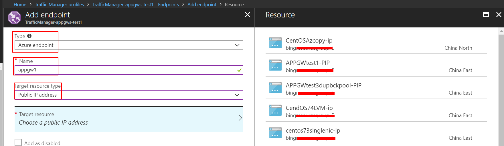
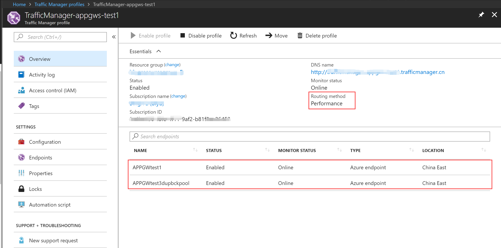
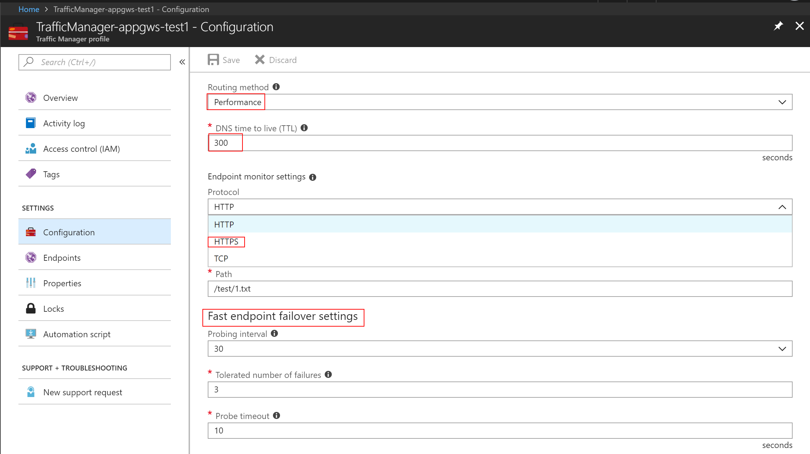

# 应用程序网关(application gateway)结合流量管理器(traffic manager)实现更丰富的流量分发场景需求

## 适用场景

由于目前应用程序网关对于后端池中的资源做 7 层的负载均衡算法只有轮询机制，即只要探针得到后端池中的所有资源正常响应，就会将流量按照轮询机制分发给后端池中所有资源（这里将 cookie  affinity 以及特定 URL path based routing rule 的情况排除在外），而实际业务场景中，往往需要更丰富的流量负载分发方式。

本文介绍了通过将应用程序网关与流量管理器结合使用的方式，从而在一定程度上实现以上需求。

## 实现方法

1. 准备好多组应用程序网关（可以部署在异地 Azure 数据中心，即北部和东部）

2. 创建一个流量管理器，有关什么是流量管理器，以及如何创建一个流量管理器，请参阅： [流量管理器概述](https://docs.azure.cn/zh-cn/traffic-manager/traffic-manager-overview)和[创建流量管理器配置文件](https://docs.azure.cn/zh-cn/traffic-manager/traffic-manager-create-profile)。

3. 其中添加流量管理器的 endpoint 步骤中，可以参考如下范例添加应用程序网关的公网 IP：

    

4. 添加完成后，流量管理器会根据配置探测此应用程序网关对应终结点的健康情况，具体如下图：

    

5. 可以通过在 configuration 中配置：

    1. 流量路由方法：性能，优先级，加权，地理
    2. DNS TTL 时间
    3. Endpoint 监控设置，这里配置为 HTTP/HTTPS, 端口为 80 或 443，可以配置一个探测的 URL 路径。此监控设置直接决定了是否将流量分配给对应的 endpoint。
    4. Endpoint 故障转移（fail over）设置：探测间隔，容许失败的次数，探测超时时间
    如下图：
        

有关流量路由的 4 种分发方式，解释如下：

- **优先级**：如果想要使用主服务终结点来处理所有流量，并提供备份来防范主终结点或备份终结点不可用的情况，可以选择“优先级”。
- **加权**：如果想要跨一组终结点来分配流量，不管是平均分配还是根据所定义的权重进行分配，可以选择“加权”。
- **性能**：如果终结点位于不同的地理位置，并且你希望最终用户依据最低网络延迟使用“最近的”终结点，可以选择“性能”。
- **地理**：选择“地理”可根据用户的 DNS 查询所源自的地理位置将用户定向到特定终结点（“Azure”、“外部”或“嵌套”）。 这使流量管理器客户可以启用特定的方案：在这些方案中，了解用户的地理区域，并基于该地理区域路由用户很重要。 示例包括遵守数据所有权要求、内容本地化和用户体验，以及测量来自不同区域的流量。

有关具体不同流量路由分发原理，可参考：[流量管理器路由方法](https://docs.azure.cn/zh-cn/traffic-manager/traffic-manager-routing-methods)。

使用者完全可以根据自身需求，以及业务特征来选择其中一种。

通过将多组应用程序网关以 endpoint 的形式，放置在流量管理器中，实现了更丰富的 DNS 级别流量分发。 
比如，用户拥有大型网站，客户端分布在全国各地，用户希望既希望为广大客户端提供多冗余的可靠服务，又希望通过提高客户端访问的速度来提升客户体验，此种场景，可以通过如下配置实现：

1. 建立多组应用程序网关（可以分布在中国东部和中国北部），虽然应用程序网关可以选择多实例，拥有 SLA 的保障，但是仍然可以将多组应用程序网关以多个终结点的方式加入进流量管理器中，实现更高的可用性。
2. 理由方法选择为“性能”，这样流量管理器跟根据客户端的来源 IP，从现有的终结点（应用程序网关）选择一个与此客户端 IP 所在网段网络延迟最低的来响应客户端的 DNS 请求，接下来客户端会发起对此 A 记录的 http/https/websocket 的访问。
3. 由于流量管理器有故障转移（failover）设置，再次提高了服务的高可用性。

此场景仅仅是实际应用场景中的一种，用户可以根据流量管理器更多配置方法，实现更复杂的应用场景。