# 如何使用 Azure 门户配置 HTTP 流量重定向 HTTPS 的多站点应用程序网关

如下以 `site1.21vianet.party` 和 `site2.21vianet.party` 两个站点为例进行部署。

介绍如何执行下列操作：

1. 添加后端池
2. 配置自定义探测
3. 配置 HTTP 设置
4. 添加多站点侦听器
5. 配置重定向规则

以下是基于已创建的应用程序网关配置的步骤：

## 添加后端池

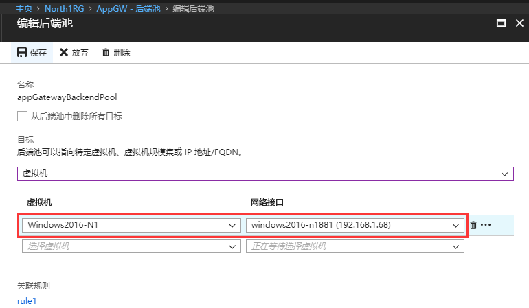

## 添加自定义探测：

对于多站点的应用程序网关，需要使用自定义的运行状况探测。

对应在 “**设置**” - “**运行状况探测**” 中添加，主机字段填写各自的域名。

Site1 配置如下：

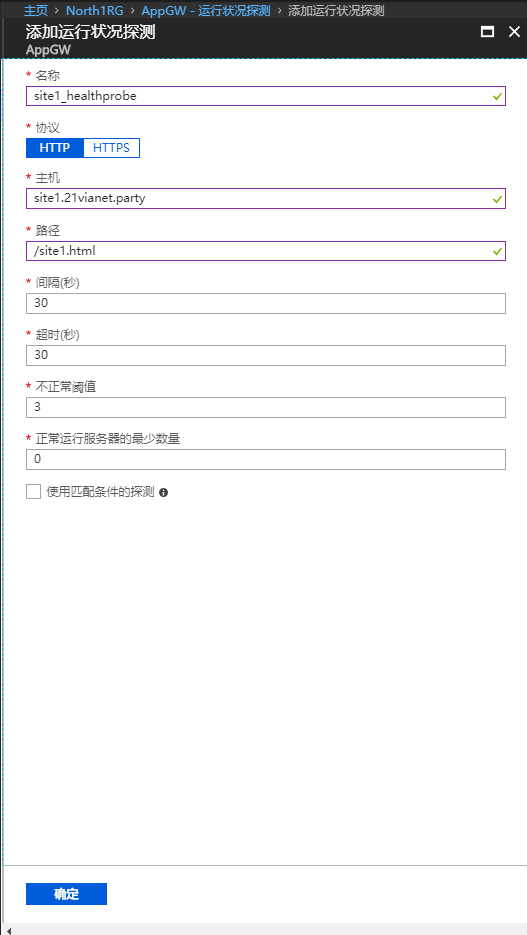

Site2 配置如下：

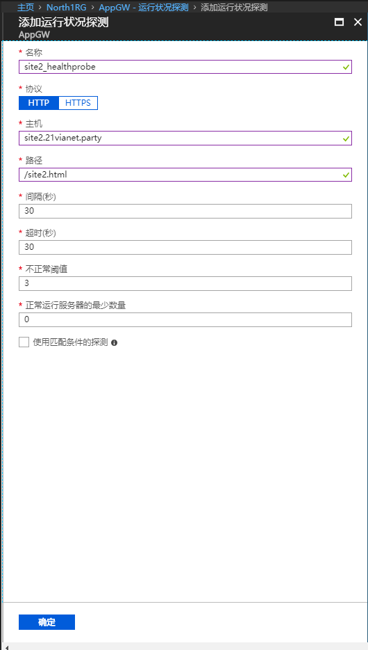

## 添加 HTTP 设置

在 “**设置**” - “**HTTP 设置**” 中分别添加 HTTP 设置，注意调用自定义运行状况探测。

Site1 配置如下：

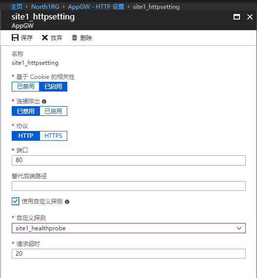

Site2 配置如下：

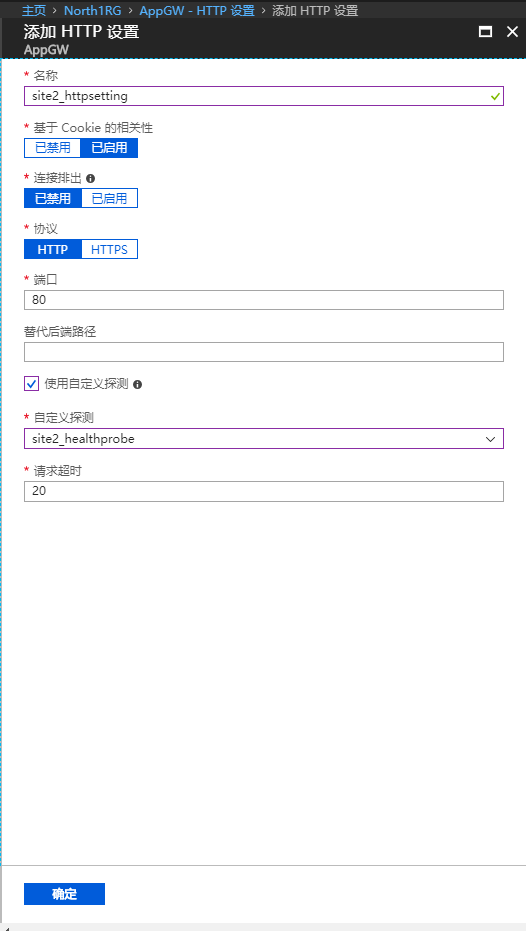

## 添加前端 IP 地址：

由于测试域名未备案，所以通过内网 IP 进行部署，在 “**设置**” - “**前端 IP 配置**” 中添加专用 IP。

实际环境中可以对应更换为公网 IP 地址。

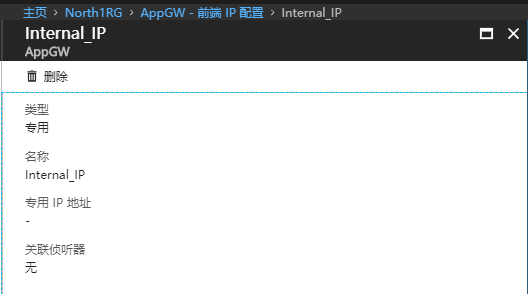

## 添加多站点侦听器

在 “**设置**” - “**侦听器**” 中添加创建 Site1 的 HTTPs 侦听器，并上传 PFX 证书。

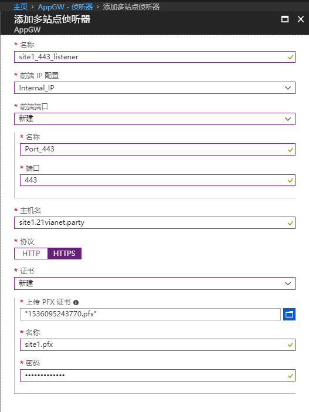

创建 Site2 的 HTTPs 侦听器，并上传 PFX 证书。

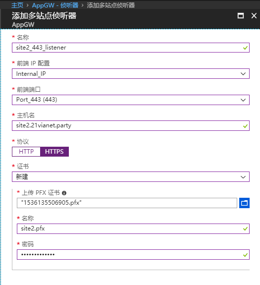

## 配置规则（对应 HTTPS 的流量）

在 “**设置**” - “**规则**” 中添加 Site1_https_rule 配置如下：

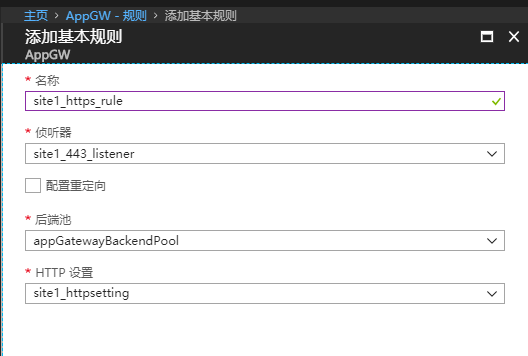

Site2_https_rule 配置如下：

以上，已经完成多站点的 HTTPS 的应用程序网关，接下来要进行 HTTP 重定向的配置。

## 配置 HTTP 侦听器

直接按照如下配置添加会出现报错：

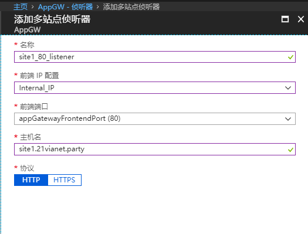

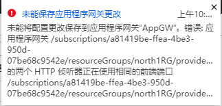

此时需要删除默认侦听器，在门户上直接删除即可。

## 再次添加 HTTP 侦听器

Site1 HTTP 侦听器：

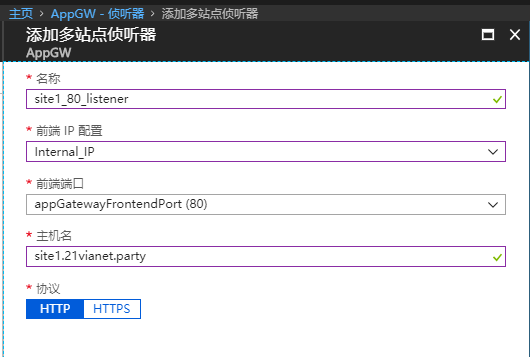

Site2 HTTP 侦听器：

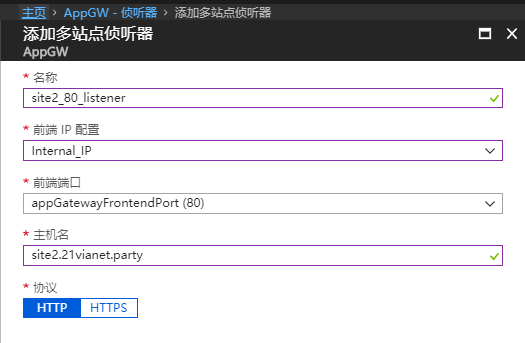

## 配置重定向规则

在 “**设置**” - “**规则**” 中，添加重定向配置。

Site1 重定向规则如下：

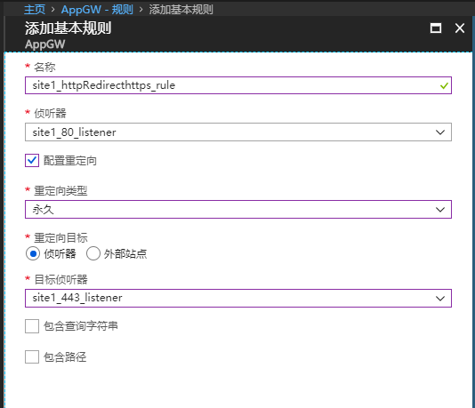

Site2 重定向规则如下：

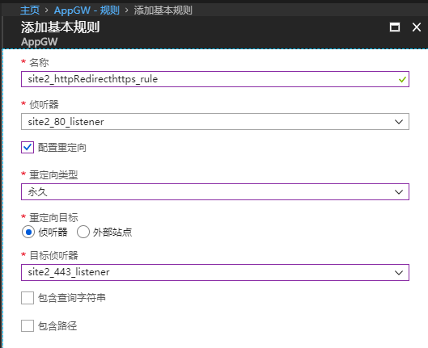

## 测试结果

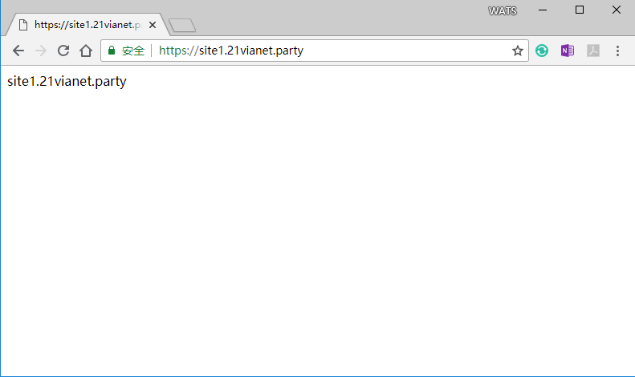

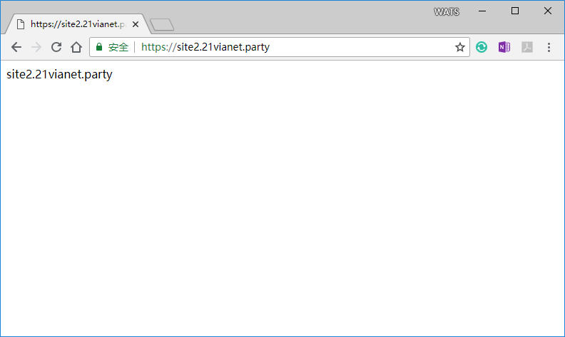

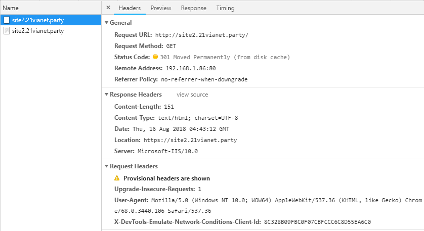