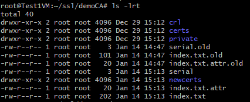
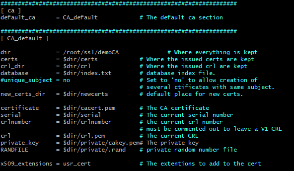
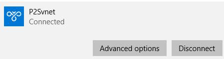
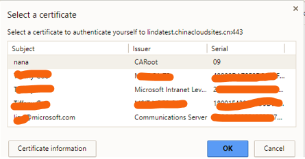

# 如何用 OpenSSL 创建自签名证书

## 需求分析

当用户使用的不是企业证书解决方案，或者由于某种原因不想通过 CA 购买证书，如用于测试等场景，则需要创建自签名证书。<br>
可以通过 Linux 的 OpenSSL 命令行工具生成自签名证书，实现加密解密， 甚至还可以当做 CA 来用，创建以及吊销证书。使用 OpenSSL 生成的自签名证书经测试验证， 既可适用于 Azure 点对站点 VPN 连接， 同时也可用于与 HTTPS 应用服务器之间的 TLS 通信。

本文主要指导 P2S VPN 场景以及与 HTTPS 服务器连接场景下，如何使用 OpenSSL 创建自签名证书以及注意事项。

## 自签名证书类型

- 自签名证书
- 自建 CA 签名的证书

自签名的证书无法被吊销，CA 签名的证书可以被吊销，能不能吊销证书的区别在于如果私钥不小心被恶意获取，如果证书不能被吊销那么黑客很有可能伪装成受信任的客户端与用户进行通信。<br>
如果你的规划需要创建多个客户端证书，那么使用自建 CA 签名证书的方法比较合适，只要给所有的客户端都安装了 CA 根证书，那么以该 CA 根证书签名过的客户端证书都是信任的，不需要重复的安装客户端证书。<br>
请注意由于是自建 CA 证书，在使用这个临时证书的时候，会在客户端浏览器报一个错误，签名证书授权未知或不可（signing certificate authority is unknown and not trusted.），但只要配置正确，继续操作并不会影响正常通信。 自签名证书的 Issuer 和 Subject 是一样的。<br>
下面就分别阐述不同的应用场景下，如何使用 OpenSSL 生成这两种自签名证书。

## 应用场景

### 应用场景一：P2S VPN

#### 自签名证书

使用自签名证书，创建步骤如下：

1. 生成服务器私钥

	```
	openssl genrsa -out client.key 4096
	```

	这一步您可以选择是否使用密码保护私钥，设置私钥密码的话，每次启动服务器搜需要输入该密码从而保证了私钥的安全性

2. 生成证书签名请求（CSR）

	```
	openssl req -new -key client.key -out client.csr
	```

	生成 CSR 的过程中，会提示输入一些信息，其中一个提示是 Common Name (e.g. YOUR name)，这个非常重要，这一项应填入 FQDN(Fully Qualified Domain Name)完全合格域名/全称域名，如果您使用 SSL 加密保护网络服务器和客户端之间的数据流，举例被保护的网站是 `https://test.chinacloudsites.cn`，那么此处 Common Name 应输入 `test.chinacloudsites.cn`

	

3. 使用上一步的证书签名请求签发证书

	```
	openssl x509 -req -days 365 -in client.csr -signkey client.key -out client.crt 
	```
	
	以上三个步骤也可以通一个简单的方法，实现一步创建私钥和证书：
	
	```
	openssl req -new -x509 -newkey rsa:4096 -keyout client.key -out client.crt
	```

#### 创建自签 CA 证书

创建自签 CA 证书，主要分为两个部分： 创建[CA 根证书](#setcion1)及[签发客户端证书](#setcion2)。

##### <a id="setcion1"></a>创建 CA 根证书

使用 OpenSSL 可以创建自己的 CA，给需要验证的用户或服务器颁发证书，这就需要创建一个 CA 根证书，在创建 CA 根证书之前，请做好如下准备工作：修改好 CA 的配置文件、序列号、索引等等。

1. 创建 CA 目录

	```
	mkdir -p ~/ssl/demoCA/{certs,newcerts,crl,private}
	cd ~/ssl/demoCA
	Touch index.txt
	echo "01" > serial
	```

	

	具体每个目录存储什么信息，可以查看 openssl 的配置文件：`vi /etc/ssl/openssl.cnf`:

	

	> [!NOTE]
	> 本文以 ubuntu 16.04 版本为例，具体 openssl.cnf 配置文件位置取决于实际的 linux 操作系统。
      
2. 修改 openssl.cnf 文件

	建议拷贝 openssl.cnf 文件到自定义文件夹下，这样可以自定义证书和证书申请中的一些属性和扩展，如秘钥扩展等：

	```
	sudo cp /etc/ssl/openssl.cnf ~/ssl/openssl.cnf
	vi ~/ssl/openssl.cnf
	```

3. 生成 CA 根证书及密钥

	```
	openssl req -new -x509 -newkey rsa:4096 -keyout cakey.key -out cacert.crt -config openssl.cnf -days 365
	```

	使用 X.509 证书结构生成证书，X.509 证书的结构是用 ASN1(Abstract Syntax Notation One)进行描述数据结构, X.509 证书编码格式主要有两种： .PEM 和.DER。<br>
	.DER 是二进制编码，可包含所有私钥、公钥和证书，是大多数浏览器的缺省格式，常见于 Windows 系统中的证书格式。<br>
	.PEM 是明文格式的, 以 “`-----BEGIN CERTIFICATE-----` 开头，已 `-----END CERTIFICATE-----` 结尾”, 中间是经过 base64 编码的内容, Apache 和 NGINX 服务器偏向于使用这种编码格式，也是 openssl 默认采用的信息存放方式。PEM 其实就是把 DER 的内容进行了一次 base64 编码。<br>

	此处通过命令生成扩展名为.crt 的根证书文件和扩展名为.key 的公钥，生成的证书和公钥可能是.PEM 编码格式，也可能是.DER 编码格式。

	使用生成的根证书和公钥用于 P2S VPN 场景时，把根证书和公钥保存在.cer 文件中， 再通过 FTP/SFTP 等方式传到本地 Windows 主机文件夹，点击安装根证书并添加到了 windows 的 current User\Trusted Root Certification Authority 目录下，通过 Azure Powershell 把证书中的公钥上传至 P2S VPN。

	```
	cat cacert.crt cakey.key > cacert.cer
	```

4. Linux 查看证书信息，编码，转码：

	查看公钥的内容命令为：`openssl rsa -noout -text -in cakey.key`<br>
	即可观察秘钥的编码方式，如果为.PEM ,则会以 base 64 明文方式显示。<br>

	查看证书的内容命令为：`openssl x509 -noout -text -in cacert.crt`<br>
	证书编码格式转换:<br>
	- PEM 转为 DER：`openssl x509 -in cacert.crt -outform der -out cacert.der`
	- DER 转为 PEM：`openssl x509 -in cert.crt -inform der -outform pem -out cacert.pem`

#### <a id="setcion2"></a>签发客户端证书

使用 OpenSSL 创建客户端证书时，请注意：

- 创建私钥时，请将长度指定为 `4096`。
- 创建证书时，对于 `-extensions` 参数，指定 `usr_cert`。

1. 生成 4096 bit 的客户端私钥

	```
	openssl genrsa -out client.key 4096
	```

2. 用该客户端私钥生成证书签名请求，扩展名.csr

	```
	openssl req -new -key client.key -out client.csr -config openssl.cnf
	```

3. 使用 CA 根证书签发客户端证书

	```
	openssl ca -in client.csr -out client.crt -cert cacert.crt -keyfile cakey.key -config openssl.cnf
	```

	> [!NOTE]
	> 当使用 CA 签发客户端证书时，就会加上 usr_cert 的证书扩展项。

4. 把客户端证书和私钥保存为.pem 格式

	```
	cat client.crt client.key > client.pem
	```

5. 如需导出到 windows 供 P2S VPN 客户端使用, 需把客户端证书转换成.pfx 格式

	```
	openssl pkcs12 -export -inkey client.key -in client.pem -out client.pfx
	```

	之后可以通过 FTP/SFTP 等方式把 client.pfx 证书拷贝到 windows 主机上任意文件夹，然后在 windows 上点击该.pfx 文件安装客户端证书，并导出私钥 [点到站点安装客户端证书](/vpn-gateway/point-to-site-how-to-vpn-client-install-azure-cert)。

	在 Azure P2S VPN 中，可以为每个客户端生成唯一证书，也可以对多个客户端使用同一证书。若想在 Linux 中生成唯一客户端证书，可以通过生成不同的客户端私钥及证书申请文件，再由根证书签发出不同的客户端证书，存储在相应文件夹，导出到 Windows 客户端。

	上传该自签名根证书到 Azure, 在本地客户端安装导出的.pfx 证书，观察连接状态为 connected:

	

### HTTPS 服务器通信

以上两种自签名证书，也可以用于客户端浏览器与 HTTPS 服务器之间进行证书认证，实现数据的加密传输。根据用户实际认证需求，通常有以下几种常见证书使用场景：

- 自签名证书：如用户内部两台设备需要 HTTPS 加密通信，又不想使用第三方签发证书，这时候客户端和服务器使用相同的证书和私钥。
- 自建 CA 签发服务器证书：如果 HTTPS 通信的两端需要经过第三方平台进行服务器和客户端的验证，可以通过自建 CA 签发服务器端证书安装在服务器端，并把自建 CA 根证书安装到客户端浏览器受信任的证书颁发机构中。

通常情况下实现服务器端认证即可，但特殊情况下我们也需要对客户端进行验证，即双向认证。如 Web 应用上 开启了’client authentication” 选项，这个时候只有当客户端请求带了可用的客户端证书才能调通 Web 应用，如在客户端浏览器访问 Web 应用时跳出如下窗口：




> [!IMPORTANT]
> 在生成 HTTPS 服务器端证书时，注意要加上秘钥扩展 `extendedKeyUsage =  serverAuth,1.3.6.1.5.5.7.3.1`, 这样生成的秘钥才可以用来在服务器和客户端之间进行认证，不然会提示鉴权失败。
> 在生成 HTTPS 服务器端证书时，需要填写 Common Name (e.g. server FQDN or YOUR name), 即访问服务的域名信息，如果有很多子域名，可以用 `*` 代替，如 `*.test.com`。
> 如果需要客户端和服务器端双向认证， 在生成客户端证书时， 注意要加上秘钥扩展 `extendedKeyUsage =  clientAuth,1.3.6.1.5.5.7.3.2`。


