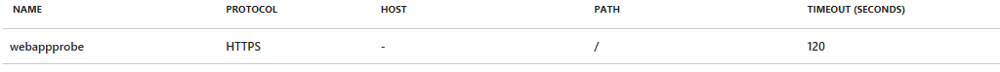
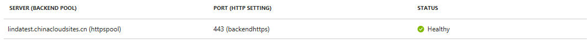

# 如何通过 PowerShell 创建后端池为 Web 应用的应用程序网关以实现端到端 SSL 通信

## 介绍

我们知道应用程序网关可以实现 SSL 卸载，以避免 Web 服务器出现开销较高的 SSL 解密任务 [ARM 模式下应用网关实现 SSL 卸载](/application-gateway/application-gateway-ssl-arm)，但是对于某些场景来说，用户有一些安全和合规上的规定或者后端服务器的特性，要求到达后端服务器上的数据都要经过加密。对于这种需求，应用程序网关会在网关上终止前端 SSL 会话解密用户流量，然后应用所配置的 SSL 规则，发起到后端服务器的新 SSL 连接，并先使用后端服务器的公钥证书重新加密数据，把请求传输到后端 Web 服务器上实现端到端的 SSL 传输。

本文主要指导完成通过 PowerShell 创建后端池为 Web 应用的应用程序网关，实现端到端的 SSL 通信，以及在部署过程中怎么避免 Web 应用域名的暴露。
对于端到端SSL通信请见[端到端 SSL](/application-gateway/application-gateway-end-to-end-ssl-powershell)
如何在应用程序网关后配置Web应用请假[应用程序网关配置 Web 应用](/application-gateway/application-gateway-web-app-powershell)

> [!IMPORTANT]
> 本文所提及的端到端 SSL 只适用于 Resource Manager 模式。

## 开始之前

在创建端到端的 SSL 连接之前，请确保您的 Web 应用后端池满足以下条件：

- 为应用实施 HTTPS
- 将自定义 DNS 名称映射到 Web 应用
- 应用服务绑定了受信任的 SSL 证书

为了保证 Web 应用的安全， 用户可以购买 “Azure APP 的 SSL 证书”，把证书保存在 “Azure Key Vaul” 里， 并与自定义域名关联使用， 实现快速生成证书，Rekey 和 Sync 等证书管理操作。 但是由于 Azure 中国区目前还没有开通 “APP Service Certificate ”服务， 对于使用 HTTPS 类型服务作为后端池的需求，用户可以选择从可信任的证书机构购买证书，或者对于某些测试场景可以采用自签名证书的方式。

## 自签名 SSL 证书制作

由于是自签名证书，所以在创建证书时要格外注意，SSL 证书需要满足以下要求：

- 由可信任的证书机构签发（或者自建 CA 签发）
- 可以导出.pfx 格式
- 私钥至少 2048 bit
- 证书链中需包含所有中间证书

自签名证书创建详情请参考 “[如何用 openssl 创建自签名证书](aog-application-gateway-howto-create-self-signed-cert-via-openssl.md)”

## Web 应用端到端 SSL 应用程序网关创建步骤

### 创建 Resource Group, vnet, subnet 等

```PowerShell
New-AzureRmResourceGroup -Name APPGWRG -Location "ChinaNorth"
$gwSubnet = New-AzureRmVirtualNetworkSubnetConfig -Name 'appgwsubnet' -AddressPrefix 10.12.0.0/26
$nicSubnet = New-AzureRmVirtualNetworkSubnetConfig  -Name 'appsubnet' -AddressPrefix 10.12.1.0/24
$vnet = New-AzureRmvirtualNetwork -Name 'appgwvnet' -ResourceGroupName APPGWRG -Location "ChinaNorth" -AddressPrefix 10.12.0.0/23 -Subnet $gwSubnet, $nicSubnet
$publicip = New-AzureRmPublicIpAddress -ResourceGroupName APPGWRG -Name 'httpspublicIP' -Location "ChinaNorth" -AllocationMethod Dynamic
$vnet = Get-AzureRmvirtualNetwork -Name 'appgwvnet' -ResourceGroupName APPGWRG
$gwSubnet = Get-AzureRmVirtualNetworkSubnetConfig -Name 'appgwsubnet' -VirtualNetwork $vnet
$nicSubnet = Get-AzureRmVirtualNetworkSubnetConfig -Name 'appsubnet' -VirtualNetwork $vnet
$gipconfig = New-AzureRmApplicationGatewayIPConfiguration -Name 'gwconfig' -Subnet $gwSubnet
$fipconfig = New-AzureRmApplicationGatewayFrontendIPConfig -Name 'IPconfig' -PublicIPAddress $publicip
```

### 创建后端 Web 应用的 probe

```PowerShell
$match = New-AzureRmApplicationGatewayProbeHealthResponseMatch -StatusCode 200-399
$probeconfig = New-AzureRmApplicationGatewayProbeConfig -name webappprobe -Protocol Https -Path / -Interval 30 -Timeout 120 -UnhealthyThreshold 3 -PickHostNameFromBackendHttpSettings -Match $match
```

> [!IMPORTANT]
> 由于 Web 应用是是比较特殊的后端池，它的 probe 需要通过“PowerShell”中的 `PickHostNameFromBackendHttpSettings` 命令去创建，通过此命令从后端主机名中获得主机标头，如果手动在 Azure 门户上指定后端 Web 应用的主机名， 很有可能 probe 建立不成功

创建成功的 Probe 示例如下：



### 获得创建好的 HTTPS 类型的 Web 应用

```PowerShell
$webapp = "lindatest.chinacloudsites.cn"
```

### 创建 HTTPS Web 应用后端池

```PowerShell
$pool = New-AzureRmApplicationGatewayBackendAddressPool -Name 'httpspool' -BackendFqdns $webapp
```

### 创建前端监听端口

```PowerShell
$fp = New-AzureRmApplicationGatewayFrontendPort -Name 'porthttps' -Port 443
```

### 把导出证书的密码转换为密文， 密码必须在 4 到 12 字符内

```PowerShell
$password = ConvertTo-SecureString "Test123" -AsPlainText -Force
```
### 上传.pfx 格式的证书到应用网关上

```PowerShell
$cert = New-AzureRmApplicationGatewaySSLCertificate -Name sslcert -CertificateFile C:\Users\xxx\ca.pfx -Password $password
```

上传 Base 64 编码格式的.pfx 证书，负责解密来自应用程序网关前端的 SSL 请求，应用程序网关前端（Client与AppGW之间的HTTPS证书，配置在本地和应用程序网关的HTTP Listener上）和后端（AppGW和Web应用之间的HTTPS证书，配置在应用程序网关的HTTP Settings和后端Web应用上）可以不同。


### 创建 HTTPS 监听

```PowerShell
$listener = New-AzureRmApplicationGatewayHttpListener -Name httpslistener -Protocol Https -FrontendIPConfiguration $fipconfig -FrontendPort $fp -SSLCertificate $cert -HostName xxxxx.cn
```

监听中的 `HostName` 为用户自定义访问域名， 需要在用户 DNS 服务器上做相应的 A 记录，指向应用程序网关的公网地址。如果您的应用程序网关后端有多个应用服务站点， 请在此处创建多站点监听器，由于入栈流量会按侦听器的显示顺序进行处理，因此应将多站点侦听器配置在基本侦听器之前，以确保将流量路由到正确的后端。

### 创建后端 HTTPS 设置时需上传 authentication 证书

```PowerShell
$authcert = New-AzureRmApplicationGatewayAuthenticationCertificate -Name 'authcert' -CertificateFile C:\Users\xxx\public.cer
```

> [!IMPORTANT]
> 此处上传的证书，为后端 Web 应用使用的.pfx 格式证书对应的公钥，以 .CER 格式导出后端服务器上安装的证书（不是根证书）。
> 应用程序网关 Probe 默认会从后端服务器的 IP 地址所绑定的默认 SSL 上获取公钥， 同时与上传到此处的公钥进行比较，从而把通过鉴权的后端 web 应用加到后端池白名单里。因为应用程序网关只会与已知的后端实例通信，所以需要把这些实例的证书加入到应用程序网关的允许列表中。

### 创建后端 HttpSettings

```PowerShell
$poolSetting = New-AzureRmApplicationGatewayBackendHttpSettings -Name 'backendhttps' -Port 443 -Protocol Https -CookieBasedAffinity Disabled -AuthenticationCertificates $authcert -PickHostNameFromBackendAddress -Probe $probeconfig
```

必须在后端 HTTP 设置上提供 `PickHostNameFromBackendAddress`， 才能正常运行 Web 应用 ，请见[应用程序网关配置 Web 应用](/application-gateway/application-gateway-web-app-powershell)

### 创建后端 Routing Rule

```PowerShell
$rule = New-AzureRmApplicationGatewayRequestRoutingRule -Name 'httpsrule' -RuleType basic -BackendHttpSettings $poolSetting -HttpListener $listener -BackendAddressPool $pool
```

### 定义应用程序网关的 SKU

```PowerShell
$sku = New-AzureRmApplicationGatewaySku -Name Standard_medium -Tier Standard -Capacity 2
```

### 定义应用程序网关上使用的 SSL 策略，这里需要声明策略类型

```PowerShell
$SSLPolicy = New-AzureRmApplicationGatewaySSLPolicy -MinProtocolVersion TLSv1_2 -CipherSuite "TLS_ECDHE_ECDSA_WITH_AES_128_GCM_SHA256", "TLS_ECDHE_ECDSA_WITH_AES_256_GCM_SHA384", "TLS_RSA_WITH_AES_128_GCM_SHA256" -PolicyType Custom
```

若要设置自定义 SSL 策略，请传递以下参数：PolicyType、MinProtocolVersion、CipherSuite 和 ApplicationGateway。 <br>
若要设置预定义 SSL 策略，请传递以下参数：PolicyType、PolicyName 和 ApplicationGateway。 <br>
如果尝试传递其他参数，则在创建或更新应用程序网关时会出错， 关于 SSL 策略相关版本和限制， 请参考 [SSL 策略](/application-gateway/application-gateway-configure-ssl-policy-powershell)。

### 创建应用程序网关

```PowerShell
$appgw = New-AzureRmApplicationGateway -Name appgateway -SSLCertificates $cert -ResourceGroupName "APPGWRG" -Location "Chinanorth" -BackendAddressPools $pool -BackendHttpSettingsCollection $poolSetting -FrontendIpConfigurations $fipconfig -GatewayIpConfigurations $gipconfig -FrontendPorts $fp -HttpListeners $listener -RequestRoutingRules $rule -Sku $sku -SSLPolicy $SSLPolicy -AuthenticationCertificates $authcert -Verbose -Probes $probeconfig
```

操作完成后，可以采用以下几种方法确认 Web 应用后端池的状态并且是否可以成功访问自定义域：

## 后端池健康状态

### 从 Azure 门户或者使用命令行工具观察后端池的健康状态



如果后端池显示 unhealthy 状态，可能是由于探测失败导致：

- 后端 Web 应用不可用
- Web 应用不在应用网关白名单中

请确认上传到应用程序网关中的鉴权证书为后端 Web 应用所使用证书的公钥。
确认后端 Web 应用 HTTPS 是否使用了主机标头和 SNI 的形式，导致应用程序网关在检索后端公钥时出现问题。如果是这种情况，需要在后端 Web 应用上设置默认 SSL 绑定，具体请参考[端到端 SSL](/application-gateway/application-gateway-end-to-end-ssl-powershell)， [自定义 SSL 证书绑定到 Azure Web 应用](/app-service/app-service-web-tutorial-custom-SSL)。

## 访问自定义域

客户端浏览器访问自定义域 `https://<your.custom.domain>`, 观察是否可以成功打开页面，具体输出取决于用户实际应用程序配置。注意需要在客户端安装客户端证书，并把根证书加到可信任的证书列表中才可成功访问 Web 应用。

本文测试中观察到通过应用程序网关访问 Web 应用，返回用户自定义域名：


## 应用程序网关访问日志

通过 Powershell 开启应用程序网关日志诊断[诊断日志和指标](/application-gateway/application-gateway-diagnostics#%E9%80%9A%E8%BF%87-powershell-%E5%90%AF%E7%94%A8%E6%97%A5%E5%BF%97%E8%AE%B0%E5%BD%95-a-nameenable-logging-through-powershella)

可以从访问应用日志中观察请求是否成功转发给后端 Web 应用处理， 以及返回的 HTTP 代码信息：

```json
{
	"records": 
	[
		
		{
			 "GatewayId": "xxxxxxxx-af39-4024-9ce0-xxxxxxxxxxx",
			 "Region": "China North",
			 "resourceId": "/SUBSCRIPTIONS/90222032-C61C-470C-A030-13367B7B2C36/RESOURCEGROUPS/APPGWRG/PROVIDERS/MICROSOFT.NETWORK/APPLICATIONGATEWAYS/APPGATEWAY",
			 "operationName": "ApplicationGatewayAccess",
			 "time": "2018-02-05T07:21:10Z",
			 "category": "ApplicationGatewayAccessLog",
			 "properties": {"instanceId":"ApplicationGatewayRole_IN_1","clientIP":"xxx.220.255.xx","clientPort":55831,"httpMethod":"GET","requestUri":"/","requestQuery":"X-AzureApplicationGateway-CACHE-HIT=0&SERVER-ROUTED=LINDATEST.CHINACLOUDSITES.CN&X-AzureApplicationGateway-LOG-ID=ff533891-6a3d-4318-abab-83cbaf6beda2&SERVER-STATUS=200","userAgent":"Mozilla/5.0+(Windows+NT+10.0;+Win64;+x64)+AppleWebKit/537.36+(KHTML,+like+Gecko)+Chrome/63.0.3239.132+Safari/537.36","httpStatus":200,"httpVersion":"HTTP/1.1","receivedBytes":385,"sentBytes":43932,"timeTaken":602,"sslEnabled":"on","host":"lindatest.chinacloudsites.cn"}
		}
    ]
}
```

## Web 应用服务器日志

参考[启用日志](/app-service/web-sites-enable-diagnostic-log)启用应用服务日志。<br>
可以从应用服务器日志中观察到，后端 IIS 服务器收到了来自应用程序网关（40.xxx.xx.183）的请求，并返回 HTTP 状态码 200 Ok（sc_status=200ok）。

```
date time s-sitename cs-method cs-uri-stem cs-uri-query s-port cs-username c-ip cs(User-Agent) cs(Cookie) cs(Referer) cs-host sc-status sc-substatus sc-win32-status sc-bytes cs-bytes time-taken
2018-02-05 15:21:10 LINDATEST GET / X-ARR-LOG-ID=e9f536c6-c4a7-4543-92e9-741a2426c2ee 443 - 40.xxx.xx.183 - - - lindatest.chinacloudsites.cn 200 0 64 34560 741 15
```

从客户端浏览器，应用程序网关，后端 Web 应用三部分分别观察，都证明了端到端的 SSL 连接访问 Web 应用成功。

## 后续步骤

请参考为[Azure 云服务配置自定义域名](/cloud-services/cloud-services-custom-domain-name-portal)，了解如何为云服务创建自定义域名。
