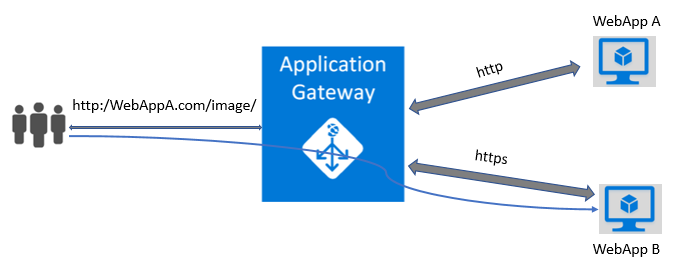
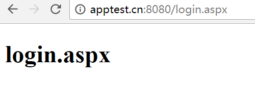
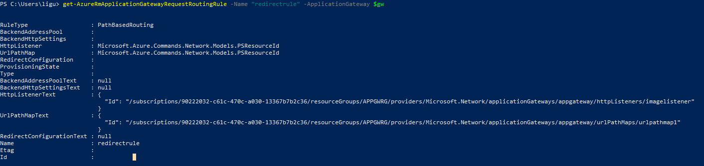
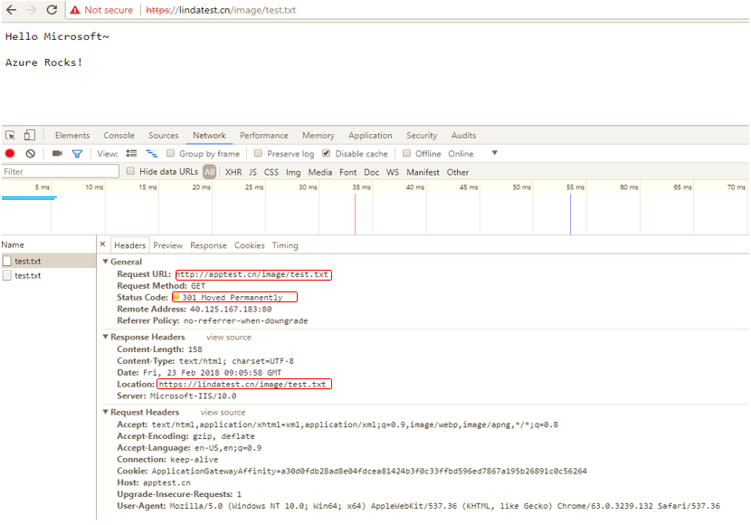
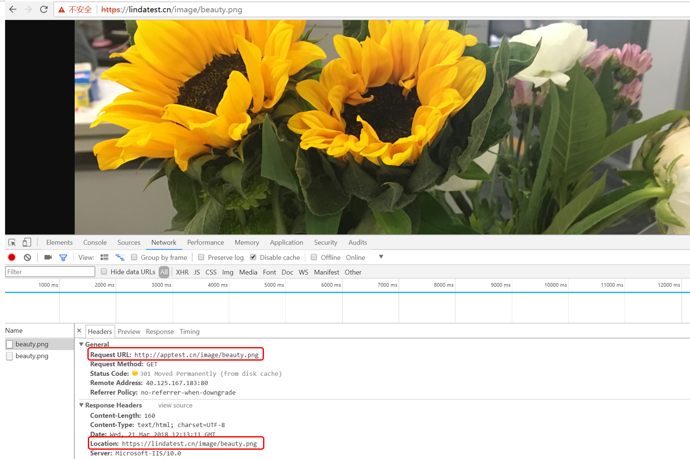

# 应用程序网关如何基于路径重定向到后端 Web 应用

## 介绍

应用程序网关重定向支持具有以下功能:

1. 在网关上从一个侦听器全局重定向到另一个侦听器。这样可实现站点上的 HTTP 到 HTTPS 重定向。
2. 基于路径的重定向。这种类型的重定向只能在特定站点区域中进行 HTTP 到 HTTPS 重定向，例如 /cart/* 表示的购物车区域。
3. 重定向到外部站点。

本文主要介绍通过域名解析把域名解析到应用程序网关的前端 IP，在多站点应用程序网关上实现 HTTP 到 HTTPS，基于路径的重定向到后端 Web 应用池。

## 开始之前

目前 Azure 应用程序网关支持 Web 应用的后端池类型，如用户想实现通过路径重定向到后端 Web 应用。如 Web 应用 A 只处理 txt 文本信息，Web 应用 B 可以处理 image 图像信息，当用户访问 Web 应用 A 的图像时，可以重定向到 Web 应用 B 上相应的目录获得图像信息。



本文主要针对用户的这种需求，介绍如果通过应用程序网关实现基于路径重定向到后端 Web 应用。

## 重定向配置步骤

```powershell
# 获得现有的应用程序网关
$gw = Get-AzureRmApplicationGateway -Name appgateway -ResourceGroupName APPGWRG
# 获得现有的 https 的 listener
$httpslistener = Get-AzureRmApplicationGatewayHttpListener -Name httpslistener -ApplicationGateway $gw
# 获得 应用程序网关前端 IP 配置
$fipconfig = Get-AzureRmApplicationGatewayFrontendIPConfig -Name IPconfig -ApplicationGateway $gw
# 添加监听端口，如果已经存在监听端口，请使用 Get-AzureRmApplicationGatewayFrontendPort
Add-AzureRmApplicationGatewayFrontendPort -Name FrontendPort2 -Port 8080 -ApplicationGateway $gw
$fp = Get-AzureRmApplicationGatewayFrontendPort -Name FrontendPort2 -ApplicationGateway $gw
# 创建重定向 listener 监听重定向请求
Add-AzureRmApplicationGatewayHttpListener -Name imagelistener -Protocol Http -FrontendPort $fp -FrontendIPConfiguration $fipconfig -ApplicationGateway $gw -hostname apptest.cn
# 获得新创建的 listener
$newlistener = Get-AzureRmApplicationGatewayHttpListener -Name imagelistener -ApplicationGateway $gw
# 配置重定向，重定向到现有的 https 的 listener
Add-AzureRmApplicationGatewayRedirectConfiguration -Name redirectpath -RedirectType Permanent -TargetListener $httpslistener -IncludePath $true -IncludeQueryString $true -ApplicationGateway $gw
# 获得已经创建的重定向配置
$redirectconfig = Get-AzureRmApplicationGatewayRedirectConfiguration -Name redirectpath -ApplicationGateway $gw
# 获得现有的 https 后端配置
$poolSetting = Get-AzureRmApplicationGatewayBackendHttpSettings -Name backendhttps -ApplicationGateway $gw
# 获得现有的 https 后端池
$pool = Get-AzureRmApplicationGatewayBackendAddressPool -Name httpspool -ApplicationGateway $gw
# 创建基于路径的重定向规则
$pathRule = New-AzureRmApplicationGatewayPathRuleConfig -Name pathrule -Paths "/image/*" -RedirectConfiguration $redirectconfig
# 为重定向规则创建 url path map，同时 与目的后端池关联起来
Add-AzureRmApplicationGatewayUrlPathMapConfig -Name urlpathmap1 -PathRules $pathRule -DefaultBackendAddressPool $pool -DefaultBackendHttpSettings $poolSetting -ApplicationGateway $gw
# 获得已经创建的 url path map
$urlPathMap = Get-AzureRmApplicationGatewayUrlPathMapConfig -Name urlpathmap1 -ApplicationGateway $gw
# 创建基于路径的 routing rule：
Add-AzureRmApplicationGatewayRequestRoutingRule -Name redirectrule -RuleType PathBasedRouting -HttpListener $newlistener -UrlPathMap $urlPathMap -ApplicationGateway $gw
# 更新应用程序网关，使配置生效
Set-AzureRmApplicationGateway -ApplicationGateway $gw
```

## 验证步骤

当配置完成并生效之后， 可以通过集中方法验证配置是否成功以及是否可以成功完成重定向：

1. 从 Azure 门户 或者 PowerShell 中观察

    例如从 PowerShell 中观察， 使用 `Get-AzureRmAplicationgatewayRequestRoutingRule` 获得基于路径的重定向规则如下， 检查配置已经正确写入：

    

    下一步使用 `Get-AzureRmApplicationGatewayUrlPathMapConfig` 获得 url path map，观察到已经与目的后端池关联了，以此保证图像请求可以重定向到 web app B 上。

    

2. 本地浏览器打开 url

    通过本地浏览器访问 `apptest.cn/image/test.txt`,经过应用程序网关跳转至 lindatest.cn 的 image 目录下， 得到以下内容，表明基于路径的重定向成功：

    

## 重定向过程

同时我们也可以从网关访问日志中观察重定向的具体过程，请求的域名和 url 以及 HTTP 状态码等。可以观察到，客户端访问域名 apptest.cn 的 /image/ 路径下的 test.txt 文件时，首先返回重定向状态码 301，通知客户端将对此请求做永久重定向， 重定向到后端 Web 应用 `lindatest.chinaclousites.cn` 去处理，并返回 `200OK` 。

```json
{ 
    "records":
    [
        {
            "GatewayId": "ff1834b6-af39-4024-9ce0-9328846289af", 
            "Region": "China North", 
            "resourceId": "/SUBSCRIPTIONS/90222032-C61C-470C-A030-13367B7B2C36/RESOURCEGROUPS/APPGWRG/PROVIDERS/MICROSOFT.NETWORK/APPLICATIONGATEWAYS/APPGATEWAY", "operationName": "ApplicationGatewayAccess", 
            "time": "2018-02-23T09:05:59Z",
            "category": "ApplicationGatewayAccessLog",
            "properties": {"instanceId":"ApplicationGatewayRole_IN_0","clientIP":"111.xx.xx.76","clientPort":37992,"httpMethod":"GET","requestUri":"/image/test.txt","requestQuery":"-","userAgent":"Mozilla/5.0+(Windows+NT+10.0;+Win64;+x64)+AppleWebKit/537.36+(KHTML,+like+Gecko)+Chrome/63.0.3239.132+Safari/537.36","httpStatus":301,"httpVersion":"HTTP/1.1","receivedBytes":494,"sentBytes":365,"timeTaken":110,"sslEnabled":"off","host":"apptest.cn"} 
        },
        { 
            "GatewayId": "ff1834b6-af39-4024-9ce0-9328846289af",
            "Region": "China North",
            "resourceId": "/SUBSCRIPTIONS/90222032-C61C-470C-A030-13367B7B2C36/RESOURCEGROUPS/APPGWRG/PROVIDERS/MICROSOFT.NETWORK/APPLICATIONGATEWAYS/APPGATEWAY", "operationName": "ApplicationGatewayAccess", 
            "time": "2018-02-23T09:06:22Z", 
            "category": "ApplicationGatewayAccessLog", 
            "properties": {"instanceId":"ApplicationGatewayRole_IN_0","clientIP":"111.xx.xx.76","clientPort":31848,"httpMethod":"GET","requestUri":"/image/test.txt","requestQuery":"X-AzureApplicationGateway-CACHE-HIT=0&SERVER-ROUTED=LINDATEST.CHINACLOUDSITES.CN&X-AzureApplicationGateway-LOG-ID=f6b4e19d-e45d-4171-9d73-824623528d42&SERVER-STATUS=200","userAgent":"Mozilla/5.0+(Windows+NT+10.0;+Win64;+x64)+AppleWebKit/537.36+(KHTML,+like+Gecko)+Chrome/63.0.3239.132+Safari/537.36","httpStatus":200,"httpVersion":"HTTP/1.1","receivedBytes":500,"sentBytes":614,"timeTaken":143,"sslEnabled":"on","host":"lindatest.chinacloudsites.cn"} 
        }
    ]
}
```

> [!IMPORTANT] 
> 在本文中 Web 应用 A 与 Web 应用 B 均为同一应用程序网关的后端池，对于 Web 应用 A 正常的访问，应用程序网关对应一个监听，对于 Web 应用 A 图像的访问， 应用程序网关对应另一个监听，这两个监听由于监听在同一个 Host, 同一个前端 IP， 这时不能使用同样的监听端口， 如示例中 8080 端口监听来自 Web 应用 A 的文本信息， 具体如何设置，需要考虑用户实际需求。

