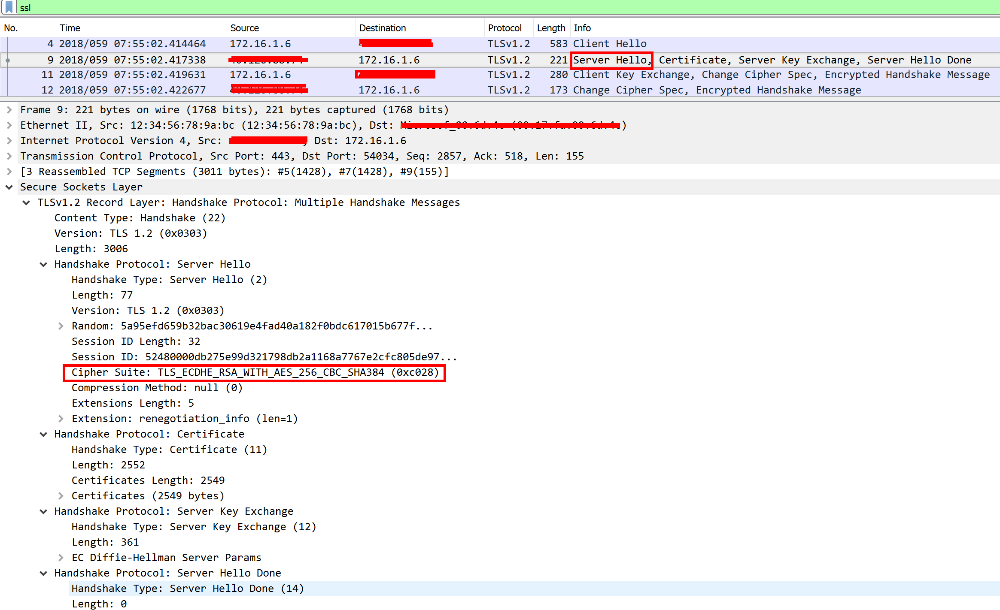

# 如何配置应用程序网关使用指定的加密算法接收 HTTPS 的请求并予以验证以及注意事项

出于某些安全或兼容性的考虑，使用者需要指定应用程序网关使用特定的 HTTPS 的加密算法。
有关如何具体配置应用程序网关的加密策略算法，请参考： [在应用程序网关上配置 SSL 策略版本和密码套件](/application-gateway/application-gateway-configure-ssl-policy-powershell)

# 操作步骤

使用以下 PowerShell 命令进行操作：

```powershell
# 登录 Azure 账号，输入您的订阅账户和密码
Login-AzureRmAccount -EnvironmentName AzureChinaCloud

# 获取您的应用程序网关
$gw = Get-AzureRmApplicationGateway -Name appgwname -ResourceGroup appgwresourcename
# 查看当前的配置
Get-AzureRmApplicationGatewaySslPolicy -ApplicationGateway $gw

# 配置应用程序网关使用预定义 SSL 加密算法
Set-AzureRmApplicationGatewaySslPolicy -PolicyType Predefined -PolicyName "AppGwSslPolicy20170401S" -ApplicationGateway $gw
# 或使用自定义 SSL 加密算法
# Set-AzureRmApplicationGatewaySslPolicy -ApplicationGateway $gw -PolicyType Custom -MinProtocolVersion TLSv1_1 -CipherSuite " TLS_ECDHE_RSA_WITH_AES_256_GCM_SHA384 ","TLS_RSA_WITH_AES_128_GCM_SHA256"

# 查看并确认配置是否有误
Get-AzureRmApplicationGatewaySslPolicy -ApplicationGateway $gw 
# 更新配置
Set-AzureRmApplicationGateway -ApplicationGateway $gw
```

按照以上 Azure PowerShell 命令步骤，我们配置应用程序网关仅使用我们指定的加密算法，我们可以验证策略是否生效，即应用程序网关是否接受基于如上配置的加密算法的 HTTPS 的请求，本文推荐使用 nmap 或 openssl 软件工具(以下例子中，部署在应用程序网关的网站主机名为 `webtest.chinacloudapp.cn`，建议使用公网 DNS 注册域名并添加 A 记录和 CNAME)：

```
nmap:
nmap --script ssl-enum-ciphers -p 443 webtest.chinacloudapp.cn
openssl:
openssl s_client -connect webtest.chinacloudapp.cn:443 -cipher 后面接具体的加密算法
```

配置自定义 SSL 策略时，必须在以下列表中至少选择一个密码套件。 因为应用程序网关使用 RSA SHA256 密码套件进行后端管理。

```
TLS_ECDHE_RSA_WITH_AES_128_GCM_SHA256
TLS_ECDHE_RSA_WITH_AES_128_CBC_SHA256
TLS_DHE_RSA_WITH_AES_128_GCM_SHA256
TLS_RSA_WITH_AES_128_GCM_SHA256
TLS_RSA_WITH_AES_256_CBC_SHA256
TLS_RSA_WITH_AES_128_CBC_SHA256
```

在使用以上 nmap 工具扫描兼容的加密算法时，也可以再次通过抓包分析 client hello 包和 server hello 包，client hello 包中包含了客户端所支持的所有加密算法，server hello 包中包含了应用程序网关从 client hello 包中所列举的众多加密算法中所选取的加密算法，也就是客户端和应用程序网关所协商出来的加密算法结果。



> [!NOTE]
> 截止目前，应用程序网关还暂时不支持 ECDHE_ECDSA 算法。