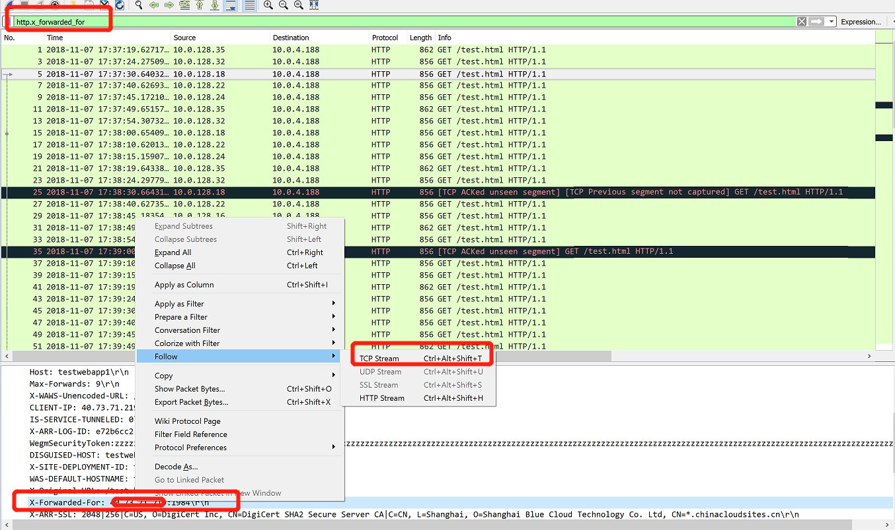

# 如何在后端池 server 查看经过应用程序网关的请求的原始客户端 IP 和端口

## 操作步骤

具体操作步骤如下：

1. 使用 Wireshark 抓包。

2. Filter 输入 `http.x_forwarded_for`

    

3. 使用以下 TCP Stream 得到以下结果：

    ```json
    GET /test.html HTTP/1.1
    Connection: Keep-Alive
    Host: testwebapp1
    Max-Forwards: 9
    X-WAWS-Unencoded-URL: /test.html
    CLIENT-IP: 40.73.68.238:1984
    IS-SERVICE-TUNNELED: 0
    X-ARR-LOG-ID: 3d523d17-0e07-4fa4-b252-95a81a64d3cc
    WegmSecurityToken:zzzzzzzzzzzzzzzzzzzzzzzzzzzzzzzzzzzzzzzzzzzzzzzzzzzzzzzzzzzzzzzzzzzzzzzzzzzzzzzzzzzzzzzzzzzzzzzzzzzzzzzzzzzzzzzzzzzzzzzzzzzzzzzzzzzzzzzzzzzzzzzzzzzzzzzzzzzzzzzzzzzzzzz
    DISGUISED-HOST: test.chinacloudsites.cn
    X-SITE-DEPLOYMENT-ID: testwebapp1
    WAS-DEFAULT-HOSTNAME: testwebapp1.chinacloudsites.cn
    X-Original-URL: /test.html
    X-Forwarded-For: 40.73.xx.xxx:1984
    X-ARR-SSL: 2048|128|C=US, O=DigiCert Inc, CN=DigiCert SHA2 Secure Server CA|C=CN, L=Shanghai, O=Shanghai Blue Cloud Technology Co. Ltd, CN=*.chinacloudsites.cn
    X-Forwarded-Proto: https
    ```

    ```json
    HTTP/1.1 200 OK
    Content-Type: text/html
    Last-Modified: Tue, 06 Nov 2018 06:01:59 GMT
    Accept-Ranges: bytes
    ETag: "42cac43a9675d41:0"
    Server: Microsoft-IIS/10.0
    X-FE-DATA: AppId:Unknown-NoMatch
    X-Powered-By: ASP.NET
    DWAS-Handler-Name: EXECUTE|200|0|0x0|CONFIG_SUCCESS|StaticFile|10.0.4.188|\\10.0.176.12\volume-43-default\&ApiApp=0
    Date: Wed, 07 Nov 2018 09:38:45 GMT
    Content-Length: 316

    <html>
        <head>
            <title>first page</title>
        </head>
        <body>
            <h1>This is heading 1</h1>
        </body>
    </html>
    ```

## 结论

由于应用程序网关会作为 http 层的代理，在接收到客户端的请求后，作为代理重新对后端的请求，此时后端池中的 server 看到的网络层的来源 IP 应该时应用程序网关的 IP 地址，但是我们仍然可以在应用程序网关向后端发起的请求里，从 header 中 `X-Forwarded-For:`可以看到原始客户端访问 IP ，和端口。