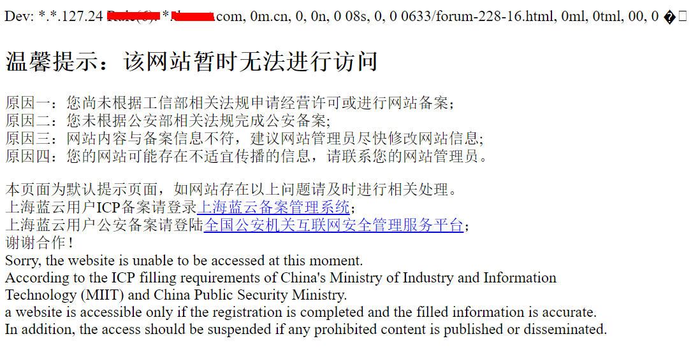
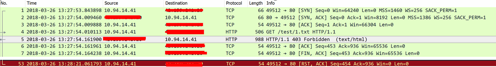
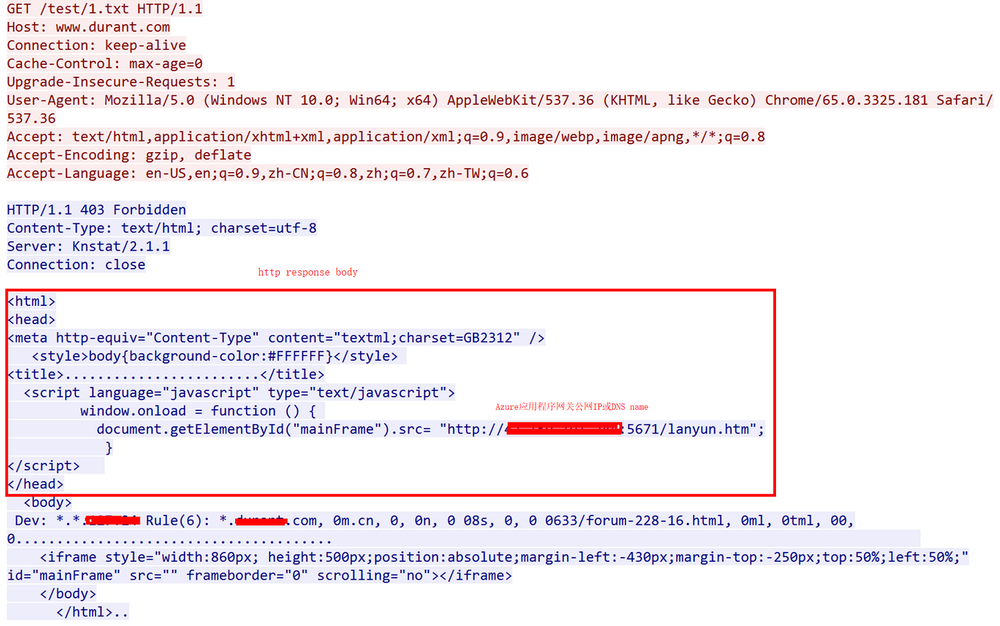

# 分析使用未在 ICP 备案的 Azure 平台公网 IP 或 DNS Name 作为主机名访问 Azure 资源被阻断的原因

本文针对客户通过 Azure 应用程序网关的公网 IP 或 DNS Name 直接作为 URL 的主机名部分访问 Web 资源失败的原因做简单分析。

## 问题描述

客户端如果是使用浏览器访问，会得到如下响应页面，如果客户端是应用程序，连接会被重置，具体报错视应用程序代码设计而定。

## 问题分析

通过网络层抓包，可以看到：

以上可以看到阻断的原因是，Azure 中国区的设计中有 ICP 备案的检测和提示系统，该系统会针对客户端提交的主机名做检测，如果检测到该域名未做过 ICP 备案，会有如上提示。 
如客户遇到此类问题，可以确认这不是应用程序网关亦或是后端 Web 服务的问题。