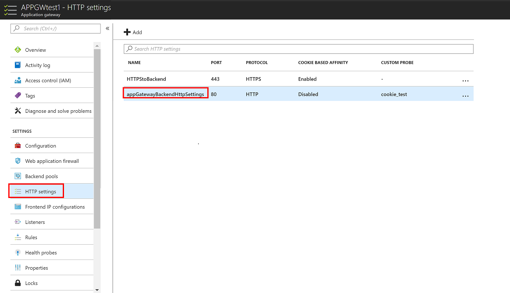
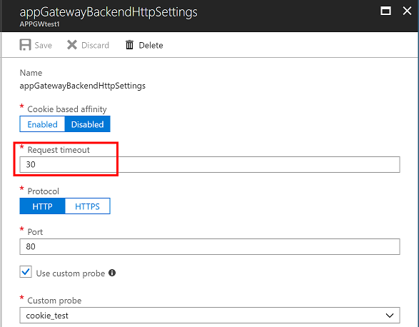

# 如何排查应用程序网关返回 HTTP Code 502 或客户端得到应用程序网关响应慢的问题(一)

## 问题描述

经过初步排查，应用程序网关本身工作正常，同时也排除了 Azure 平台网络的延迟。出现的现象通常是部分的 URL 响应正常、部分 URL 响应慢或是返回 HTTP Code 502。

## 问题分析

1. 通过分析访问日志判断应用访问以及响应情况（有关如何启用以及获取诊断日志请参考：[应用程序网关的后端运行状况、诊断日志和指标](https://docs.azure.cn/zh-cn/application-gateway/application-gateway-diagnostics)）。
2. 对比后端 Web 服务器的访问日志，通过时间戳或是 URL 来查询同一个请求在应用程序网关以及后端 Web 服务器的响应情况。
3. 如果在应用程序网关以及后端 Web 服务器的访问日志中看到部分 URL 访问中 `timetaken` 数值相对于请求内容大小异常大（例如请求内容只有几十 K，但是响应时间多达 5 秒以上）说明后端服务器响应慢。
4. 如果应用程序网关记录了 Http Response Code 502 而后端 Web 服务器的访问日志中记录返回 HTTP Code 200，仔细留意时间戳，发现后端服务器的 Http Response Code 200 响应的时间比应用程序网关记录此 URL 访问的 Http Response Code 502 晚了 1 秒或是更长的时间。

以上分析过程可以判断出，此问题与后端 Web 服务器响应慢有关。 
这包含两种可能：

1. Web 服务器工作异常。

  如果是基于 IIS 的 Web 服务器，可以通过开启 failed request tracing (FRT) 功能来跟踪某个响应慢或异常的请求，具体可以参考另外一篇文章：[如何排查应用程序网关返回 HTTP Code 502 或客户端得到应用程序网关响应慢的问题(二)](aog-application-gateway-qa-web-server-backend-error.md)

2. Web 服务器工作正常，但应用逻辑运算需要时间比较长。

  由于应用程序网关在默认的 HTTP settings 中超时时间为 30 秒，30 秒后，如果后端 Web 服务器没有响应此请求，应用程序网关会认为此请求会话超时，并返回给前端客户端 HTTP Code 502。

HTTP settings 超时时间配置如下图：

## 解决方法

针对以上问题，可以通过以下两种方式解决：

1. 适当延长应用程序网关的 HTTP settings 的超时时间（时间越长，对于应用程序网关的消耗越大）以便于应用程序网关超时时间匹配（略大于）后端 Web 服务器的应用正常响应所需的最大响应时间。
2. 如果不想加大应用程序网关的 HTTP settings 的超时时间，而 Web 应用中配置了 keep-alive 机制，建议不要设为刚好 30 秒，而是大于 30 秒，从而避免了应用程序网关在 30 秒内没有收到 Web 服务器的响应从而 timeout 并返回 HTTP Code 502 给前端客户端。

以上两种情况均为 Web 服务器工作正常的情况，只是应用逻辑运算需要时间比较长。 
如上所说也可能是后端 Web 服务器本身工作异常，如果是基于 IIS 的 Web 服务器，可以通过开启 failed request tracing (FRT) 功能来跟踪某个响应慢或异常的请求，具体可以参考另外一篇文章：[如何排查应用程序网关返回 HTTP Code 502 或客户端得到应用程序网关响应慢的问题(二)](aog-application-gateway-qa-web-server-backend-error.md)
