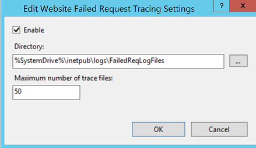
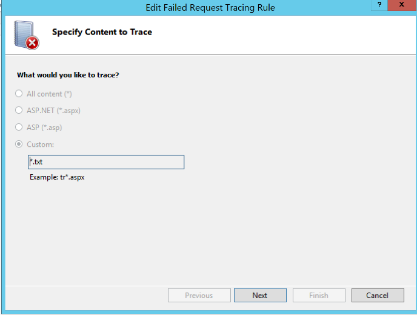
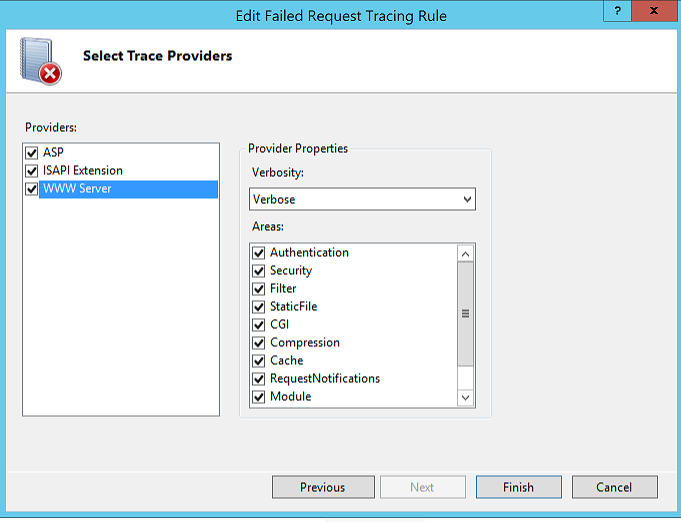
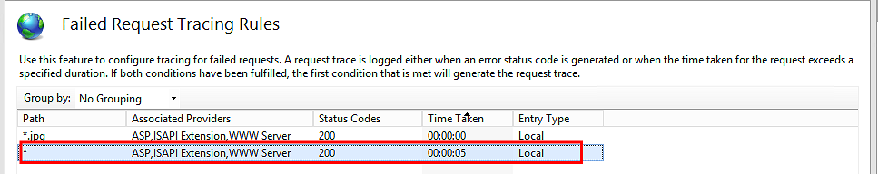
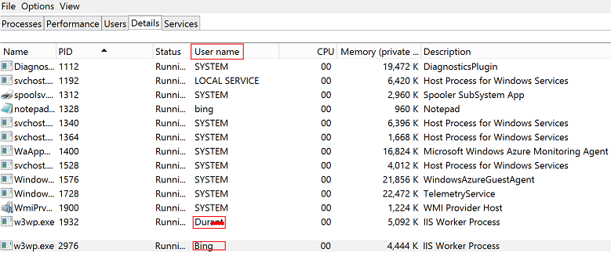
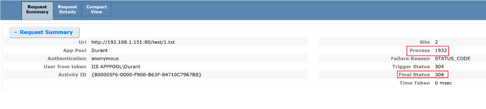
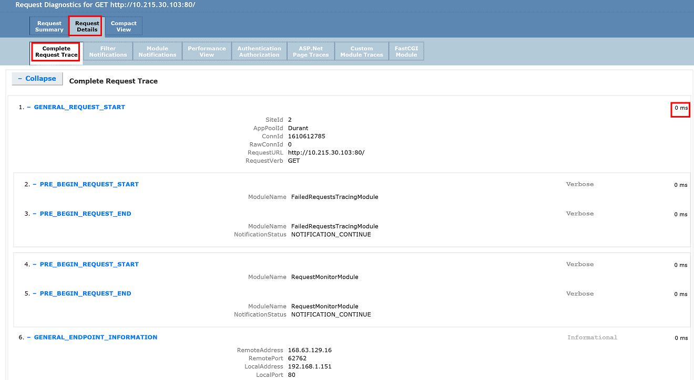
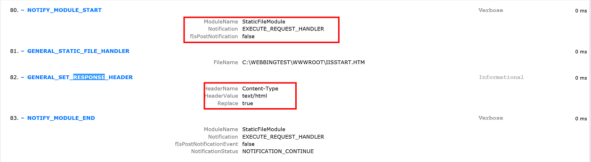

# 如何排查应用程序网关返回 HTTP Code 502 或客户端得到应用程序网关响应慢的问题(二)

## 问题描述

经过[如何排查应用程序网关返回 HTTP Code 502 或客户端得到应用程序网关响应慢的问题(一)](aog-application-gateway-qa-web-server-backend-delay.md)中的排查步骤，可以判断出是由于 Web 服务器自身问题导致的响应异常。

那么可以在 IIS 中开启 failed request tracing (以下以 FRT 代称) 功能来跟踪并分析此响应异常的原因。

具体步骤参考如下（本文以 Windows Server 2012 为例）：

1. 在[系统管理工具中开启 FRT](https://docs.microsoft.com/zh-cn/iis/configuration/system.applicationHost/sites/site/traceFailedRequestsLogging#setup)。

2. 开启后，可以在 IIS manager 中对应的 sites 的面板中看到 Failed Request Tracing 选项，再在右侧的 action 面板中配置 FRT 的 rule。

3. 配置 rule 之前，先开启并配置 trace file 最大数量：

    

4. 配置 FRT rule:

    1. 配置匹配请求内容后缀：

        

        这里为了尽量缩小诊断范围，可以考虑针对有问题的 URL 的请求配置匹配文件后缀名。

    2. 配置匹配条件：

        

        这里有三种，status code，Timetaken，以及 event severity，这里的条件之间是与的关系，例如可以使针对 HTTP Response Code 200 但是 Timetaken 时间超过 5 秒的请求做 tracing.

    3. 配置跟踪提供程序：

        

    4. 配置完成后:

        

5. 一旦问题出现，`%SystemDrive%\inetpub\Logs\FailedReqLogFiles\` 下面会有 .xml 文件生成，一个 .xml 文件对应一次请求的 tracing,请根据时间戳判断要分析的是哪一个请求。

6. 建议使用浏览器打开，如果要此 .xml 文件复制到其他 server 上分析，建议连通 freb.xsl 一起复制过去，因为此文件是 FRT log 的格式文件，当使用浏览器打开时，会按照此文件中的格式编排，可读性比较好。

7. 打开任务管理器，记录当前 IIS 进程的 PID：

    

    如果是多站点，可以根据应用程序池的名字来判断有问题的站点的进程的 PID。

8. 再打开 FRT 的 .xml，可以根据 PID 来确认：

    

9. 接下来可以点击 Request Details 来分析具体是哪一个环节 timetaken 长导致的延迟响应，从而锁定问题范围：

    

以上可以看到，trace 信息中将此请求的每一个细部均列出，并计算出每一步所花费的时间即 Timetaken，以及请求和返回信息的细节，如 header，handler 信息：

通过 trace 信息，可以帮助应用开发人员判断问题出在哪里，是否需要调整应用代码，或是调整哪部分代码，为最终解决此 web 应用本身的问题提供了必要信息。