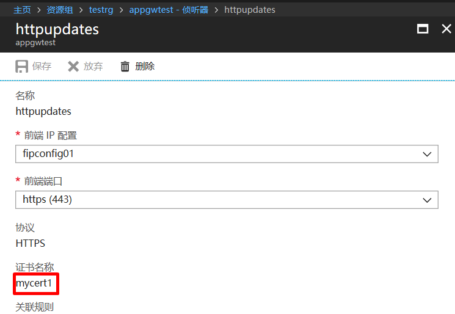
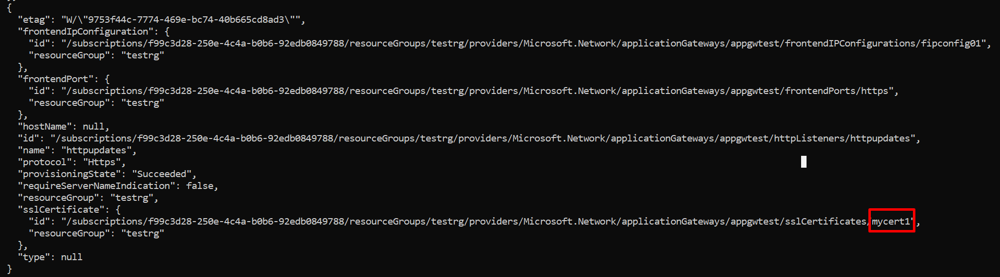
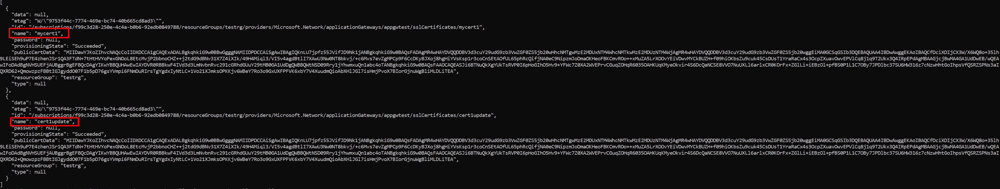
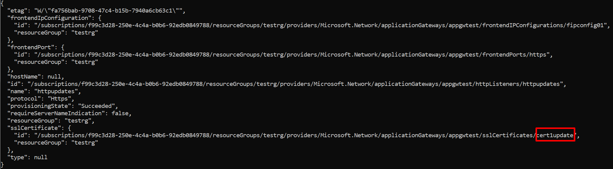
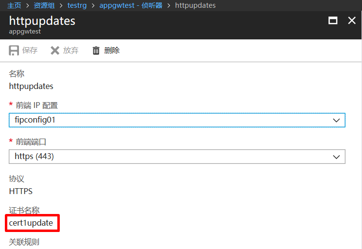

# Azure CLI 2.0 修改应用程序网关以进行 SSL 证书更新

## 概述

当客户的应用程序网关 SSL 证书由于授权到期或者其他原因需要更换时，则需要对应用程序网关侦听器使用的 SSL 证书进行更新。

本文主要介绍如何使用 Azure CLI 更新应用程序网关已进行 SSL 证书更新。

## 先决条件

### 安装 Azure CLI 2.0

若要执行本文中的步骤，需要安装[适用于 Mac、Linux 和 Windows 的 Azure 命令行接口 (Azure CLI)](https://docs.azure.cn/zh-cn/cli/install-azure-cli?view=azure-cli-latest)。
 
## 查询现有程序网关上侦听器使用 SSL 证书

登录 [Azure 门户](https://portal.azure.cn)在需要更换 SSL 证书应用程序网关 Https 侦听器中查看当前.pfx 证书。



## 在现有程序网关上更新 SSL 证书

应用程序网关在门户上不支持更换 ssl 证书的操作，但是可以使用 Azure CLI 更换证书，下面讲述操作步骤：

1. 使用 `az login` 命令登录到 Azure 订阅在 Azure 中国区使用 Azure CLI 2.0 之前，请先运行:

    ```azurecli
    az cloud set -n AzureChinaCloud
    ```

2. 使用 Azure CLI 查看应用程序网关 Https 侦听器 .pfx 证书。

    ```azurecli
    az network application-gateway http-listener list --gateway-name  appgwtest --resource-group  testrg
    ```

    

3. 使用 Azure CLI 在应用程序网关添加一个新的 .pfx 证书。

    ```azurecli
    az network application-gateway ssl-cert create -name "cert1update" --cert-file /home/azureuser/self-signed/AdatumAppGatewayCert.pfx --cert-password '123456' --gateway-name appgwtest --resource-group testrg
    ```

4. 查看应用程序网关已添加 .pfx 证书。
   
    ```azurecli
    az network application-gateway ssl-cert list --gateway-name  appgwtest --resource-group testrg
    ```

    

5. 使用 Azure CLI 指令更新 Https 侦听器使用 .pfx 证书。

    ```azurecli
    az network application-gateway http-listener update --gateway-name  appgwtest  --name httpupdates --resource-group testrg  --ssl-cert cert1update
    ```

    

6. 在 Azure 门户中查看应用程序网关 Https 侦听器 .pfx 证书是否更新成功。

    