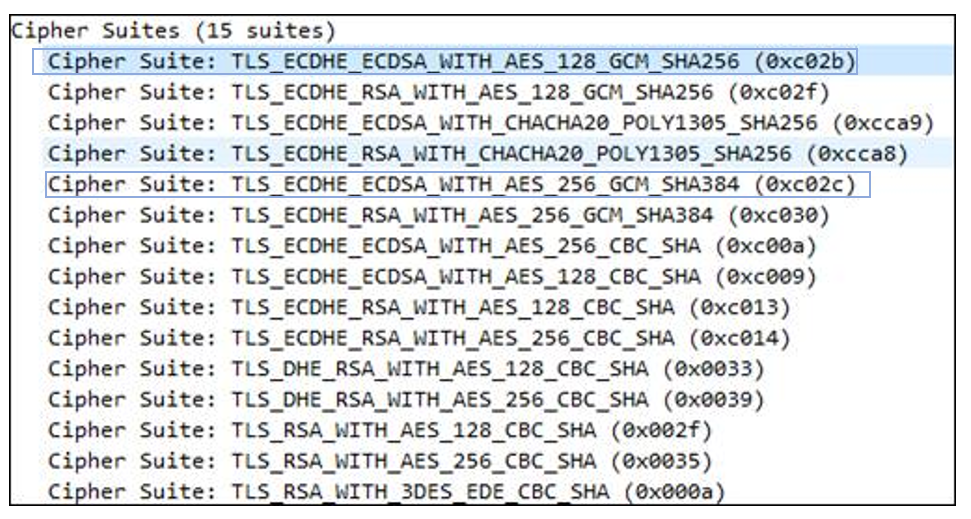
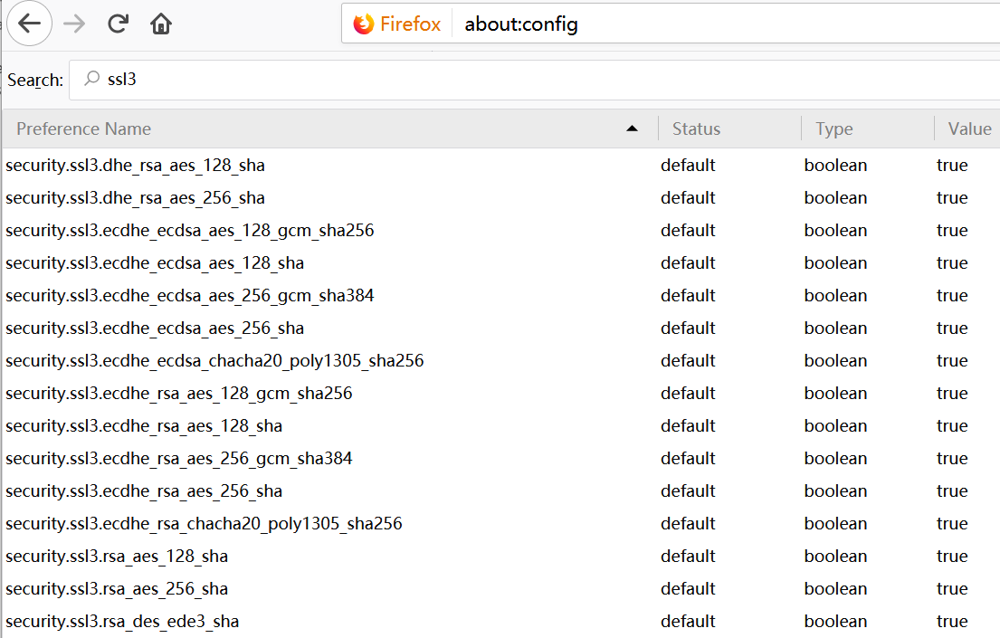
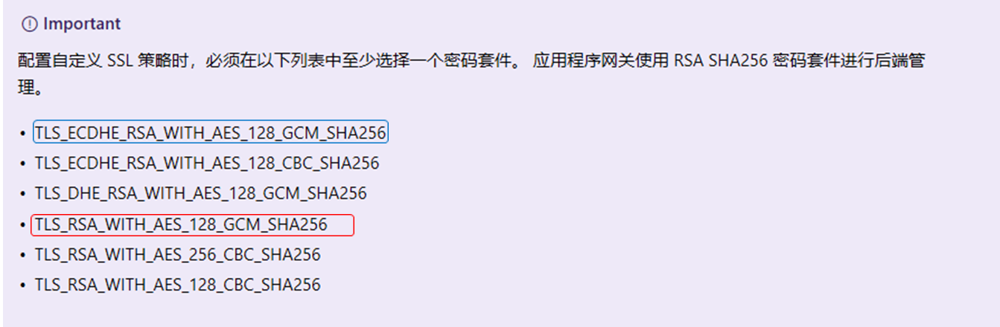

# 使用火狐浏览器访问自定义策略的应用网关注意事项

## 概述

用户在添加应用程序网关后部署了不同的 Web 应用，通过谷歌浏览器访问时没有问题， 通过火狐浏览器访问时提示 “Secure Connection Failed” 。 此错误主要是由于在 SSL 协商的过程中发生的错误， 区别在于这两种浏览器所支持的密码套件不同。

## 排查分析

通过使用 wireshark 或者 network monitor 抓包工具，查看两种浏览器中所支持的加密套件。本示例中使用的是 wireshark 抓包工具。

### 使用谷歌浏览器访问 Web 应用

在客户端浏览器发给应用程序网关中的 “client hello” 包中携带了 14 个加密套件，在应用程序网关回给浏览器的 “server hello” 消息中，使用 “TLS_RSA_WITH_AES_128_GCM_SHA256” 协商成功。

截图如下：


### 使用火狐浏览器访问 Web 应用

在客户端使用火狐浏览器访问 Web 应用时，从客户端浏览器发给应用程序网关中的 “client hello” 包中携带了 15 个加密套件，且应用程序网关并没有返回 “sever hello” 消息，而是重置了客户端请求。



也可以到浏览器的 about:config 文件中查看目前所支持的密码套件，正是上述的 15 个套件：



### 后台抽取应用程序网关的 SSL 策略

```
$AppGW = Get-AzureRmApplicationGateway -Name "APPGW" -ResourceGroupName "APPGWRG"
$sslpolicy = Get-AzureRmApplicationGatewaySslPolicy -ApplicationGateway $AppGW
```

输出：

```
"SSLPolicy": {
            "CipherSuites": [
                "TLS_ECDHE_ECDSA_WITH_AES_128_GCM_SHA256",
                "TLS_ECDHE_ECDSA_WITH_AES_256_GCM_SHA384",
                "TLS_RSA_WITH_AES_128_GCM_SHA256"
            ],
            "MinProtocolVersion": "TLSv1_2",
            "PolicyType": "Custom"
```

发现应用程序网关上使用的是自定义 SSL 策略，谷歌浏览器正是使用自定义策略中的 ”TLS_RSA_WITH_AES_128_GCM_SHA256“ 套件，协商成功， 而火狐浏览器上报的 cipher suites 中并没有这一套件。火狐浏览器中虽然有 "TLS_ECDHE_ECDSA_WITH_AES_128_GCM_SHA256“ 和"TLS_ECDHE_ECDSA_WITH_AES_256_GCM_SHA384" 密码套件， 但是在与应用网关进行 SSL 交互时并不起作用

> [!Note]：在使用自定义 SSL 策略时有如下限制，应用程序网关使用 RSA SHA256 密码套件进行后端管理，参考 [SSL 策略配置](https://docs.azure.cn/zh-cn/application-gateway/application-gateway-configure-ssl-policy-powershell#configure-a-custom-ssl-policy)。
> 

## 解决建议：

由于用户的随机性和大量性，即使可以手动添加浏览器的密码套件，但并不是一种好的解决办法，建议在应用程序网关上添加一组或多组 Firefox 可以支持的 RSA_SHA256 密码套件，例如： ”TLS_ECDHE_RSA_WITH_AES_128_GCM_SHA256“ ，并把 Web 应用根证书添加到 Firefox 的 certificate manager 的可信任证书列表中， 通过本地应用程序网关测试后验证使用 Firefox 可以成功访问 Web 应用。